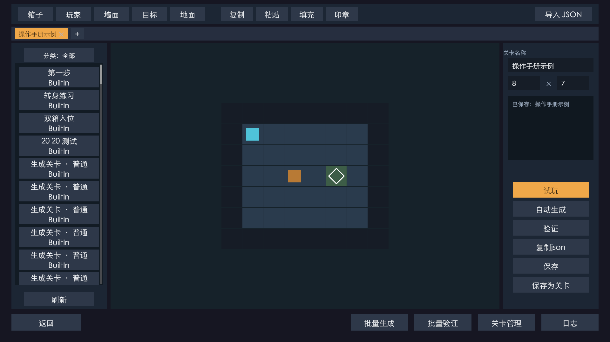

# 推箱子与关卡编辑器

使用 Unity 制作的推箱子游戏，包含完整的选关、游玩、通关与进度保存流程，以及可在游戏内使用的关卡编辑器。编辑器覆盖关卡绘制、求解回放、自动生成、批量管理和印章复用。

**版本 0.14.2 · Unity 2022.3.51f1c1 · Windows · 临时美术资源**

**架构部分使用Codex + GPT 6 Astra，核心代码使用GPT6.1 Sol与Qwen3.8 Max，边缘代码部分使用DeepSeek V4.1 Flash**

> **进入关卡编辑器：按键盘 `=` 键显示右上角 GM → 展开「GM ▼」→ 点击「关卡编辑器」。**
>
> 在 Unity 中先点击 Game 窗口，使其获得键盘焦点。独立运行版也包含 GM 和关卡编辑器。


## 运行与操作

### 直接运行 Windows 构建

仓库提供 [Windows 构建（Bulid 文件夹）](Bulid/) 和 [Unity 资源包（KuroTest.unitypackage）](KuroTest.unitypackage)。

下载仓库并解压后，打开 `Bulid` 文件夹，双击 **`KuroTest.exe`** 即可运行，无需安装 Unity。请保持整个文件夹的结构，不要只复制 exe；运行需要同目录的 `KuroTest_Data`、`MonoBleedingEdge` 和 `UnityPlayer.dll` 等配套文件。

独立运行版同样可以按 **`=` → GM ▼ → 关卡编辑器** 进入编辑器。

### 打开源码工程

1. 使用 Unity Hub 添加工程根目录，以 **Unity 2022.3.51f1c1** 打开，等待依赖加载与脚本编译。
2. 打开 `Assets/Scenes/start.unity`，点击 Play。
3. 点击「开始游戏」，选择关卡开始游玩；将全部箱子推到目标点即可通关。
4. 要制作关卡，按 **`=` → GM ▼ → 关卡编辑器**。也可直接打开 `Assets/Scenes/editor.unity` 运行。

| 操作 | 按键 |
| --- | --- |
| 移动 / 连续移动 | 方向键或 WASD / 长按 |
| 撤销 | Z 或 Backspace |
| 重开 | R |
| 暂停 | Esc 或 P |
| 查看完整地图 | M |
| 显示 / 隐藏 GM | **`=`** |

Windows 构建需要 Unity Windows Build Support。四个流程场景顺序为 `start → level → game → editor`，工程已配置对应 Build Settings。

### 导入 Unity 资源包

使用 **Unity 2022.3.51f1c1** 创建内置渲染管线的 2D 工程，通过 **Assets → Import Package → Custom Package…** 导入根目录的 **`KuroTest.unitypackage`**。

资源包不包含 `Packages` 和 `ProjectSettings`，导入后需要配置 UI 依赖、旧版输入、四个流程场景及动态加载 Shader。具体步骤见 [Unity 资源包导入说明](docs/UNITY_PACKAGE_IMPORT.md)。

## 游戏功能

- **完整流程**：主菜单、关卡预览、顺序解锁、暂停、通关结算、下一关和返回选关。
- **推箱体验**：移动与推箱计数、撤销、重开，大地图跟随视野与整图查看。
- **本地进度**：保存解锁状态与关卡成绩，重新进入后继续游玩。
- **视听设置**：音乐、音效、CRT、动画和低特效选项，保存个人偏好；关闭动画后移动与界面过渡直接完成。
- **GM 工具**：进入编辑器、查看全部或玩家关卡、切换关卡、重开、强制胜利、解锁关卡与清空玩家数据。

## 关卡编辑器



| 模块 | 功能 |
| --- | --- |
| 绘制与编辑 | 多文档页签，墙、地面、玩家、箱子、目标五种笔刷；框选、多选、填充、复制、剪切、粘贴、长按移动与撤销 |
| 画布与试玩 | 缩放、平移、保存和进入实际游戏试玩，返回后继续编辑 |
| 导入与导出 | 主界面粘贴关卡 JSON 并打开新页签；关卡管理导出所选或当前分类为 XLSX，预览并导入 XLSX 为新关卡 |
| 求解与回放 | 结构检查、可解性求解；优先最少推箱，同推箱数下最少移动；完整解答、自动播放与单步查看 |
| 自动生成 | 按尺寸、推箱次数与复杂度约束生成，预览后采用；支持批量生成、去重和保存 |
| 关卡管理 | 分类、排序、对玩家公开、多选迁移、删除、批量验证和操作日志 |
| 印章复用 | 使用内置印章、新建印章、从选区创建；支持透明格和叠层内容，保存后重复放置 |
| 编辑保护 | 未保存关闭提示、退出确认、保存失败保留内容、删除备份与批量写回冲突检查 |

推荐制作流程：**新建或打开 → 绘制 → 求解 → 回放 → 保存 → 试玩 → 分类与公开**。详细按钮说明、鼠标操作与各界面图片见[图文操作手册](docs/USER_MANUAL.md)。

## 技术与工具

工程使用 **C#、uGUI、Unity 内置渲染管线、HLSL Shader 和 JSON**。规则模型与场景表现分离，关卡、印章和分类数据采用 JSON 保存；后台任务处理生成与验证，界面在主线程更新。

求解器以推箱 A* 搜索为主，结合玩家可达区域 BFS、箱子与目标匹配下界及死锁剪枝。生成器参考 [AutoGenerateSokobanLevel](https://github.com/huanggaole/AutoGenerateSokobanLevel) 的 HTML 实现，逐步添加结构并求解，再由本项目求解器确认约束。单关与批量生成共用核心逻辑。

开发使用 Unity Editor、Codex 和 Unity MCP 辅助编码与编辑器操作，PowerShell 支持模型检查和构建，Node.js 用于生成离线手册。运行游戏不需要 MCP 或文档工具。

## 项目文档

- [图文操作手册](docs/USER_MANUAL.md)：游戏与编辑器的逐界面说明。
- [离线 HTML 手册](docs/Sokoban-User-Manual.html) / [PDF 手册](docs/Sokoban-User-Manual.pdf)：内含操作截图，可离线阅读。
- [开发过程](docs/DEVELOPMENT.md)：编辑工具、生成算法和表现层的阶段演进。
- [技术结构](docs/TECHNICAL_OVERVIEW.md)：代码职责、规则、数据和后台任务。
- [Unity 资源包导入说明](docs/UNITY_PACKAGE_IMPORT.md)：新工程导入、依赖、输入、场景和 Shader 配置。
- [素材与参考来源](THIRD_PARTY_NOTICES.md)：美术、音频、字体、算法与工具来源。

## 工程结构

```text
Assets/
  Scenes/              主菜单、选关、游戏、编辑器
  Scripts/Game/        规则、存储、求解、生成与游戏表现
  Scripts/LevelEditor/ 游戏内关卡编辑器、印章与批处理
  Resources/           关卡、印章、贴图、预制体、字体与声音
  Shaders/             背景、面板、转场与 CRT
  TextMesh Pro/        字体与 UI 配套资源
  Tests/               模型与流程检查代码
  ThirdParty/          素材来源说明
Packages/              Unity 依赖
ProjectSettings/       场景顺序、渲染与输入等工程设置
docs/                 图文手册、技术说明与开发记录
Tools/                 构建、模型检查与手册生成工具
Bulid/                 Windows 构建，入口为 KuroTest.exe
KuroTest.unitypackage   Unity 代码与资源导入包
```

美术和声音包含 Balatro 临时资源，部分棋盘素材、字体及 AI Logo 来自原工程。第三方内容的归属与已知许可信息见[素材说明](THIRD_PARTY_NOTICES.md)。
