# 推箱子游戏与关卡编辑器操作手册

适用版本 0.14.2 · Windows · 2026-10-07

本手册面向试玩者、关卡策划和工程评阅者。前五节介绍游戏流程，其余章节逐一说明关卡编辑器的入口、按钮、鼠标操作、内容生产和数据管理。建议先完成第八节的示例关卡，再尝试自动生成和批量任务。

截图来自本版本 Windows 开发构建的真实界面，使用隔离测试数据。示例关卡名称、列表数量、解锁进度和日志会与个人存档不同。编辑器使用简洁色块表达逻辑，实际游戏使用贴图表现。推荐 1920×1080；至少使用 1280×720 的横向窗口。离线 HTML 内嵌全部图片，放大浏览器可查看细节；Markdown 图片随 docs/images 一起保存。

## 01 运行与主菜单

通过 Unity Hub 打开工程，使用 Unity 2022.3.51f1c1。导入和编译完成后，打开 Assets/Scenes/start.unity 并点击 Play。若已取得独立运行版本，启动 Bulid/KuroTest.exe 即可。

主菜单的「开始游戏」进入选关，「设置」调整音量和画面，「退出」关闭程序。存在未保存编辑文档时，退出会先询问如何处理。Unity 内请先点击 Game 窗口，使键盘输入进入游戏。

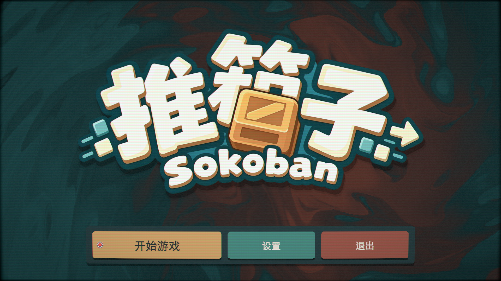

**编辑器入口：按 `=` 显示右上角 GM → 展开「GM ▼」→ 点击「关卡编辑器」。** 首次打开工程时，请等待依赖与资源导入完成后再运行。

## 02 选关与玩家进度

点击左侧关卡，右侧显示对应预览，再点「开始」。未解锁的关卡不可开始；完成当前关卡会解锁战役顺序中的下一关。已完成标记和最佳成绩保存在本地。

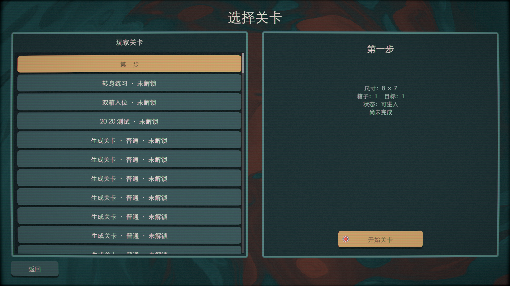

玩家只看见关卡管理中已公开分类下的内容。分类名称属于编辑器信息，不显示在普通选关界面。关卡顺序和名称可在编辑器中调整，公开分类决定玩家能够看到的内容。

修改关卡名称不会清除同布局的成绩；修改布局后，旧布局的成绩不会套用到新布局。GM 游玩、强制完成和编辑器试玩不计普通成绩，也不推动正常解锁。

## 03 游玩与完整地图

把所有箱子推到目标点即通关。玩家只能推一个箱子，不能拉箱子，也不能一次推动一排箱子。墙和其他箱子会阻挡运动；被阻挡的动作不增加步数。一个推箱动作同时计入总移动和推箱次数。


| 操作 | 输入 | 作用 |
| --- | --- | --- |
| 移动 | 方向键或 WASD | 支持长按连续移动 |
| 撤销 | Z 或 Backspace | 回退已接受的动作 |
| 重开 | R 或界面按钮 | 回到本关初始状态 |
| 暂停 | P 或 Esc | 阻止移动并暂停计时 |
| 整图 | M 或地图按钮 | 查看完整地图 |
| 开发入口 | = | 显示或隐藏右上角 GM |

14×10 以内的地图固定显示整图。超过任一尺寸时，视野跟随玩家并限制在地图范围内。完整地图会临时屏蔽移动输入；点「关闭」或按 M / Esc 返回。

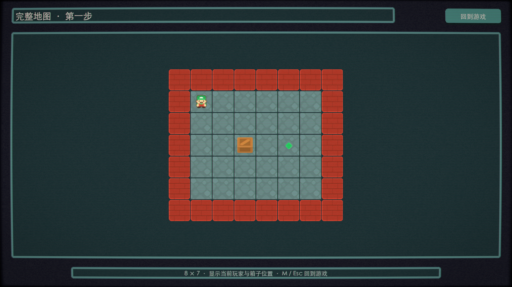

## 04 暂停与通关结算

暂停菜单可继续、重开、进入设置或返回选关。暂停时，底层移动和撤销不会响应，游戏用时停止增长。打开地图和其他模态界面时也应先关闭界面再继续操作。

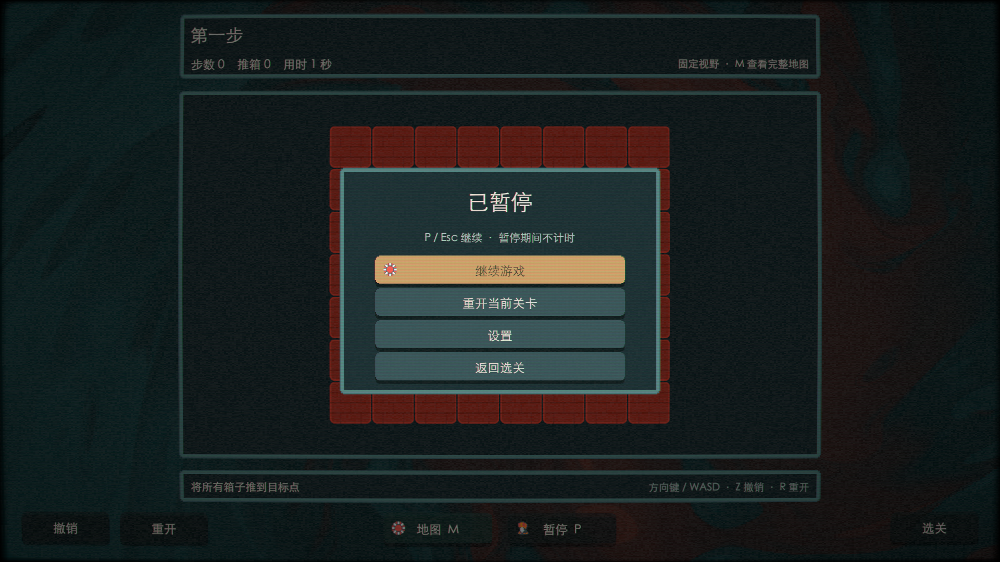

所有箱子到位后显示结算。普通通关保存成绩并开放下一关；最后一关的「下一关」入口变为「返回选关」。编辑器试玩的结算会标注试玩，返回后继续编辑原文档。GM 强制完成会显示专门标记。

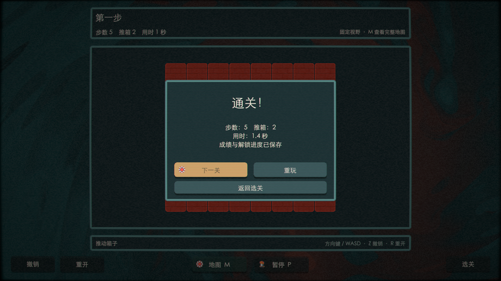

## 05 设置与开发入口

设置中的音乐、音效、CRT 滑条即时作用于对应内容；CRT 为 0 时关闭该后处理。低特效降低部分画面效果开销。音乐、音效、CRT、动画和低特效均保存为本地偏好。

**显示模式：** 从主菜单「设置」或游戏暂停菜单「设置」进入，点击「窗口模式」或「无边框全屏」切换。无边框全屏覆盖当前显示器；返回窗口模式时恢复上次窗口尺寸。模式和窗口尺寸自动保存在本地，下次启动继续使用。

窗口模式可拖动系统窗口边缘调整大小，最小为 **1280×720**；缩到更小时会自动调整回最小尺寸。游戏界面按比例缩放，不强制窗口保持 16:9，宽高比不同时会保留空余背景。编辑器沿用相同缩放适配，不增加显示设置入口，调整尺寸不会改变关卡内容。

显示模式功能用于 Windows 独立运行版；Unity 中的 Game 预览窗口由 Unity 编辑器控制，设置面板中的显示模式按钮不可用。


**动画：** 默认开启。关闭后角色、箱子和跟随视野直接到位，取消按钮、弹窗、Logo、粒子及圆形转场动效，背景与 CRT 噪声停止变化。正在移动的对象和弹窗会立即完成落位，不会停在半途。重新开启可恢复动画，退出游戏后仍保留选择。

关闭动画不会暂停游戏或关闭音效，推箱、撤销、计时与求解回放仍正常执行；箱子入位后的贴图和其他状态提示仍会更新。

进入编辑器的步骤：按键盘 = → 点击右上角「GM ▼」→ 点击「关卡编辑器」。GM 入口默认隐藏；按 = 可再次隐藏。其显示和展开状态跨场景保留。

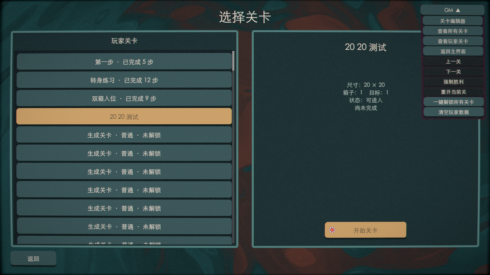

| GM 功能 | 用途 |
| --- | --- |
| 关卡编辑器 | 进入内容制作工作台 |
| 全部关卡 / 玩家关卡 | 切换调试列表或普通公开内容列表 |
| 前后关、重开、强制胜利 | 快速验证流程，强制胜利不计普通成绩 |
| 解锁全部 | 为调试开放玩家关卡 |
| 清空玩家数据 | 确认后重置解锁、完成记录和成绩，不删除关卡及印章 |
| 返回主界面 | 回到主菜单 |

## 06 编辑器空界面与工作区

第一次进入或关闭全部页签时，会显示空编辑区。点击中央「新增关卡」创建文档，也可点击左侧已有关卡打开。空界面仍可进入印章、生成、管理及批量任务。

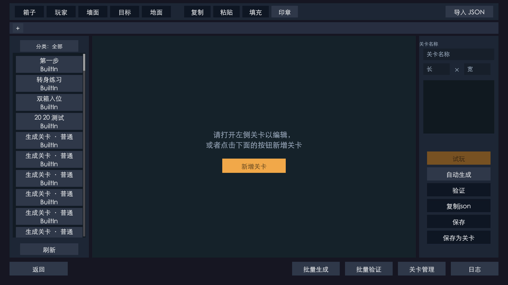

打开关卡后，界面分为六部分。图中数字为手册标注，游戏内不会显示。

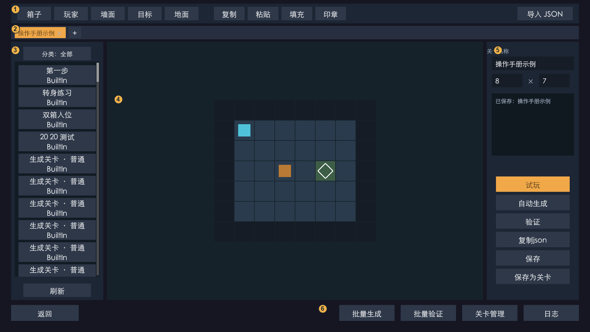

| 区域 | 作用 |
| --- | --- |
| 1 顶部工具栏 | 五种笔刷、复制、粘贴、填充、印章 |
| 2 页签栏 | 切换文档，点击 + 新建，点击 × 关闭 |
| 3 左侧资源列表 | 分类筛选、打开已有关卡、刷新列表 |
| 4 中央画布 | 绘制、选区、落位、缩放和平移 |
| 5 右侧属性与动作 | 名称、尺寸、状态、试玩、生成、验证、复制 JSON、保存 |
| 6 底部工具入口 | 返回、批量生成、批量验证、关卡管理、日志 |

橙色按钮或页签通常表示当前工具、当前文档或主要动作。右侧状态区显示结构问题、操作结果和保存失败原因；内容较长时可滚动。

## 07 页签 名称与地图尺寸

点击页签切换文档。每个关卡或印章拥有独立的数据和撤销记录。点击左侧已经打开的关卡会切回对应页签。名称在右侧输入框编辑，结束输入时应用；页签上出现 * 表示未保存。

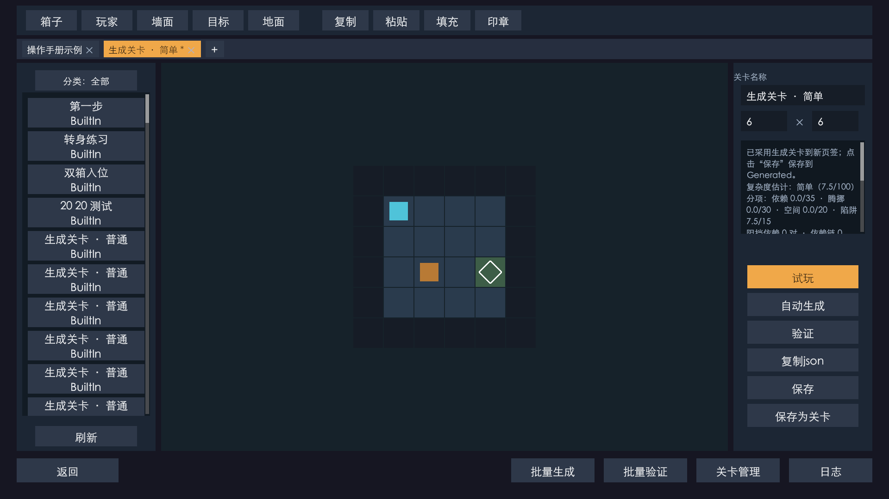

名称下面的两项分别为水平格数和垂直格数。普通关卡范围为 3–40，印章为 1–40。修改后结束输入即可应用；不支持的数字会限制到范围内，非数字不产生有效尺寸修改。

**缩小尺寸会裁掉边界外的箱子和目标。** 普通地图会重新形成外围墙，玩家坐标会限制到内部；增加出来的区域可能为墙，需要自行用地面笔刷开路。调整后应重新检查箱子/目标数量与玩家位置。误改时立即 Ctrl+Z。

在输入框中打字时，编辑器快捷键暂停响应。结束文字输入并点击画布后，再执行复制或撤销。

## 08 做出第一张可通关关卡

建议先创建一个 8×7 的单箱示例，熟悉完整制作流程。此布局与下图中的操作手册示例一致，预期最少推箱 2 次、总移动 5 步。


1. 点击 + 或「新增关卡」，输入名称「我的第一关」。
2. 将尺寸设为水平 8、垂直 7，保留外围一圈墙，把内部区域设为地面。
3. 以左上角为 (0,0)，在 (1,1) 放玩家，在 (3,3) 放箱子，在 (5,3) 放目标。
4. 点击「验证」，确认结果为可解并查看完整回放。
5. 返回编辑后点击「保存」，再点击「试玩」，按下、下、右、右、右完成。
6. 从试玩返回编辑；若要让普通玩家选到此关，再按第二十节将其分类公开。

```text
########
#@.....#
#......#
#..B.G.#
#......#
#......#
########
```

此处 # 为墙、. 为地面、@ 为玩家、B 为箱子、G 为目标，仅用于手册示意。游戏 JSON 中 terrain 只记录墙和地面，箱子、玩家和目标使用独立坐标，不能把这张字符图直接粘贴到 JSON。

## 09 五种笔刷与分层规则

选择顶部笔刷后，在目标格**单击并松开左键**落笔。拖动鼠标用于框选，不是连续涂刷；需要大面积铺地或造墙时，先框选再填充。


| 笔刷 | 对目标格的影响 |
| --- | --- |
| 箱子 | 放入箱子，保留目标点，替换该格玩家 |
| 玩家 | 移动唯一的玩家起点，保留目标点，替换该格箱子 |
| 墙面 | 变成墙，清除该格的目标和实体 |
| 目标 | 添加目标点，可与箱子或玩家共存 |
| 地面 | 清成纯地面，清除该格箱子、玩家和目标 |

编辑器以蓝绿色方块表示玩家、棕色方块表示箱子，目标使用绿色地面与白色菱形。把箱子或玩家画到目标上时，目标仍然存在。普通关卡必须有一个有效玩家、至少一只箱子，且箱子数和目标数相同。

右键或 Esc 取消当前笔刷、粘贴、印章等状态。清除内容请用地面笔刷；右键不是橡皮擦。

## 10 框选 多选与填充

在画布上按住左键并拖动，松开后选择矩形覆盖区域。按住 Ctrl 点击单格可加入或移除该格，因此能够选择不相邻的格子。Ctrl 配合框选可在已有选区上继续加入区域。

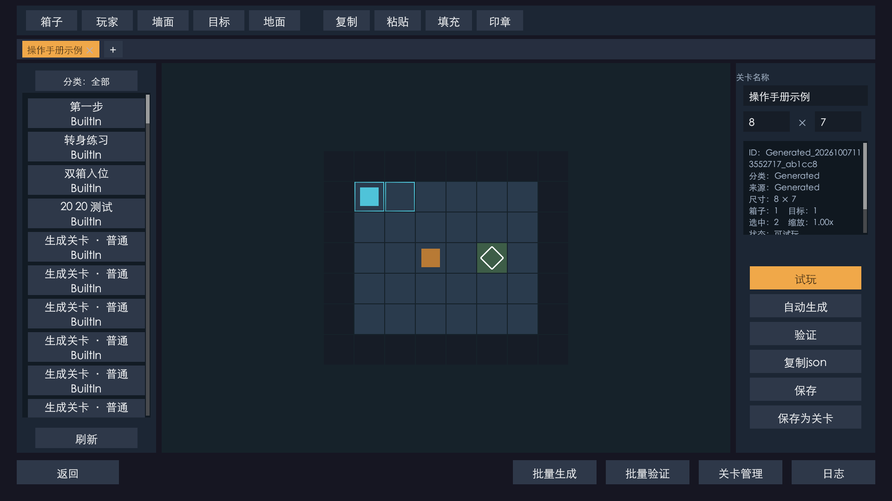

填充的顺序是：选好区域 → 选择笔刷 → 点击「填充」。选区内所有格子按该笔刷的分层规则更新，完成后选区清空。整次填充可以一次撤销。没有选区或没有笔刷时，右侧会提示原因。

玩家笔刷不适合整片填充，因为地图只允许一个玩家；连续设置玩家最终只保留一个起点。墙面和地面填充都会影响原有实体，应在填充后检查数量。

## 11 复制 剪切与粘贴

复制：选择区域 → 点击「复制」或 Ctrl+C → 点击「粘贴」或 Ctrl+V → 移动鼠标看虚影 → 左键落位。复制会保留源内容并清空选区；复制的整格包含地形、目标和实体。目标位置的整格内容会被覆盖。

普通粘贴为持续模式，可以多次落位。再次点粘贴、右键或 Esc 退出。剪贴板与印章画笔是不同的功能，使用印章不会把普通剪贴板清空。

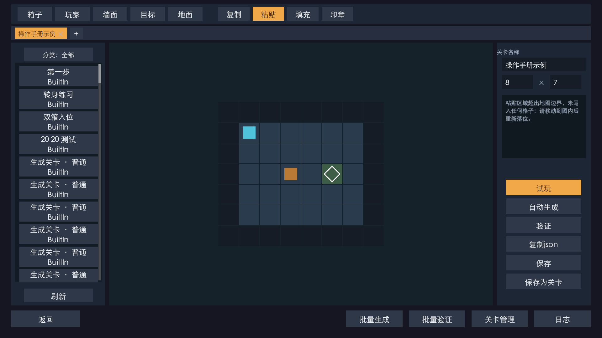

从 0.14.2 起，只要一个待粘贴格越出地图，整次放置就被拒绝，不写入任何格子，不增加撤销记录，也不消耗剪贴板。把虚影移回地图内再落位。粘贴锚点是所选区域包围框的左上角；不相邻选区的空隙不会自动补成实心区域。

剪切：选择区域 → Ctrl+X。源格立即变成地面，进入一次性粘贴；成功落位后自动退出。若剪切后改变主意，应按 Ctrl+Z 恢复源内容。**右键或 Esc 只退出当前模式，不会自动撤回已经执行的剪切。**

## 12 长按移动 撤销与视图

在已选择的区域内长按左键，编辑器会剪切整个选区并显示跟随鼠标的虚影；松开后，再在目标位置单击左键落位。未选区时，长按一个实体只剪切最上层，优先级为玩家、箱子、目标，下层目标可以留在原处。

复制/整区剪切覆盖完整格子；长按提起单个上层实体时，落位采用分层合并。例如把箱子搬到目标上会保留目标。

| 操作 | 输入 | 范围 |
| --- | --- | --- |
| 撤销 | Ctrl+Z | 当前页签，最多保留 100 次记录 |
| 缩放 | Ctrl + 滚轮 | 约 0.5–2.5 倍 |
| 平移 | 按住鼠标中键拖动 | 移动画布视图，不改变地图坐标 |
| 退出工具状态 | 右键 / Esc | 不等于撤销内容修改 |

当前没有重做，也没有 Ctrl+S 保存快捷键；保存请点击右侧按钮。撤销后旧求解结果会失效，需要重新验证。跨界面往返会保留编辑视图与文档，程序重启后不会恢复未保存会话。

## 13 保存 另存与试玩

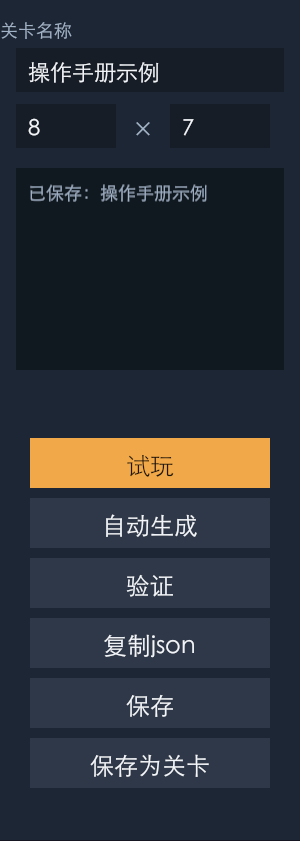

| 按钮 | 作用 | 使用时机 |
| --- | --- | --- |
| 保存 | 更新当前文档；新文档首次保存时创建关卡文件 | 定期保存当前工作 |
| 保存为关卡 | 生成新 ID 的独立副本并打开新页签 | 从已有布局制作变体，避免覆盖原关 |
| 复制json | 把当前文档 JSON 放到系统剪贴板 | 调试、备份文本、检查数据；不是文件导入 |
| 验证 | 检查结构并求解，记录结果 | 保存和试玩前核对 |
| 试玩 | 使用当前布局进入实际游戏 | 评估推箱手感、视野和真实流程 |
| 自动生成 | 打开单关生成表单 | 从参数创建新候选 |

普通关卡可以先保存为草稿，保存不代表已可解。试玩会检查结构；非法布局或已有可信无解结论会阻止进入。验证、绘制、改名等操作可能使文档再次出现未保存标记，应在确认后保存。

试玩使用当前内容的快照，不要求先覆盖磁盘关卡。返回编辑会保留打开文档、未保存内容、撤销与视图。试玩成绩不写入普通玩家成绩。

## 14 未保存关闭与退出保护

关闭带未保存标记的页签会弹出确认框。「保存并关闭」成功后关掉文档；「丢弃」关闭并放弃未保存修改；「取消」回到原文档。保存失败时保留文档和提示，不应反复点击丢弃来处理保存错误。

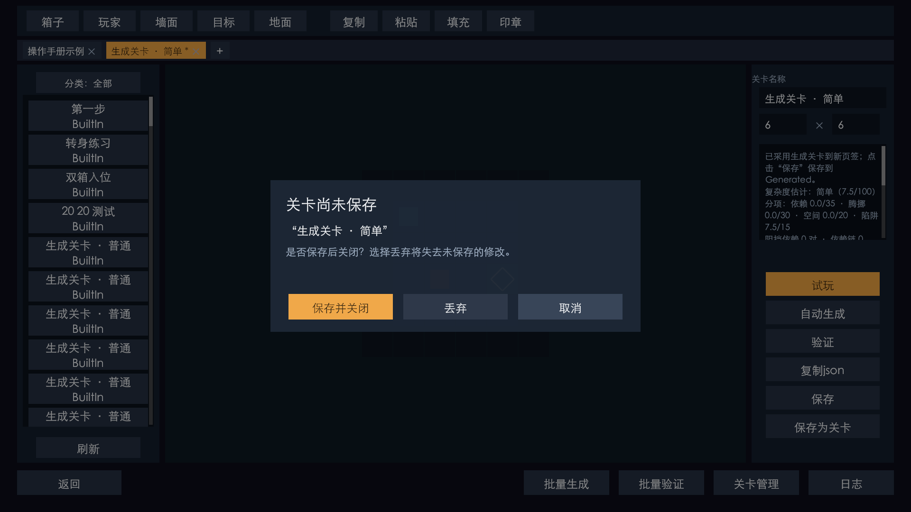

程序退出时，会统一检查所有未保存关卡与印章，可全部保存、丢弃或取消退出。通过界面返回其他场景时会保留会话，并不等于已经写入文件。

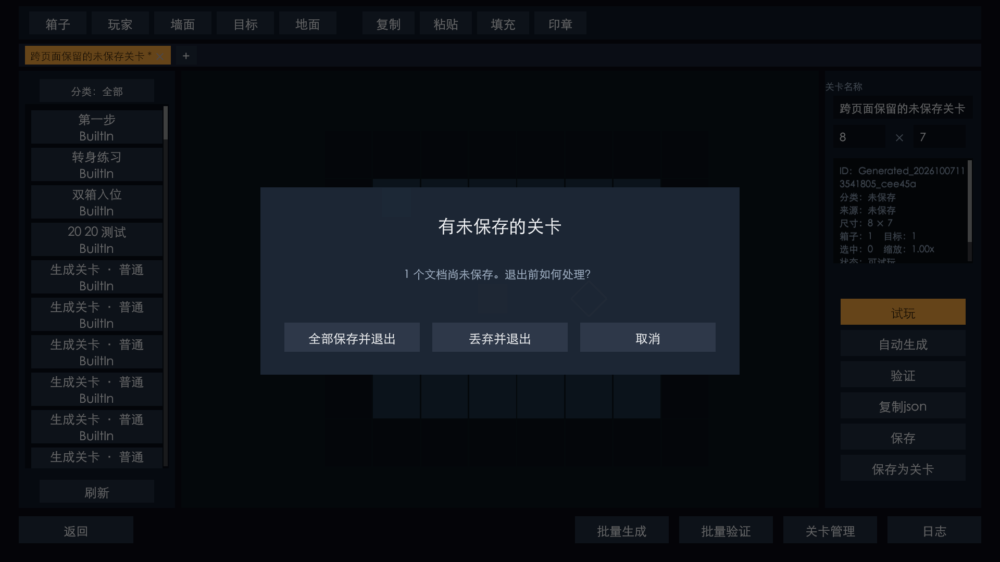

崩溃、断电或外部强制结束不能弹出此确认，也没有自动草稿恢复。制作中请定期保存；这是当前功能边界。

## 15 结构验证与可解性结果

点击「验证」后，左侧为棋盘，右侧为求解状态、统计、步骤列表和回放控件。非法布局会先给出错误，例如玩家无效、箱子/目标数量不匹配、实体位于墙内等。

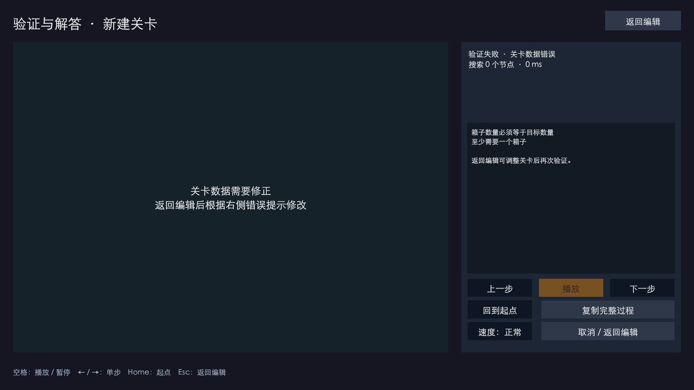

| 结果 | 含义 | 下一步 |
| --- | --- | --- |
| 可解 | 找到完整有效解答 | 回放确认，再保存 |
| 无解 | 搜索确认无法完成 | 修改布局后再验证 |
| 非法 | 数据不满足结构约束 | 按提示修正玩家、地形、箱子或目标 |
| 超时 / 搜索上限 | 预算内未能确定 | 不能当作无解；减少复杂度或调整验证预算 |
| 取消 | 用户中止 | 稍后重试 |
| 错误 | 执行失败 | 复制日志并检查工程或数据 |

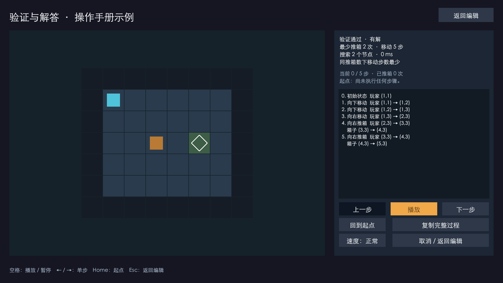

求解目标为**先最少推箱，再在这些解中最少总移动**。总移动包括推箱动作；不是忽略推箱次数后的全局最短走路路线。顶层解关步数 -1 表示未验证，0 表示合法零步解，不能把 0 当作“没有结果”。

本页验证的是当前文档快照。结果写回当前文档后会标为未保存；退出验证并点击保存，才能把新结果持久化。更改内容会使旧结果失效。

## 16 完整解答回放

回放只演示解答，不改写编辑中的起始布局。右侧步骤与当前状态会同步显示，适合检查箱子的先后关系和玩家绕行。

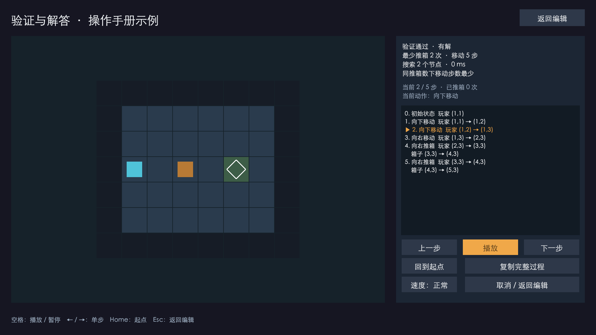

| 控件或按键 | 功能 |
| --- | --- |
| 播放 / 空格 | 自动播放与暂停 |
| 上一步 / 左方向键 | 回退一步 |
| 下一步 / 右方向键 | 前进一步 |
| 回到起点 / Home | 重置回放状态 |
| 速度 | 慢速、正常、快速切换 |
| 复制完整过程 | 复制求解统计与完整步骤文本 |
| 返回编辑 / Esc | 关闭回放；求解中使用时取消当前单关求解 |

从生成结果或批量验证进入回放时，查看的是对应结果快照，不必重新改变原关卡。

## 17 单关自动生成参数

点击右侧「自动生成」。左侧填写条件，右侧查看进度、预览和质量说明。默认箱子数和内部墙比例为空，表示由算法决定，不能把空值理解为 0。

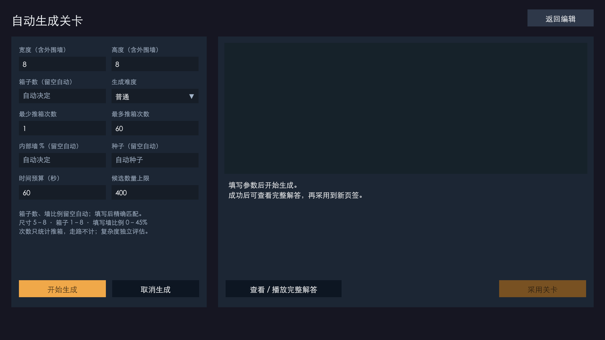

| 字段 | 范围或默认值 | 作用 |
| --- | --- | --- |
| 宽度 / 高度 | 各 5–8，默认 8×8 | 包括外围墙；与手工编辑的 3–40 范围不同 |
| 箱子数 | 空为自动；填写 1–8 | 填写时精确匹配，还要满足可用空间 |
| 生成难度 | 不限、简单、普通、困难，默认普通 | 根据复杂度评分筛选；不限仍显示评分 |
| 最少 / 最多推箱 | 1 ≤ 最少 ≤ 最多 ≤ 1000，默认 1–60 | 只统计推箱，普通走路不计入此范围 |
| 内部墙比例 | 空为自动；填写 0–45% | 按内部格数换算墙数量；0 表示没有内部墙 |
| 种子 | 空为自动或填写整数 | 同版本下用于复现随机序列 |
| 时间预算 | 1–300 秒，默认 60 | 单关最大搜索时间 |
| 候选上限 | 1–2000，默认 400 | 单关最多尝试的候选数量 |

一个便于演示的配置是 6×6、箱子 1、内部墙 0、推箱 1–15、难度不限、种子 42、预算 5 秒、候选 100。性能与时间截止可能影响最终候选，因此不要把不同机器上受时间截断的结果认定为绝对一致。

## 18 生成结果与采用

点击「开始生成」后等待状态更新。成功时显示实际箱数、墙数、推箱、移动、种子、布局质量和复杂度解释；可点「查看 / 播放完整解答」检查路线。

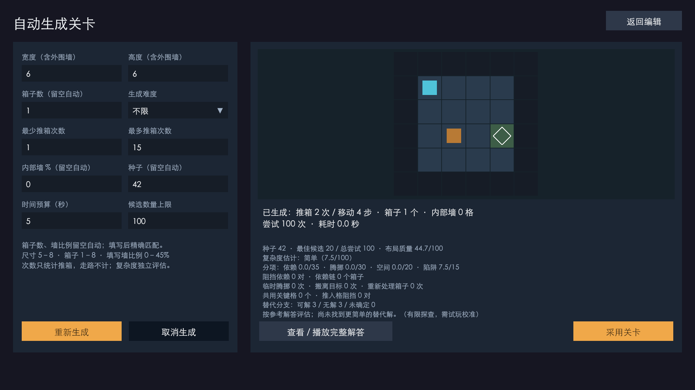

点击「采用关卡」会新建编辑页签，不覆盖原关卡。采用后的页签仍需保存；也可以继续修改。结果不匹配时不会自动放宽你的参数，也不会改坏正在编辑的地图。

复杂度主要考虑箱子依赖、腾挪规划、空间争用和失败分支，分档为简单小于 25、普通 25–49.99、困难不低于 50。布局质量是另一项评分，两者不能混用。自动评估不替代玩家试玩。

找不到结果时，先尝试难度不限、箱子/墙留空、更低的最少推箱次数；确认参数后再增加预算。单关任务点击「取消生成」或返回编辑会取消；批量任务的行为见下一节。

## 19 批量生成与结果保存

点击底部「批量生成」，参数与单关共用，额外提供生成数量 1–100。时间预算和候选上限均按每关计算，整批耗时可能显著增加。任务按顺序执行，没有并行和暂停。

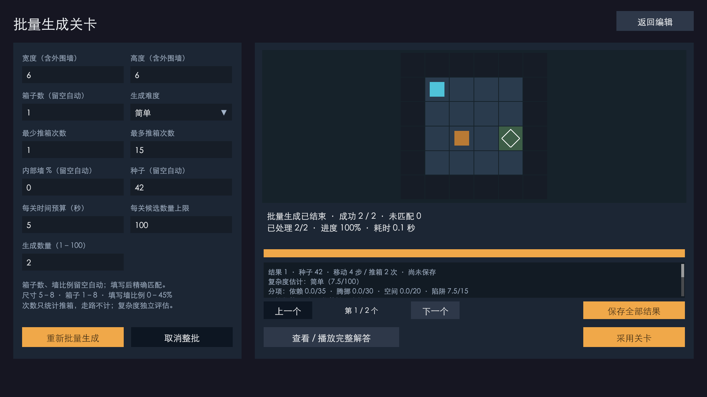

开始后可查看整批进度、逐关结果和失败原因。「上一个」「下一个」切换预览；「采用关卡」把当前成功结果放进新页签；「保存全部结果」保存成功结果，避免覆盖已有文件。批次内会做布局去重。

「取消生成」请求取消余下工作，已完成的结果仍可查看或保存。返回编辑或切到其他场景不会停止批量任务；完成后出现底部通知，点击通知可回到结果页。

任务和未保存结果只保留在本次程序运行中。退出程序不会在下次启动自动续跑，重要结果请先保存。

## 20 关卡管理 分类与公开

底部「关卡管理」打开管理页。左侧是分类列表及每个分类的公开开关，右侧是关卡表。表中“分类”是策划组织方式，“来源”是存储来源，二者可以不同。

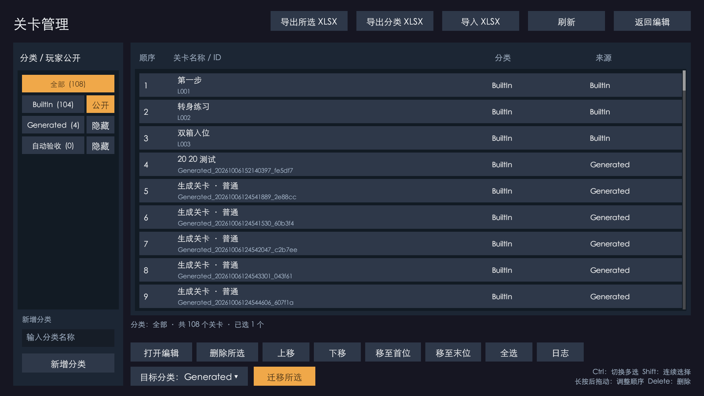

新增分类：在左下输入分类名称 → 点击「新增分类」。筛选：点击分类名称；「全部」显示所有可见关卡。公开：点击分类旁的公开状态按钮，控制该分类内容是否出现在普通玩家选关及下一关流程。

**公开操作会对整个分类生效。** 推荐先建立“草稿”和“正式”两个分类，在草稿中制作、验证，再迁移到正式分类并公开。分类公开不会自动证明其中每关合法或可解，应先批量验证和人工试玩。

点击「打开编辑」可将选中关卡打开到编辑器页签。当前公开 BuiltIn 分类中包含大量生成内容和一个测试名称关卡；这份手册不会替你删掉或重新排序原有内容。

## 21 多选 迁移与排序

| 输入 | 选择行为 |
| --- | --- |
| 单击一行 | 选择该关卡 |
| Ctrl + 单击 | 切换该行是否加入选中 |
| Shift + 单击 | 从锚点连续选中 |
| Ctrl + Shift | 合并连续范围 |
| 全选 / Ctrl+A | 选中当前筛选列表 |
| 方向键 | 移动选择；Ctrl 可仅移动焦点 |
| Enter | 在关卡行上打开编辑 |
| Delete | 请求删除，仍需确认 |

迁移步骤：选择关卡 → 点击底部目标分类按钮 → 选择目标分类 → 点击「迁移所选」。迁移分类不等于另存一个关卡，ID 和原布局不因此改变。

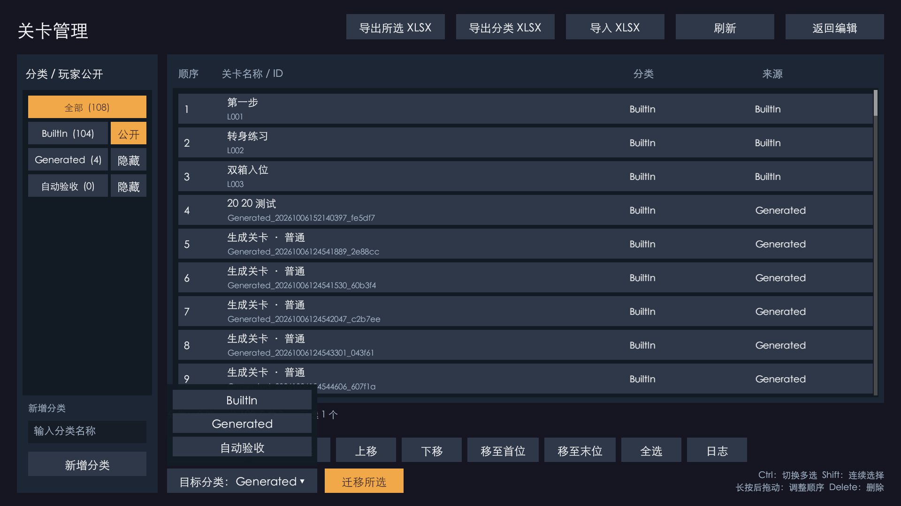

排序可用「上移」「下移」「移至首位」「移至末位」，也可按住关卡行稍候再拖动。看到插入标记后释放；拖到列表边缘会滚动。短距离直接拖动可能被判为列表滚动，因此先等长按触发。Esc 可取消正在进行的拖动。

排序基于当前列表视图；公开分类的顺序影响玩家流程。移动多选组前建议先筛选到要编排的分类。

## 22 删除确认与管理恢复

选择关卡后点击「删除所选」或 Delete，确认框会提示删除范围。只有点「确认删除」才执行；不确定时点「取消」。删除不是编辑器 Ctrl+Z 能恢复的画布动作。

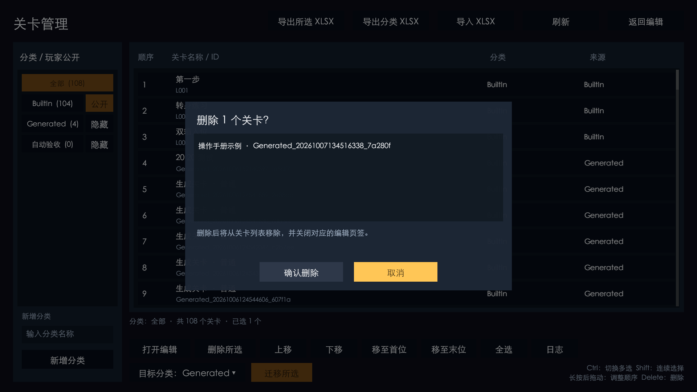

独立运行版不会改写安装包内资源：删除已打包关卡通过本地删除标记实现；自建文件和索引操作有备份机制。恢复属于数据维护操作，当前没有一键回收站界面。操作前可保存关卡 JSON 或备份持久目录。

修改分类/排序后可点击「刷新」重载列表。若文件由外部程序变更，先保存或另存当前编辑页签，再刷新，避免把旧页签当成磁盘最新内容。

## 23 批量验证与写回

点击底部「批量验证」。在左侧筛选分类，使用单选、多选或全选确定范围，设置每关时间预算 1–300 秒，然后点击「验证所选关卡」。

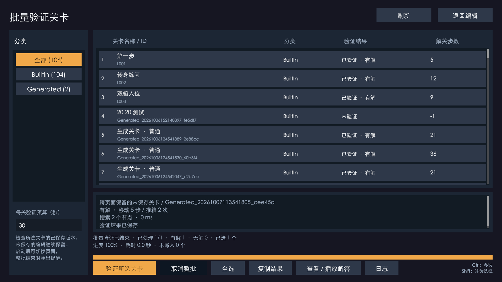

表中逐关显示可解、无解、非法、超时、取消等状态及相关统计。选中已求解结果后，可点「查看 / 播放解答」；「复制结果」导出文本报告，「日志」查看执行过程。

这里验证的是**已保存文件的快照**，未保存页签修改不会自动参与。开始前先保存相关文档。写回前会检查文件是否被修改或删除；检测冲突时保留报告，避免覆盖新文件。报告中的未写回应单独检查。

「取消整批」中止剩余工作，返回编辑或换场景不会停止整批任务。完成通知可把你带回结果页。超时不是无解；可以针对未确定关卡重新选择并提高每关预算。

## 24 印章库与重复放置

点击顶部「印章」打开印章库。左侧选择预设，右侧预览，底部提供新建、从选区创建、编辑和使用。内置直角墙、箱子与目标、地面区域等示例。没有打开关卡时可以制作印章，但不能直接使用到画布。

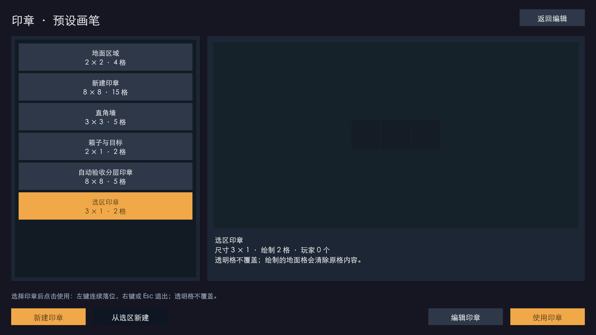

使用步骤：先打开目标关卡 → 选择印章 → 点击「使用印章」→ 移动鼠标看虚影 → 左键重复放置 → 右键或 Esc 退出。每次放置作为一个完整撤销动作。

印章的鼠标锚点为**最上方一行中最左边的已绘制格**，不包含透明边距。任意已绘制格越界时整次拒绝。透明格不会清掉下方内容，明确画出的地面会清空下方内容。

印章包含玩家时，放置会移动关卡的唯一玩家。批量盖章后请重新检查目标、箱子和玩家数量并验证；印章有效不等于被盖出的关卡可解。

## 25 新建与编辑印章

点击「新建印章」进入独立制作页签，背景棋盘格表示透明。可使用普通笔刷、选区、复制剪切粘贴、填充、尺寸调整与撤销；顶部额外出现「透明」按钮。

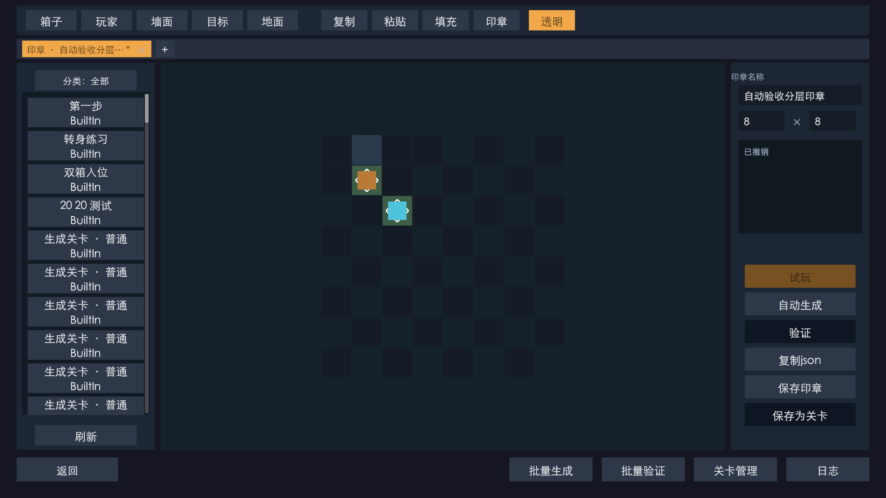

「透明」恢复未绘制状态，放置时穿透保留目标内容；「地面」是一格明确的内容，会擦除目标格中的实体和目标。这是两者最关键的区别。

印章尺寸为 1–40，至少绘制一格；最多一个玩家，不要求有外围墙，也不要求箱子数等于目标数。箱子或玩家可与目标叠层。填写名称后点击「保存印章」，保存后可在库中重复使用。试玩、关卡求解等不适用于印章文档。

从选区创建：在普通关卡中选择区域 → 打开印章库 → 点击「从选区新建」→ 命名并保存。不相邻格形成稀疏印章，未选空隙保持透明。印章不会写入关卡列表，也不会成为玩家可选关卡。

制作印章的页签同样有未保存关闭和退出保护。关闭全部文档后，印章库仍可打开；图下示例展示无打开文档时的库界面。

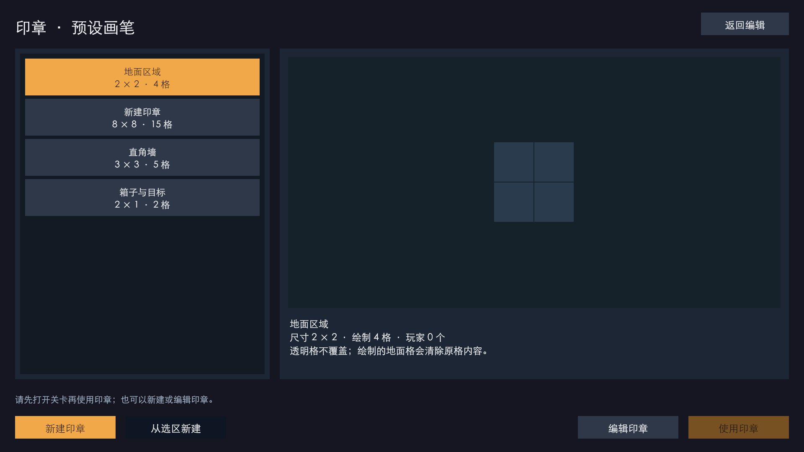

## 26 分类筛选 日志与任务通知

编辑器左侧「分类」只过滤当前资源列表，不修改关卡分类，不改变普通玩家公开状态。完成分类迁移后可点「刷新」重新显示。

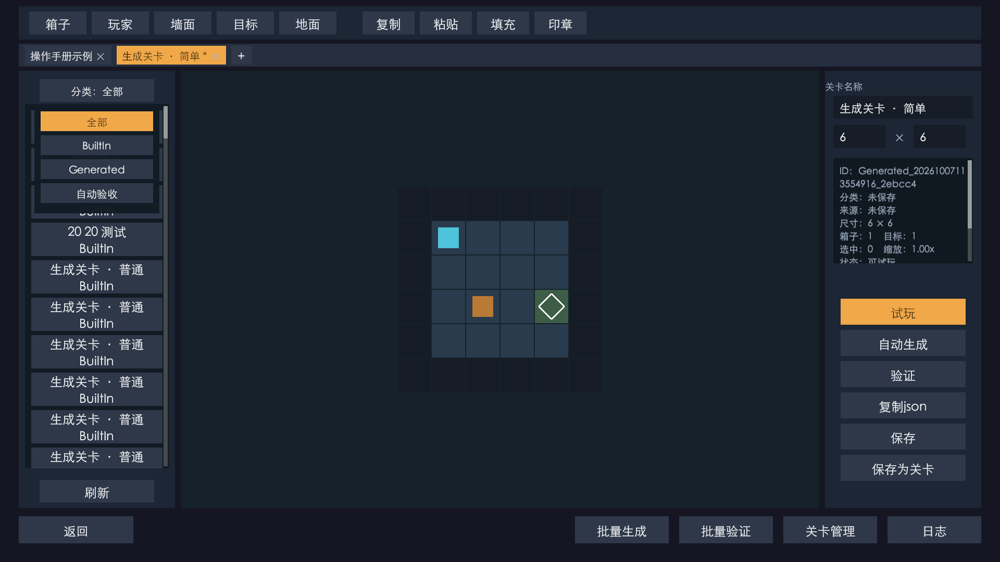

底部「日志」记录本次运行的绘制、保存、求解、生成和管理操作。可复制日志用于复现问题，也可清空日志显示。清空日志不删除关卡或玩家成绩。

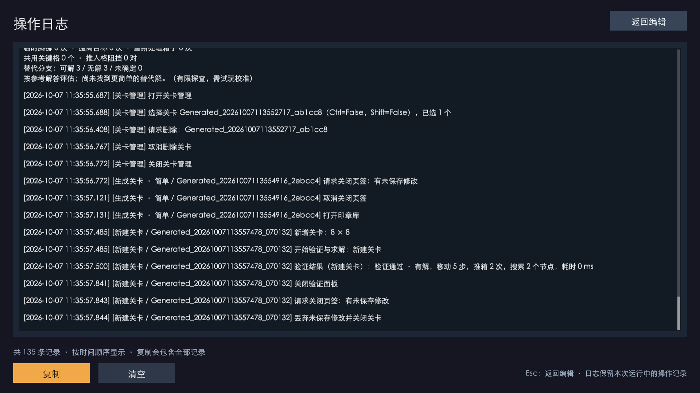

批量生成和验证可在后台继续；任务结束会显示通知。点击查看回到对应页面。通知不是跨程序重启的任务记录，关闭程序前请保存结果并复制需要的报告。

## 27 保存位置与备份

| 数据 | Unity 编辑器运行 | Windows 独立运行 |
| --- | --- | --- |
| 关卡及分类索引 | Assets/Resources/data/level | 持久目录 / level，本地同 ID 覆盖打包内容 |
| 自建印章 | Assets/Resources/data/Stamps | 持久目录 / Stamps |
| 玩家进度和成绩 | 持久目录 / progress.json | 同左 |
| 音量与画面偏好 | Unity PlayerPrefs | Unity PlayerPrefs |

当前 Windows 持久目录为 `%USERPROFILE%/AppData/LocalLow/flourgame/KuroTest`，对应工程中的公司名 flourgame、产品名 KuroTest。早期版本使用 `%USERPROFILE%/AppData/LocalLow/DefaultCompany/kuluobishi`；如需沿用旧存档，请先退出游戏并备份，再将旧目录中的关卡、印章和进度文件复制到新目录。音量与显示等 PlayerPrefs 偏好不随这些文件迁移。

Unity 里直接保存会写入工程资源，因此正式制作前建议备份或建立版本管理。独立运行版不向安装目录写入自建内容。关卡与印章均为 JSON；只把 JSON 文本复制出来，不等于已经保存到关卡库。

## 28 常见问题与操作速查

| 现象 | 原因或处理 |
| --- | --- |
| 找不到编辑器 | 按 = 显示 GM，再展开菜单；或直接运行 editor.unity |
| 拖动画布没有画出墙 | 拖动是框选，先选区再点墙面和填充 |
| 复制后没有虚影 | 复制和粘贴是两步；还需点击粘贴 / Ctrl+V |
| 粘贴点到边缘无变化 | 有格越界，已整次拒绝；移回地图内 |
| Esc 后剪切源没有回来 | Esc 只退模式，用 Ctrl+Z 撤销剪切 |
| 保存了但玩家看不见 | 关卡所在分类未公开，或未走正常解锁流程 |
| 验证通过却仍有 * | 验证结果修改了文档，返回后再次保存 |
| 超时是否说明无解 | 不能；它表示本次预算内未确定 |
| 自动生成总失败 | 检查尺寸与结构约束，降低推箱下限、放宽难度或增加预算 |
| 返回编辑后任务还运行 | 批量任务设计为后台继续，点取消整批才停止 |
| 改了关卡但批量验证像没变 | 批验证读取已保存快照，先保存再重新开始 |
| 关闭动画后仍能移动和回放 | 正常；该选项关闭视觉过渡，玩法、回放步骤、计时和音效继续执行 |
| 快捷键不响应 | 先结束输入框编辑、关闭模态界面，并让 Game 窗口获得焦点 |
| 退出后未保存页签消失 | 未保存会话不跨进程保留，没有自动草稿恢复 |

推荐日常顺序：新建或打开 → 编辑 → 验证 → 回放 → 保存 → 试玩 → 分类管理与公开 → 普通玩家流程验收。复制日志时同时记录关卡 ID、实际输入、期望结果、出现问题的界面及分辨率，可提高复现效率。

## 29 粘贴 JSON 导入单个关卡

编辑器顶部工具栏中，「印章」右侧留有间距的「导入 JSON」可在没有打开文档时使用。点击后，把完整关卡 JSON 粘贴到文本框；也可点击「粘贴剪贴板」。本项目「复制json」输出的关卡配置可以直接使用，印章配置不能作为关卡导入。

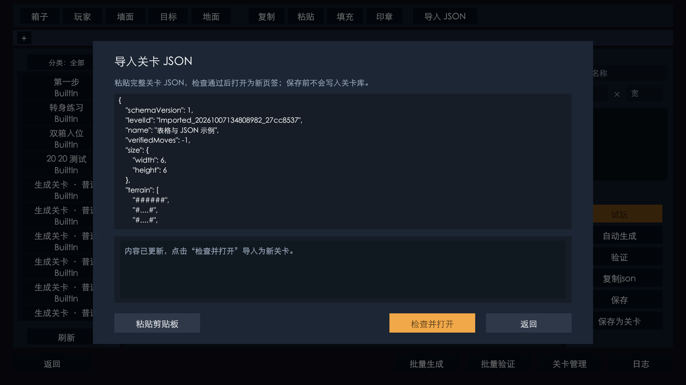

点击「检查并打开」，通过检查后会建立一个新页签，带有未保存标记。导入关卡获得新 ID，不覆盖同 ID 的原关卡，也不替换当前页签；点击「保存」才写入关卡库。点击「返回」或按 Esc 关闭窗口。

必需字段为 size、terrain、player、boxes、goals。尺寸须为 3–40，terrain 使用 # 表示墙、. 表示地面；玩家、箱子和目标须位于合法地面，箱子数等于目标数且至少有一个箱子。解析失败时窗口保留文本，并显示具体原因。此处只检查结构，可解性需导入后点击「验证」确认。

## 30 从关卡管理导出 XLSX

进入「关卡管理」，顶部增加三个按钮：「导出所选 XLSX」「导出分类 XLSX」「导入 XLSX」。导出所选需要先选择关卡；导出分类包含当前筛选分类的全部关卡，筛选「全部」时导出整个列表。

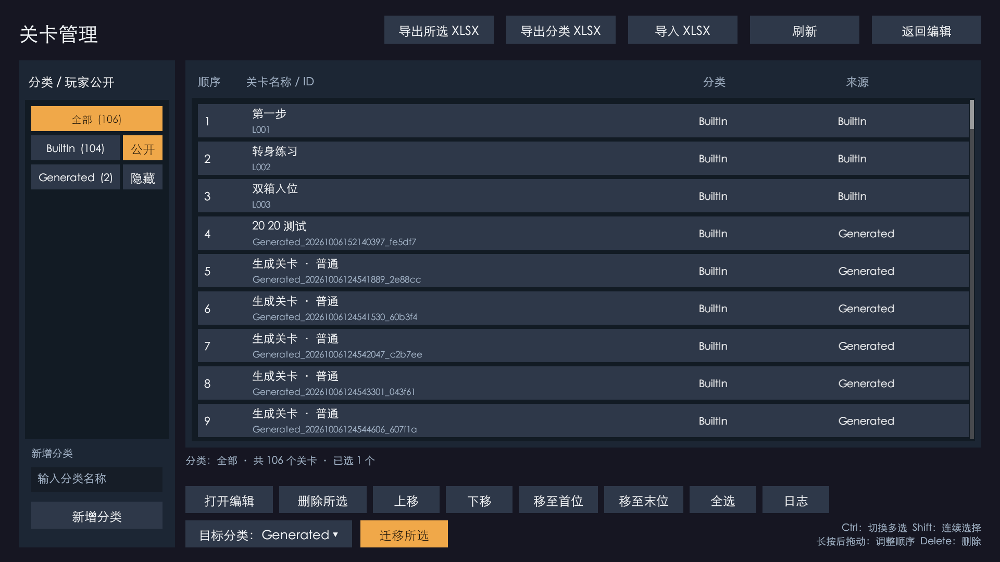

点击导出按钮后，可通过「选择保存位置」打开系统文件窗口，也可填写以 .xlsx 结尾的完整路径。点击「导出文件」完成保存；目标文件已存在时，需要再次点击「确认覆盖并导出」。导出读取的是已保存内容，修改过的页签请先保存。


| 列 | 作用 |
| --- | --- |
| ID | 原关卡标识，供追溯；重新导入时会生成新 ID |
| 名称 | 显示名称，可直接在表格里修改；导入时优先于 JSON 中的名称 |
| 分类 | 导入后的分类；留空使用 Generated，不存在的分类会创建 |
| 顺序 | 正整数，决定本次导入关卡的先后；留空使用表格行顺序 |
| 宽 / 高 / 箱子数 | 地图概览，仅供查看；修改地图需要编辑配置JSON |
| 推箱次数 / 验证步数 | 已有求解信息概览，不以这些表格列修改关卡的验证结果 |
| 配置JSON | 完整关卡配置，包含布局、元数据、生成信息及已有解答 |

每次最多处理 5000 个关卡。Excel 单元格最多容纳 32767 个字符，超出时导出会提示，已有文件保持完整。导出的文件可在支持 XLSX 的表格软件中打开，游戏读写表格不需要安装 Excel。

## 31 从 XLSX 导入关卡

点击「导入 XLSX」→「选择 XLSX」，或填写文件完整路径 →「读取并预览」。系统读取第一张工作表，第一行为表头；至少须有「配置JSON」列，可选「名称」「分类」「顺序」。也兼容 name、configJson、category、order 英文表头。只有「名称」与「配置JSON」两列的表格也可使用。

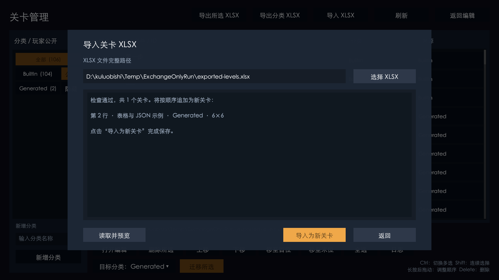

预览显示关卡数量、名称、分类及尺寸。任意一行有格式或结构错误，整表不导入，提示对应行号；修正文件后再次读取。空白行会跳过，公式须转换为值，重复的必要表头会被拒绝。单个 XLSX 文件最多 32 MB，不能使用加密工作簿。

检查通过后点击「导入为新关卡」，关卡按顺序追加到库中，并自动选中新导入项，可点击「打开编辑」。每个关卡分配新 ID，原关卡与已打开文档保留。新分类默认隐藏，已有分类沿用其公开设置；要让玩家看到内容，再按需要设置「公开」。

导入确认使用刚才预览的内容。预览后在表格软件中修改了文件，需要再点一次「读取并预览」；修改窗口内的路径会使旧预览失效。写入失败时撤回本次新建关卡，不留下已导入一半的分类索引。

可先使用[示例 XLSX](examples/Sokoban-Levels.xlsx)练习整表导入，或将[示例关卡 JSON](examples/Level.json)的文本粘贴到 JSON 导入窗口。
