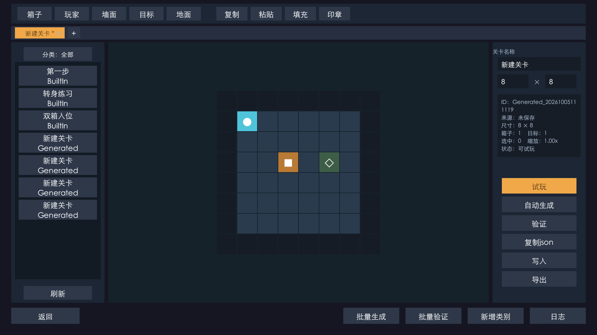
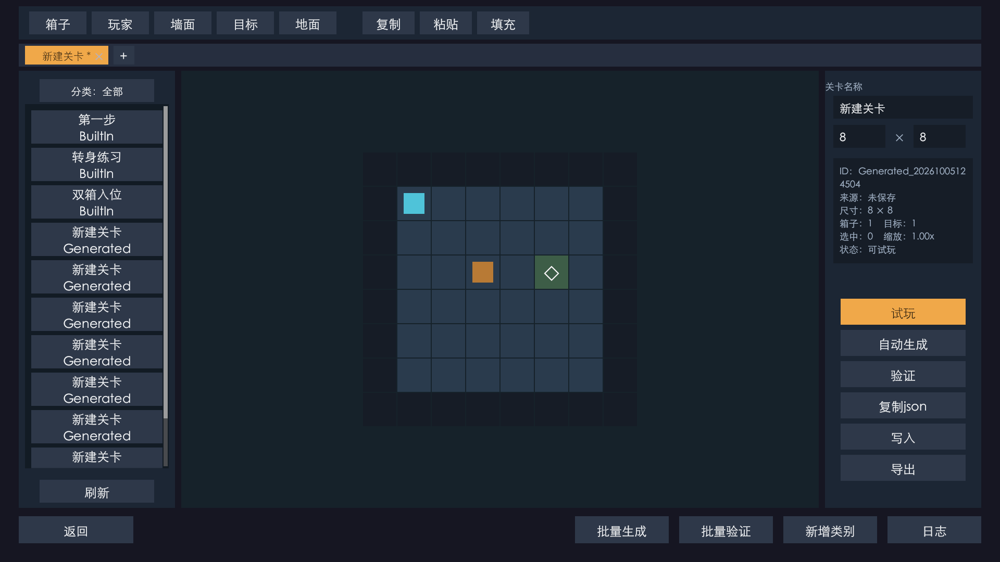

# 编辑器演进

## 从画布到多文档

0.3.x 阶段围绕工具栏、资源列表与编辑画布调整布局，并处理页签、选择操作和界面遮挡。画布使用逻辑色块显示墙、地面、箱子、目标与玩家，使关卡结构容易辨认。

绘制与选择承担不同任务：点击用于落笔，拖动用于框选，再通过填充、复制、剪切、粘贴处理选区。长按移动选区适合局部结构调整。剪贴板包含格子内容，越界粘贴整次拒绝，避免只写入部分内容而破坏结构。

多页签为每个文档保留内容、选择与撤销状态。修改后的文档显示未保存标记；关闭、退出和保存失败都围绕保留内容处理。会话保留于当前进程，文件保存负责跨次运行的持久化。

## 编辑、求解与试玩衔接

编辑器求解先检查地图结构，再计算解答；回放把完整走路与推动序列转换为可观察的步骤，方便发现绕路、依赖顺序和关键推动。实际试玩复用游戏场景，返回后继续编辑。

修改内容会让旧解答和难度指标失效，防止界面继续展示与当前地图不一致的结果。批量验证读取已保存快照，写回前检查文件是否变化。

## 从单张地图到内容库

分类与排序由独立索引管理，关卡文件位置不决定玩家可见性。「公开」决定分类是否进入玩家关卡流程，随后结合解锁进度生成选关与下一关顺序。删除保留备份，批量迁移和验证用于整理大量生成内容。

批量生成、验证的任务服务独立于页面，因此切换界面后仍可计算。结果通过通知和日志反馈，取消由任务令牌传递到计算过程。

## 印章复用

印章将常用局部结构从完整关卡中分离出来。它可以由空白文档制作，也可以从选区创建；未选中的间隙保持透明，箱子与目标等内容允许叠层。放置印章复用画布的编辑与撤销流程，印章库与关卡库分别存储。

功能操作见[图文手册](../USER_MANUAL.md)，代码分工见[技术结构](../TECHNICAL_OVERVIEW.md)。

## 内容交换

为方便在表格中整理内容，关卡管理增加 XLSX 导出和导入：名称、分类、顺序是便于编辑的列，配置JSON保存完整关卡。导入先预览检查，再按新 ID 追加，避免同一份表格重新导入时覆盖原关卡或改变玩家成绩对应关系。

主界面的 JSON 粘贴入口用于单关交换，通过结构检查后作为未保存文档打开。两种导入方式共用严格解析规则，文件写入与索引提交由交换模块处理，界面只负责路径选择、预览、确认和结果提示。
