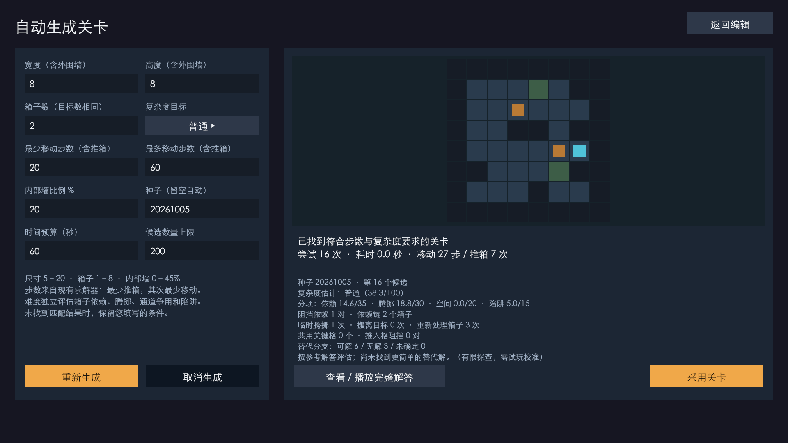

# 求解与生成的演进

## 先明确求解目标

求解器按「推箱次数、总移动次数」的字典序寻找最优解：首先减少推动，在同样推动次数下再减少走路。A* 搜索推箱动作，BFS 判断玩家能否到达箱子后方，并保留完整移动路径供回放使用。

搜索使用箱子到目标的反向距离、匹配下界与安全死锁剪枝，降低无效分支。0.4 阶段的设计参考过 SokoSolve、JSoko 的公开思路，未直接复制其实现。求解预算耗尽意味着本次未确定结果，不能当作无解。

## 生成策略的迭代

| 阶段 | 探索方向 | 与当前实现的关系 |
| --- | --- | --- |
| 0.5 | 从完成状态反向拉箱形成题面 | 早期方案，已不作为当前生成核心 |
| 0.12 | 增量变异与候选池筛选 | 中间方案，已由后续实现替代 |
| 0.13 起 | 逐步增加墙、箱子与目标，依靠构造求解反馈保留或回退 | 当前单关、批量共用的生成核心 |

当前流程为：**创建空房间 → 按权重增加结构 → 构造求解 → 保留或回退 → 候选质量筛选 → 本项目求解器复核 → 预览或批量保存**。

生成尺寸为 5–8，手工关卡尺寸为 3–40。推箱范围是解答约束；复杂度按依赖关系、规划腾挪、空间争用、失败分支估算，权重分别为 35%、30%、20%、15%；质量评分另行描述结构特征。三者分开显示与筛选。

## 参考实现与移植

当前生成器参考 [huanggaole/AutoGenerateSokobanLevel](https://github.com/huanggaole/AutoGenerateSokobanLevel) 的 [HTML_Sokoban 固定版本](https://github.com/huanggaole/AutoGenerateSokobanLevel/tree/4ccf418633cf47e153436723c45518ea60f8cfa9/HTML_Sokoban)，将构造、评分与回退逻辑接入 C# 数据模型。

| 参考文件 | 本项目对应实现 |
| --- | --- |
| AILevelGenerator.js | SokobanHtmlGenerationSearch.cs |
| GenerateLevel.js | SokobanHtmlGenerationLayout.cs |
| Solver.js、State.js、StateNode.js | SokobanHtmlConstructionSolver.cs |
| LevelQualityEvaluator.js | SokobanHtmlGenerationQuality.cs |
| ProgressiveFallbackGenerator.js | SokobanHtmlGenerationFallback.cs |
| default-settings.json | SokobanHtmlGenerationProfile |

参考仓库未随附已确认的 LICENSE，不将其声明为 MIT 授权；完整来源见[素材与参考说明](../../THIRD_PARTY_NOTICES.md)。

## 批量生产与可复现信息

单关与批量调用同一生成策略。批量层增加数量、去重、进度、取消与保存，逐关种子使用基础种子加 `index × 104729` 偏移。生成请求、种子、生成器版本与解答随关卡 JSON 保存，便于追溯参数。参考仓库及提交版本统一记录在项目文档中，不写入每个关卡；候选编号、尝试次数、搜索节点数与耗时仅用于运行时进度和报告。

关卡编辑后，旧解答、复杂度和质量指标失效，需要再次求解。自动生成提供可筛选的候选内容，回放与试玩用于判断实际体验。
