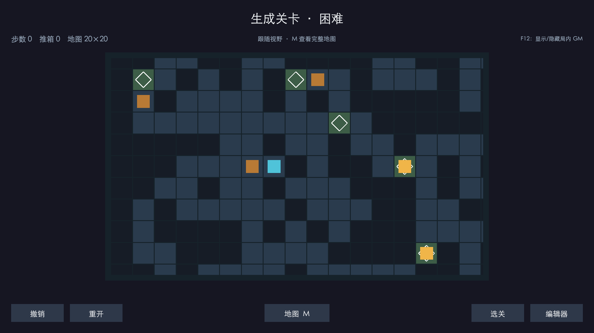
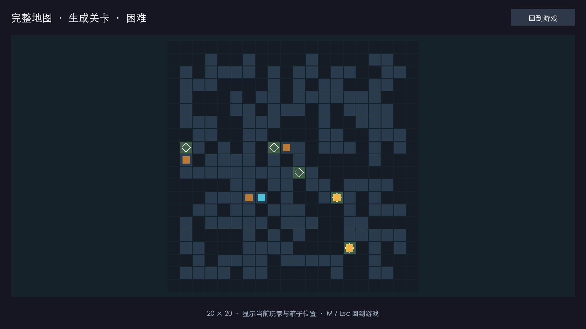
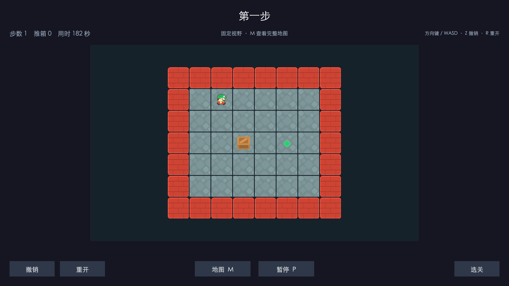
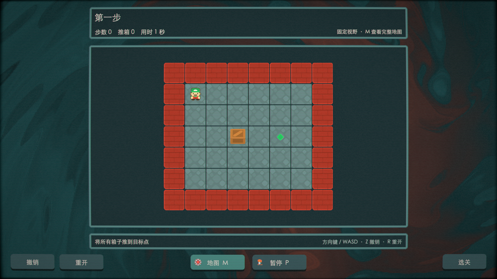
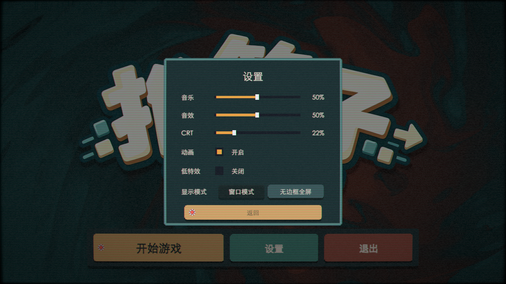

# 表现层演进

## 地图视野

小地图直接完整显示；地图超过 14×10 的任一尺寸后，镜头跟随玩家并限制在边界内。整图模式用于观察全局，打开时暂时屏蔽移动输入，关闭后恢复游玩。

## 场景与棋盘预制体

0.14.0 将游戏界面整理为场景中的 UI 与引用，棋盘则根据关卡数据逐格创建预制体。场景烘焙工具位于 `Assets/Scripts/Game/Editor`，用于开发期生成结构；运行时通过 `SokobanBoardView` 构建棋盘。

实体根节点对应规则格子，内部视觉节点承担移动过渡、倾斜和缩放。规则不等待动画完成才更新，也不从视觉坐标反推箱子位置。0.14.1 增加长按连续移动，让操作节奏与移动反馈衔接。

## 交互与视觉反馈

按钮把点击区域与视觉层分开：悬停或按下可以改变图形，但不让缩放后的边界影响点击。圆形转场统一处理场景切换，箱子入位、推动与按钮交互配合音效。CRT 的显示畸变同时映射鼠标采样位置，使显示与交互对应。

背景、面板、图标和部分声音参考或使用 Balatro 资源；具体归属见[来源说明](../../THIRD_PARTY_NOTICES.md)。开始界面 Logo 使用 AI 生成图，视觉需求保留在 [Logo 提示词](../StartLogo-Prompt.md) 中。

## 动画设置

`SokobanAnimationSettings` 统一保存动画偏好并通知表现组件。关闭时立即完成正在进行的移动、弹窗和转场，清理粒子，背景与 Shader 使用的视觉时钟停止推进。玩法计时、音效与求解回放的步骤节奏各自运行，避免把暂停全局时间误当成关闭动画。

## 桌面窗口与界面适配

Windows 运行版在主菜单和游戏暂停菜单的设置中提供窗口模式、无边框全屏。窗口默认 1280×720，可拖动边缘缩放；低于最小尺寸时自动恢复。显示模式与窗口尺寸分别保存，进入全屏不会覆盖原来的窗口尺寸，下次启动恢复上次选择。

`SokobanDisplaySettings` 统一处理显示切换与尺寸保存，等待系统窗口尺寸稳定后再记录，避免把切换中的临时尺寸写入偏好。界面继续使用 1920×1080 参考布局与 CanvasScaler 的 Expand 缩放方式，兼容不同宽高比。编辑器不增加设置入口，沿用窗口缩放，调整窗口不改变正在编辑的关卡。

