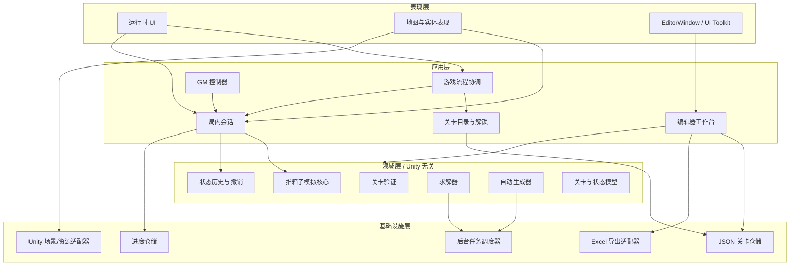
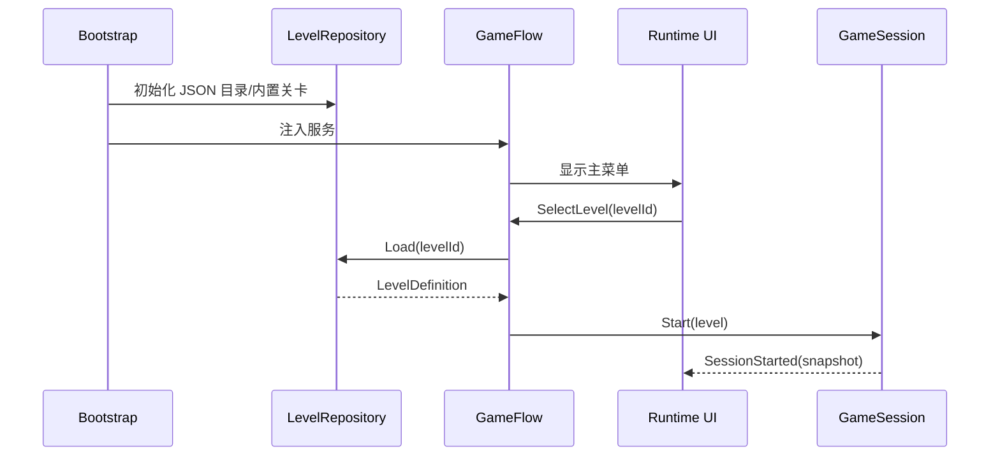
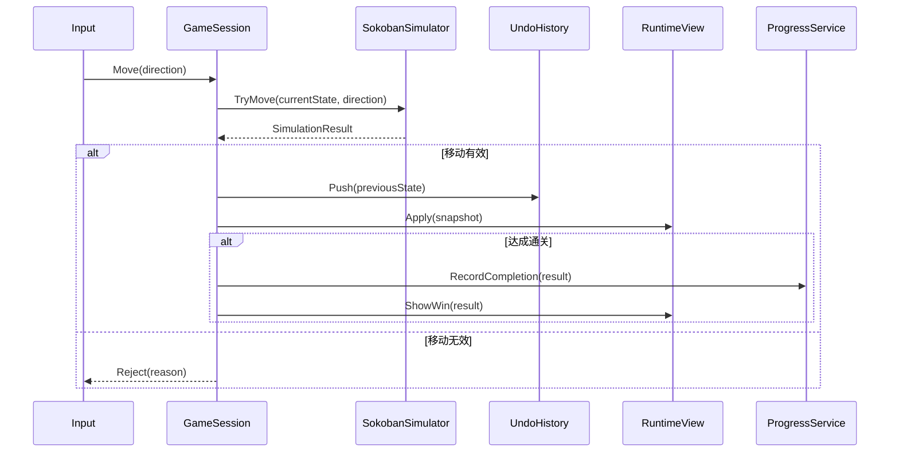
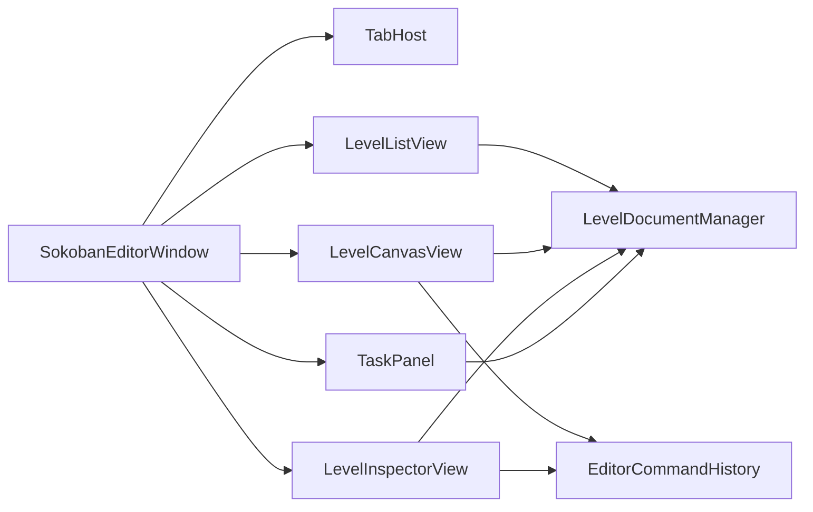

> 历史阶段记录：以下内容反映对应版本的设计与实现过程。当前功能和操作请阅读[新版操作手册](../../USER_MANUAL.md)。

# 推箱子基础版本架构设计

> 文档类型：Architecture Design Document  
> 关联规格：[Sokoban-SDD.md](Sokoban-SDD.md)  
> 版本：0.1.0  
> 状态：Draft / 基础架构基线  
> 最后更新：2026-10-04  
> 工程基线：Unity 2022.3.51f1c1

## 1. 设计目标

这份文档把 SDD 0.2.2 的范围转换成可实现的基础架构。它冻结模块职责、依赖方向、数据流和关键接口，后续代码、测试和编辑器实现都以此为边界。

基础版本的重点是：

- 推箱子规则可以脱离 Unity 场景运行和测试。
- 正式游戏与编辑器试玩使用同一套模拟核心。
- JSON 是关卡的唯一源数据格式；Unity 资产和 Excel 都是适配层。
- 求解、生成和批处理不会阻塞 Unity 主线程。
- GM、撤销、编辑器撤销和后台任务结果互不污染。
- 允许后续替换 UI、美术和存储实现，不改变领域规则。

## 2. 约束与已确认决策

| 项目 | 决策 |
|---|---|
| 平台 | Windows Standalone；编辑器运行在 Unity Editor |
| 编辑器形态 | 仅 Unity EditorWindow + UI Toolkit |
| GM | 所有构建保留，通过隐藏开关启用；默认不显示入口 |
| 求解目标 | 先最少推箱数，再最少步数 |
| 自动生成 | 随机候选 + 验证 + 求解筛选 + 哈希去重 |
| JSON | 每个关卡一个 JSON，地形/实体分层，左上角为坐标原点 |
| Excel | 一个 `.xlsx`，单工作表，每个非空单元格保存一个完整关卡 JSON |
| 并行 | 按关卡拆分任务，默认最大并发数为 CPU 核心数减一 |
| 运行时撤销 | 只作用于当前尝试，不跨关卡保存 |

## 3. 总体架构

采用分层架构，依赖只能从上层指向下层的抽象或稳定数据结构。Unity 表现层和编辑器层不能直接实现推箱子规则。



### 3.1 依赖规则

1. `Domain` 不引用 `UnityEngine`、`UnityEditor`、UI Toolkit 或文件系统 API。
2. `Application` 只依赖领域接口和基础设施接口，不依赖具体 GameObject。
3. `Presentation` 只负责显示和输入转换，不直接改变领域状态。
4. `Editor` 代码只能放在 Editor 程序集中，不能被 Standalone 运行时引用。
5. 后台任务只使用不可变快照和可序列化 DTO；Unity 对象和 UI 更新必须回到主线程。
6. JSON 仓储是关卡源数据的读写入口，其他格式通过适配器转换。

## 4. 程序集与目录结构

基础版本按职责拆分目录；若后续创建 asmdef，程序集名称沿用下表。

```text
Assets/
├─ game_script/
│  ├─ Domain/
│  │  ├─ Grid/                 # GridCoord、Direction、网格工具
│  │  ├─ Level/                # LevelDefinition、快照、元数据
│  │  ├─ Simulation/           # SokobanSimulator、MoveResult
│  │  ├─ History/              # UndoHistory、状态快照栈
│  │  ├─ Validation/           # LevelValidator、诊断结果
│  │  ├─ Solver/               # Solver、剪枝、SolveResult
│  │  └─ Generation/           # LevelGenerator、生成参数/结果
│  ├─ Application/
│  │  ├─ Bootstrap/             # 服务组合根、启动初始化
│  │  ├─ Runtime/               # GameFlow、GameSession、LevelCatalog
│  │  ├─ Progress/              # 进度用例和设置用例
│  │  └─ GM/                    # GM 命令与隐藏开关
│  ├─ Infrastructure/
│  │  ├─ Json/                 # JSON 序列化和 LevelRepository
│  │  ├─ Save/                 # 本地进度存储
│  │  ├─ Jobs/                 # JobScheduler、主线程回调队列
│  │  └─ Unity/                # 场景、资源、时间、输入适配
│  ├─ Presentation/
│  │  ├─ Runtime/              # 地图、玩家、箱子、动画、相机
│  │  └─ UI/                   # 主菜单、HUD、通关、暂停
│  └─ Tests/
│     ├─ EditMode/             # Domain 和 JSON 测试
│     └─ PlayMode/             # 场景与完整流程测试
├─ editor/
│  ├─ SokobanEditorWindow.cs
│  ├─ Workspace/                # 三栏、多页签、任务面板
│  ├─ Canvas/                   # 网格绘制、笔刷、框选
│  ├─ Commands/                # 编辑器命令、撤销/重做
│  ├─ Inspectors/              # 右侧参数面板
│  └─ Export/                  # Excel 导出 UI 和适配器
├─ Levels/
│  ├─ BuiltIn/                 # 随包发布的关卡 JSON
│  └─ Generated/               # 编辑器生成的关卡 JSON
└─ Resources/
   └─ ...
```

推荐的程序集边界：

| 程序集 | 允许引用 | 禁止引用 |
|---|---|---|
| `Sokoban.Domain` | BCL、项目纯 C# 工具 | Unity、文件系统、UI |
| `Sokoban.Application` | Domain、抽象接口 | 具体 Editor API、具体 GameObject |
| `Sokoban.Infrastructure` | Domain、Application 接口、Unity Runtime | EditorWindow |
| `Sokoban.Runtime` | Application、Infrastructure、Unity Runtime | UnityEditor |
| `Sokoban.Editor` | Domain、Application、Infrastructure、UnityEditor、UI Toolkit | 运行时场景对象的直接规则逻辑 |
| `Sokoban.Tests` | 被测程序集、Unity Test Framework | 发布资源 |

## 5. 核心领域模型

### 5.1 基础类型

```csharp
struct GridCoord { int X; int Y; }
enum Direction { Up, Down, Left, Right }
enum TerrainType { Floor, Wall }
enum SolveStatus { Unknown, Solved, Unsolvable, Timeout, Cancelled, Error }
```

坐标规则：原点在左上角，`X` 向右增加，`Y` 向下增加。所有边界检查集中在 `GridBounds`，调用方不自行复制判断。

### 5.2 关卡数据

```csharp
sealed record LevelDefinition(
    int SchemaVersion,
    string LevelId,
    string Name,
    GridSize Size,
    TerrainGrid Terrain,
    GridCoord Player,
    IReadOnlyList<GridCoord> Boxes,
    IReadOnlyList<GridCoord> Goals,
    LevelMetadata Metadata,
    GenerationMetadata Generation,
    SolveCache Solution);
```

`LevelDefinition` 是可序列化源数据，不包含运行时引用、GameObject 或材质。读取后必须经过 `LevelValidator`，验证成功才能创建会话。

### 5.3 运行时状态

```csharp
sealed record SokobanState(
    GridCoord Player,
    IReadOnlySet<GridCoord> Boxes,
    int MoveCount,
    int PushCount,
    bool IsWon);

sealed record LevelSnapshot(
    string LevelId,
    int Revision,
    LevelDefinition Definition,
    SokobanState State);
```

`SokobanState` 只保存逻辑状态；表现层位置、动画进度和粒子效果不进入快照。

### 5.4 不变量

- 玩家最多一个且必须位于可走地面。
- 箱子和目标数量相等。
- 箱子不能重叠；玩家不能与箱子重叠。
- 所有实体坐标必须在网格范围内。
- 箱子到达目标不改变目标层数据。
- `IsWon` 只能由模拟核心依据所有箱子是否在目标上计算。
- 无效移动不增加 `MoveCount`、`PushCount` 或撤销历史。

## 6. 核心接口

接口先定义用例边界，具体实现可以在基础版本中保持简单。

```csharp
public interface ISokobanSimulator
{
    SimulationResult TryMove(SokobanState state, Direction direction);
    SokobanState Restart(LevelDefinition level);
    bool IsWon(SokobanState state, IReadOnlySet<GridCoord> goals);
}

public interface IUndoHistory
{
    void Reset(SokobanState initial);
    void Push(SokobanState state);
    bool TryUndo(out SokobanState state);
    void Clear();
}

public interface ILevelRepository
{
    IReadOnlyList<LevelDescriptor> List(CancellationToken cancellationToken);
    LevelDefinition Load(string levelId);
    void Save(LevelDefinition level);
}

public interface ILevelValidator
{
    ValidationReport Validate(LevelDefinition level);
}

public interface ISokobanSolver
{
    SolveResult Solve(LevelSnapshot snapshot, SolverOptions options,
        IProgress<SolverProgress> progress, CancellationToken cancellationToken);
}

public interface ILevelGenerator
{
    GenerationBatchResult Generate(GenerationOptions options,
        IProgress<GenerationProgress> progress, CancellationToken cancellationToken);
}

public interface IJobScheduler
{
    JobHandle Submit(JobRequest request);
    void Cancel(JobId id);
}
```

## 7. 运行时架构

### 7.1 启动与场景流



### 7.2 移动、撤销与通关



撤销流程只调用 `IUndoHistory.TryUndo`，然后通知表现层刷新；不重新执行反向移动，避免箱子规则和历史状态产生偏差。

### 7.3 GameSession 职责

`GameSession` 是运行时应用层的唯一状态入口，负责：

- 管理当前关卡和当前 `SokobanState`。
- 将输入动作转换为领域调用。
- 控制撤销、重开、暂停和通关事件。
- 调用进度服务记录正常通关。
- 接受 GM 命令，但不直接修改 JSON。

`GameSession` 不负责绘制对象、播放音效或计算求解。

## 8. GM 架构

GM 所有构建保留，通过隐藏开关启用。开关由 `IGmAccessGate` 管理，命令由 `IGameMasterCommand` 统一分发。

```csharp
public interface IGmAccessGate
{
    bool IsEnabled { get; }
    void TryEnable(string token);
}

public interface IGameMasterCommand
{
    GmCommandResult Execute(GameSession session, GmCommand command);
}
```

基础命令：`JumpLevel`、`PreviousLevel`、`NextLevel`、`ForceWin`、`RestartLevel`。

`ForceWin` 必须走和正常通关相同的结算事件，但写入 `isGmCompleted=true`，不得覆盖正常最佳步数。GM 入口默认不显示，调试面板和快捷键由表现层绑定。

## 9. 编辑器架构

### 9.1 工作台组件



- `LevelDocumentManager` 管理打开文档、页签、当前文档和版本号。
- `LevelDocument` 持有一个关卡的内存编辑状态、源路径、脏标记、编辑器撤销栈、验证缓存和任务结果。
- `LevelListView` 支持搜索、标签筛选、多选、验证状态和求解状态。
- `LevelCanvasView` 只负责绘制和产生编辑命令；不直接操作运行时 GameObject。
- `LevelInspectorView` 编辑元数据、尺寸、难度、生成参数和任务结果。
- `TaskPanel` 展示求解/生成/导出任务的状态、进度、取消和错误。

### 9.2 编辑命令

所有画布修改都封装为 `IEditorCommand`：

```csharp
public interface IEditorCommand
{
    string Description { get; }
    void Execute(LevelDocument document);
    void Undo(LevelDocument document);
}
```

笔刷、框选、移动、复制、删除、尺寸修改和参数修改都通过命令执行。编辑器撤销栈与运行时 `IUndoHistory` 完全分离。

### 9.3 任务结果版本检查

每个文档有递增 `revision`。启动求解、生成或导出时记录 `inputRevision`；任务完成后只有在 `inputRevision == document.Revision` 时才能自动回写结果，否则标记为“结果已过期”。

## 10. 求解器、生成器与并行任务

### 10.1 求解器分层

```text
SolverFacade
└─ SearchStrategy (BFS / A*)
   ├─ StateKeyBuilder
   ├─ DeadlockPruner
   ├─ ReachabilityAnalyzer
   └─ PriorityQueue / VisitedSet
```

基础版本以最少推箱数为主目标、最少步数为次目标。求解器输入为只读 `LevelSnapshot`，输出为 `SolveResult`，不得持有 Unity 对象。

### 10.2 多关卡并行

- `JobScheduler` 将关卡列表拆成独立 `SolveWorkItem`。
- 每个工作项拥有自己的状态、访问集合和取消检查点。
- 主线程只负责创建快照、提交任务、接收进度和应用结果。
- 默认并发度为 `max(1, Environment.ProcessorCount - 1)`，允许用户设置上限。
- 任何关卡失败、超时或取消都转成结果状态，不终止其他工作项。

### 10.3 自动生成

生成器分为候选生成、结构验证、求解筛选和去重四步。生成结果必须保存随机种子、生成器版本和过滤原因，保证同版本同参数可复现。

## 11. 数据与存储架构

### 11.1 JSON 仓储

`JsonLevelRepository` 负责：

- 枚举 `Assets/Levels/BuiltIn`、`Assets/Levels/Generated` 下的 JSON。
- 解析并检查 `schemaVersion`。
- 将 JSON 转换成 `LevelDefinition`。
- 保存时使用临时文件写入后替换，避免写入中断留下半文件。
- 解析失败时返回带文件路径、字段路径和错误原因的诊断。

运行时内置关卡只读；编辑器可写入生成目录或用户指定路径。

### 11.2 进度存储

`ProgressRepository` 只保存玩家进度，不保存关卡源数据和撤销栈。基础版本保存：完成状态、最佳步数、最佳推箱数、是否由 GM 完成、设置项版本。

### 11.3 Excel 适配器

`ExcelJsonAdapter` 只存在于 `Sokoban.Editor`：

1. 接收关卡 JSON 文本列表。
2. 写入单个 `LevelsJson` 工作表。
3. 每个非空单元格存放一个完整 JSON。
4. 导入时扫描非空单元格并逐格解析。
5. 通过 `levelId` 报告重复、覆盖或冲突。

Excel 适配器不参与运行时加载；运行时只使用 JSON 仓储。

## 12. 线程与主线程边界

| 操作 | 线程 | 说明 |
|---|---|---|
| 推箱子移动 | Unity 主线程 | 与输入和表现刷新同步 |
| 编辑器绘制 | Unity 主线程 | UI Toolkit 约束 |
| 单关卡求解 | 后台线程 | 只读快照，无 Unity API |
| 多关卡求解 | 多个后台线程 | 由 JobScheduler 限制并发 |
| 候选生成 | 后台线程 | 只使用纯 C# 随机和领域数据 |
| JSON 解析 | 可后台线程 | 回写文档前检查 revision |
| Unity 资源/资产写入 | Unity 主线程 | 通过主线程队列执行 |
| Excel 文件写入 | 编辑器主线程 | 避免库和 AssetDatabase 并发问题 |

禁止后台线程调用：`UnityEngine.Object`、`AssetDatabase`、UI Toolkit 控件、`EditorApplication` 和场景 API。

## 13. 错误处理

错误统一分为四类：

- `ValidationError`：关卡数据不合法，阻止保存/试玩/求解。
- `LoadError`：JSON 或进度读取失败，包含文件和字段路径。
- `JobError`：求解、生成或批处理异常，单任务失败不影响其他任务。
- `PresentationError`：UI 或表现层刷新失败，保留逻辑状态并显示可恢复提示。

基础版本所有错误都必须包含 `code`、`message`、`context` 和可选 `innerError`。禁止只记录无上下文的字符串。

## 14. 测试架构

### 14.1 EditMode 测试

- 网格边界、方向和坐标转换。
- 玩家移动、推动、阻挡和通关判断。
- 撤销栈、重开和无效移动不入栈。
- LevelValidator 的错误/警告规则。
- JSON 序列化、反序列化、版本和非法字段。
- 求解器的可解、不可解、超时、取消和目标函数排序。
- 固定种子生成的可复现性和去重。

### 14.2 PlayMode 测试

- 启动到主菜单到关卡的流程。
- HUD、暂停、重开、撤销和通关反馈。
- GM 隐藏开关、跳关、前后关、强制胜利和重开。
- 编辑器试玩与正式运行时使用相同规则的抽样验证。

### 14.3 Editor 测试

- 三栏布局和多页签脏状态。
- 笔刷、框选、编辑器撤销/重做。
- 任务取消、过期结果和多关卡结果汇总。
- Excel 单元格 JSON 导出/导入和冲突报告。

## 15. 基础版本实现顺序

1. 建立 `Sokoban.Domain`：坐标、关卡模型、模拟器、撤销、验证器。
2. 建立 JSON schema v1 读写和 3 个最小测试关卡。
3. 建立 `GameSession`、运行时输入、表现刷新和基础 HUD。
4. 接入主菜单、关卡目录、进度和 GM 命令。
5. 建立 EditorWindow、LevelDocument、三栏布局、多页签、笔刷和框选。
6. 接入求解器、JobScheduler、批量求解和回放。
7. 接入生成器、JSON 批量保存和 Excel 单元格导出/导入。
8. 完成 EditMode、PlayMode、Editor 回归和 Windows 构建验收。

## 16. 架构验收标准

- 领域程序集可以在不启动场景的情况下通过 EditMode 测试。
- 运行时试玩和编辑器试玩对同一 JSON 产生一致的移动/通关结果。
- GM 不直接修改 JSON，强制胜利不会覆盖正常最佳成绩。
- 求解和生成任务在后台执行，编辑器 UI 保持可响应，并能取消。
- 文档版本变化时，旧 JSON 能明确兼容或明确报错。
- Excel 中任意一个非空单元格可独立导入为一个关卡。
- 关闭编辑器或切换页签不会丢失未保存修改，除非用户明确放弃。

## 17. 风险与后续决策

| 风险 | 处理方式 |
|---|---|
| 大关卡求解时间不可控 | 超时、取消、节点上限和明确状态；先保证小关卡体验 |
| UI Toolkit 多页签实现复杂 | 先实现单文档闭环，再扩展多文档和任务页签 |
| Excel 第三方库兼容性 | 通过 Editor-only 适配器隔离；保留同布局 CSV 降级 |
| GM 隐藏开关被玩家发现 | 不显示入口，强制胜利标记不计入正常成绩 |
| 后台任务结果覆盖新编辑 | revision 检查，过期结果只展示不回写 |
| 自动生成质量不稳定 | 生成结果必须经验证和求解筛选，记录种子便于复现 |

后续需要单独补充的文档：求解器算法规格、JSON Schema 正式文件、编辑器交互规格、UI 视觉规范和关卡内容生产规范。

## 18. 变更记录

### 2026-10-04 / 0.1.0

- 根据 SDD 0.2.2 建立基础版本架构设计。
- 冻结分层架构、程序集/目录边界、核心领域模型和接口草案。
- 增加运行时、GM、编辑器、求解器、生成器、JSON/Excel 和线程模型设计。
- 增加测试架构、实现顺序、架构验收标准和风险处理策略。

