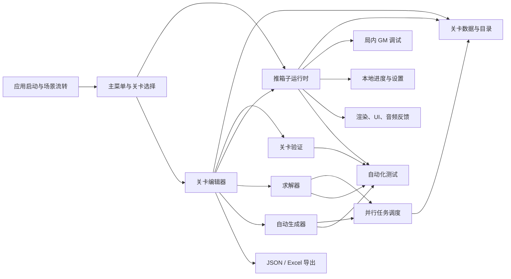

> 历史阶段记录：以下内容反映对应版本的设计与实现过程。当前功能和操作请阅读[新版操作手册](../../USER_MANUAL.md)。

# 推箱子游戏 SDD

> 文档类型：Software Design Document（规格驱动开发基线）  
> 当前阶段：功能实现、产品验收与源码交付检查
> 版本：0.14.1
> 状态：实现基线 / 产品验收未全部通过；GitHub 发布待完成  
> 最后更新：2026-10-06  
> 工程基线：Unity 2022.3.51f1c1，Windows 开发环境

## 1. 文档目的

这份文档是推箱子项目的单一事实来源。它先定义产品范围、系统边界、验收口径和一周交付切片，再逐步补充详细设计、接口、数据格式、测试记录和变更原因。

开发遵循以下顺序：

1. 先写可验收的行为规格。
2. 再实现最小闭环。
3. 用自动化测试和人工体验验证规格。
4. 实现与规格不一致时，先记录变更，再修改代码或规格。

本版本记录玩家流程、编辑器、求解、生成、管理和批量工具的实际实现及产品验收。0.14.0把游玩场景从"全部运行时动态创建"改为"场景烘焙外壳 + 棋盘预制体实例化"，接入真实贴图与行走帧并预留动画/粒子/音效挂点；0.13.0按用户下载的HTML仓库替换生成流程，保留种子、改用推箱次数范围，并保留原复杂度筛选；当前逻辑见8.8。0.11.0补齐逐关解锁、全局GM；0.11.1添加设置占位界面；0.12.0将生成器改为增量修改、失败回退、多起点与择优；0.12.1使箱数/墙比例默认留空自动，填写精确匹配，并合并单关/批量参数读取与校验。设置实际效果及持久化、Excel导出和批处理暂停/并行仍为规划，不能当作已交付功能。最终符合性和缺项以第13节及根目录`PRODUCT_CHECKLIST.md`为准。

## 2. 产品定义

### 2.1 产品目标

制作一个可独立游玩的单机推箱子游戏，玩家能够从启动进入主菜单，选择关卡，完成推箱子解谜，查看结果并继续下一关；同时提供面向内容制作者的关卡编辑器，用于创建、验证、保存、加载和试玩关卡。

### 2.2 目标用户

- 主要用户：喜欢短时解谜、愿意反复尝试的单机玩家。
- 内容用户：能够使用网格和基础控件的关卡设计人员。
- 开发/测试用户：需要快速验证规则、回放和关卡合法性的项目成员。

### 2.3 一周交付目标

一周结束时，必须有一个可运行的垂直切片，并且编辑器工具链可以独立验证关卡：

- 至少 10 个可通关关卡，难度递进。
- 主菜单、关卡选择、游戏中、暂停、重开、撤销、通关、下一关流程完整。
- 关卡进度能够在本地保存并在下次启动恢复。
- 编辑器能够绘制基础地块、放置玩家/箱子/目标点，验证关卡并直接试玩。
- 核心规则有自动化测试，关键流程可人工验收。
- 使用临时美术资源也能形成统一、可读、可操作的视觉体验。
- 局内 GM 可在开发模式下跳转关卡、上一关、下一关、强制胜利和重开。
- 局外编辑器具备三栏布局、多页签、笔刷/框选、多关卡求解和关卡导出能力。
- 求解器、自动生成器和批量处理支持取消、进度反馈和受控并行。

## 3. 范围基线

### 3.1 本期包含（In Scope）

#### 玩家体验

- 启动、加载和退出。
- 主菜单：开始游戏、设置、退出；普通界面不显示编辑器入口，编辑器通过隐藏 GM 进入。设置仅为音乐/音效滑条及动画开关的可操作占位界面。
- 关卡选择：默认仅 BuiltIn 来源，显示名称、锁定/解锁状态、完成状态和最佳步数，隐藏分类。
- 游戏场景：网格地图、玩家、箱子、目标点、墙体、地面、步数和计时显示。
- 输入：键盘方向键/WASD；菜单使用鼠标和键盘操作。
- 规则：玩家移动、箱子推动、墙体阻挡、箱子不可拉动、多个箱子与目标点、通关判断。
- 操作：重开、撤销上一步、返回关卡选择、暂停。
- 结果：通关反馈、步数统计、最佳成绩更新、下一关/重玩。
- 本地进度：解锁进度、完成状态、最佳步数、设置项。

#### 全局 GM（开发调试）

- 所有构建均可通过隐藏开关启用；默认不显示入口，避免调试入口污染普通玩家体验。
- 跳转到指定关卡。
- 上一关、下一关。
- 强制胜利：走正常通关结算流程，但结果标记为 GM 完成，不计入正常最佳成绩。
- 重开当前关卡。
- 编辑器、查看全部关卡（含类别）、查看玩家关卡、返回主界面、一键解锁全部、确认清空玩家数据。
- `=` 显示/隐藏右上角下拉入口，点击顶部展开/收起；入口与展开状态跨场景保持。紧凑单列按钮不挪动或缩小原界面。
- 无有效游戏状态时禁用前后关、强胜及重开。指定 ID 跳转仍为规划。

#### 关卡内容

- 使用统一网格坐标表达关卡。
- 内置关卡以数据资产形式存储，不把关卡布局硬编码在场景逻辑中。
- 关卡加载失败时有可读错误信息，并阻止进入不可运行状态。

#### 关卡编辑器

- 采用独立 editor 场景中的运行时 Unity UI 编辑器，编辑器和 Windows 独立版本均可使用；不采用 Unity EditorWindow 专用工作流。
- 三栏布局：左侧关卡列表，中间网格画布，右侧参数/检查器。
- 顶部多页签：已打开关卡、批量求解、自动生成、导出/校验任务；未保存页签显示脏标记。
- 笔刷工具：地面、墙体、目标、箱子、玩家、橡皮擦；支持笔刷大小和连续绘制。
- 框选工具：矩形框选、移动、复制、删除、批量设置地块属性。
- 新建、打开、保存、另存为关卡数据。
- 绘制/擦除墙体、地面和目标点。
- 放置、移动、删除玩家和箱子。
- 网格尺寸调整及越界保护。
- 关卡验证：玩家数量、箱子/目标点数量、可达性、明显非法布局。
- 一键进入试玩，试玩结束返回编辑状态。
- 显示验证错误、警告和统计信息。

#### 求解、生成与批处理

- 当前关卡求解：给出是否可解、移动序列、推箱数、移动数、搜索节点数和耗时。
- 多关卡求解：对选中关卡或目录批量求解，支持并行、暂停/取消、失败重试和结果汇总。
- 自动生成关卡：按尺寸、箱子数、目标数、难度/推箱数区间、随机种子生成候选关卡；生成后必须经过验证和求解筛选。
- 生成结果可预览、去重、批量保存为 JSON，并带有生成参数和求解结果。

#### 数据交换

- 每个关卡使用一个 JSON 文件作为可读、可版本化的源数据。
- 编辑器支持单关卡 JSON 导入/导出和批量导出。
- 支持导出 Excel 工作簿，单个表格中每个单元格保存一个完整关卡 JSON。

#### 工程与质量

- 支持 Windows Standalone 作为首个交付平台。
- 核心模拟逻辑与 Unity 表现层分离，便于测试和编辑器复用。
- 关键数据采用可版本化的文本/序列化资产格式。
- 提供核心规则单元测试和至少一条端到端流程验收记录。

### 3.2 本期不包含（Out of Scope）

- 联机、排行榜、账号、云存档和跨设备同步。
- 多人模式、实时对战和合作模式。
- 移动端触控、手柄专属布局和主机认证。
- 面向玩家的智能提示、自动走步和解题教学；编辑器求解器与生成器属于本期范围。
- 复杂剧情、角色成长、货币、广告和内购。
- 关卡分享平台、在线下载和创作者社区。
- 复杂动画系统、角色换装和最终商业美术资源。
- 专业级音频混音、配音和多语言本地化。

如果这些内容后续必须加入，应先建立新的范围版本和时间预算，不直接挤占本期验收项。

## 4. 系统清单

### 4.1 系统总览



### 4.2 系统边界与职责

| 编号 | 系统 | 主要职责 | 明确不负责 |
|---|---|---|---|
| SYS-01 | 应用启动与场景流转 | 初始化服务、加载首场景、处理场景切换和退出 | 玩法规则、关卡编辑 |
| SYS-02 | 主菜单与前端流程 | 开始游戏、关卡选择、设置、编辑器入口、返回逻辑 | 保存具体进度数据 |
| SYS-03 | 关卡目录 | 提供关卡列表、元数据、顺序和解锁条件 | 判断箱子是否完成目标 |
| SYS-04 | 推箱子模拟核心 | 网格、实体、移动、推动、撤销、重开、通关判断 | UI 显示、音频和具体美术 |
| SYS-05 | 输入系统 | 将键盘/鼠标输入转换为游戏动作和菜单动作 | 直接修改地图状态 |
| SYS-06 | 运行时表现层 | 地图与实体可视化、动画过渡、相机、特效占位 | 决定移动是否合法 |
| SYS-07 | 游戏内 UI | 步数、计时、暂停、重开、撤销、通关结果和错误提示 | 持久化格式定义 |
| SYS-08 | 本地进度与设置 | 保存/加载完成状态、最佳步数、解锁状态和设置 | 计算一次移动是否合法 |
| SYS-09 | 关卡数据层 | 关卡资产、序列化、版本号、加载和保存 | 编辑器交互布局 |
| SYS-10 | 关卡编辑器 | 创建、绘制、编辑、保存、加载和试玩 | 运行时进度统计 |
| SYS-11 | 关卡验证 | 结构校验、可达性检查、错误/警告输出 | 自动修复所有非法布局 |
| SYS-12 | 音频与反馈 | 移动、推动、失败、通关、按钮等反馈 | 关卡状态判定 |
| SYS-13 | 测试与诊断 | 核心规则测试、编辑器验证测试、日志和调试信息 | 代替人工体验验收 |
| SYS-14 | 局内 GM | 开发模式下的跳关、前后关、强制胜利、重开和状态诊断 | 正式玩家功能、修改关卡源数据 |
| SYS-15 | 求解器 | 单关卡搜索、解答指标、取消、超时和结果序列化 | 修改编辑器数据、Unity 主线程 UI |
| SYS-16 | 自动生成器 | 按参数生成候选关卡、去重、验证和求解筛选 | 保证所有生成关卡都具备唯一解 |
| SYS-17 | 编辑器工作台 | 三栏布局、多页签、笔刷、框选、脏状态和任务面板 | 推箱子规则本身 |
| SYS-18 | 批处理任务调度 | 多关卡任务队列、并行度限制、进度、取消、错误聚合 | 直接调用 Unity API 的后台线程逻辑 |
| SYS-19 | JSON/Excel 导出 | 关卡 JSON 读写、批量导出、单表格 Excel JSON 容器 | 修改运行时状态 |

### 4.3 依赖关系

- SYS-01 提供服务初始化和场景生命周期。
- SYS-02 依赖 SYS-03、SYS-08，并通过 SYS-01 切换场景。
- SYS-04 只依赖 SYS-09 提供的关卡数据和 SYS-05 提供的动作，不依赖具体 UI。
- SYS-06、SYS-07、SYS-12 订阅 SYS-04 的状态变化。
- SYS-10 复用 SYS-09 和 SYS-11，并调用 SYS-04 的同一套模拟核心进行试玩。
- SYS-14 通过 SYS-04、SYS-03 和 SYS-08 的公开命令接口工作；不直接操作表现层对象。
- SYS-15 只依赖可脱离 Unity API 的状态快照和动作模型；SYS-16 组合 SYS-11、SYS-15 和 SYS-19。
- SYS-17 编排 SYS-09、SYS-11、SYS-15、SYS-16、SYS-18、SYS-19，但不拥有玩法规则。
- SYS-18 的后台任务只传输不可变 DTO；所有 UI、资产和文件写入回到主线程执行。
- SYS-13 覆盖 SYS-04、SYS-09、SYS-10、SYS-11、SYS-14 至 SYS-19；不把测试逻辑混入运行时代码。

## 5. 核心用户流程

### 5.1 首次启动

启动 → 初始化本地数据 → 主菜单 → 开始游戏 → 关卡选择 → 第一个关卡。

若本地数据损坏，系统应备份或重建默认数据，并向用户显示可理解的提示；不得静默进入半初始化状态。

### 5.2 正常通关

关卡选择 → 加载关卡 → 移动/推动 → 达成全部目标 → 通关反馈 → 保存进度 → 下一关或返回选择。

### 5.3 失败恢复

玩家发现布局无法继续 → 重开或撤销 → 回到可操作状态。重开不应清除关卡完成记录；撤销只影响当前尝试。

### 5.4 编辑器流程

编辑器入口 → 新建/打开关卡 → 在左侧选择关卡 → 中间画布编辑 → 右侧修改参数 → 验证 → 修正错误 → 保存 → 试玩 → 返回编辑器或退出。

多页签流程：打开多个关卡后，每个页签维护独立编辑状态和脏标记；切换页签不触发隐式保存。关闭未保存页签必须先确认保存、放弃或取消。

### 5.5 编辑器求解与生成流程

- 当前关卡求解：验证基础结构 → 启动求解任务 → 显示进度/取消按钮 → 返回解答和指标 → 可在画布中回放解答。
- 多关卡求解：左侧多选关卡或按筛选条件选取 → 创建批处理任务 → 按受控并行度执行 → 实时汇总成功/失败/超时 → 导出结果。
- 自动生成：填写生成参数 → 生成候选 → 验证 → 求解筛选 → 去重 → 预览 → 批量保存。

### 5.6 局内 GM 流程

任意场景按 `=` 显示右上角 GM 入口，点击顶部展开或收起。菜单提供编辑器、全部/玩家关卡、返回主界面、前后关、强制胜利、重开、解锁全部与确认清空玩家数据。GM 强制胜利走统一结算流程并标记来源；GM 游玩、强胜和编辑试玩均不记录普通成绩或推进解锁。详细规格见12.3。

## 6. 初始功能规格

以下 ID 是后续详细 SDD、代码任务和测试用例的引用键。

| 规格 ID | 规格 | 优先级 | 验收摘要 |
|---|---|---:|---|
| FR-001 | 玩家只能在网格内移动 | P0 | 无障碍时移动一格，越界和墙体前移动作被拒绝 |
| FR-002 | 玩家可推动相邻箱子 | P0 | 箱子后方为空地时，玩家和箱子各移动一格 |
| FR-003 | 箱子不可被拉动或推动穿过障碍 | P0 | 后方越界、墙体或另一箱子时推动失败 |
| FR-004 | 全部箱子到达目标点即通关 | P0 | 通关事件只在全部目标满足时触发一次 |
| FR-005 | 支持撤销和重开 | P0 | 撤销恢复上一个完整状态，重开恢复初始状态 |
| FR-006 | 关卡可选择、解锁和保存成绩 | P0 | 默认仅 BuiltIn、首关可玩；正常通关保存成绩并解锁下一关，重启保留；锁定关卡无法通过回调或直接加载绕过 |
| FR-007 | 运行时流程完整 | P0 | 可从启动走到通关并进入下一关或返回选择 |
| FR-008 | 编辑器可构建基础关卡 | P0 | 可放置必要元素、保存并重新打开 |
| FR-009 | 编辑器可验证关卡 | P0 | 已实现结构检查和求解验证；区分数据错误、已证明无解、超时及搜索上限 |
| FR-010 | 编辑器可直接试玩 | P0 | 验证通过后使用运行时模拟核心试玩 |
| FR-011 | 核心规则可自动测试 | P1 | 移动、推动、撤销、通关和非法状态有测试覆盖 |
| FR-012 | 临时美术资源保持可读性 | P1 | 墙、地面、箱子、目标和玩家视觉区分清晰 |
| FR-013 | 跨场景全局 GM | P0 | `=` 右上角下拉、顶部展开/收起、紧凑单列、原界面不变；编辑器/全关浏览/跳关/强胜/重开/全部解锁/确认清空；GM 成绩及进度隔离 |
| FR-014 | 编辑器三栏工作台 | P0 | 左列表、中画布、右参数面板可同时工作 |
| FR-015 | 编辑器多页签 | P0 | 多关卡可同时打开，页签切换保留独立编辑状态和脏标记 |
| FR-016 | 编辑器笔刷与框选 | P0 | 支持基础笔刷、连续绘制、矩形框选、移动/复制/删除 |
| FR-017 | 单关卡求解 | P0 | 已实现完整移动/推箱步骤、最少推箱后最少步数、节点数、耗时和取消 |
| FR-018 | 多关卡求解 | P0 | 已实现分类/多选、后台进度、取消、逐关报告及验证 JSON 写回；当前顺序执行，暂停/并行扩展后续补充 |
| FR-019 | 自动生成关卡 | P0 | 按参数生成候选并经过验证、求解和去重后保存 |
| FR-020 | JSON 关卡格式 | P0 | 单文件可保存、加载、校验并跨编辑器/运行时复用 |
| FR-021 | Excel 导出 | P1 | 一个工作表中每个单元格保存一个完整关卡 JSON，可重新导入 |
| FR-022 | 完整求解过程与回放 | P0 | 已实现完整步骤列表/复制、自动播放/暂停、上一步/下一步、起点重置和速度切换；回放不改变关卡布局 |
| FR-023 | 关卡分类管理与排序 | P0 | 分类筛选/新增、Ctrl/Shift/Ctrl+Shift 多选、批量删除/分类迁移、按钮与长按拖动排序；结果持久化并同步各关卡列表 |
| FR-024 | 印章预设画笔 | P0 | 工具栏印章库可选择预设并连续落位，新建/编辑印章复用网格工作区；独立JSON持久化、透明格、撤销与未保存保护 |
| FR-025 | 设置占位界面 | P1 | 主菜单/暂停菜单可打开设置；音乐和音效滑条显示百分比，动画开关可切换；返回或Esc关闭，底层输入隔离；不应用声音/动画，不保存配置 |

## 7. 非功能要求

| 类别 | 本期要求 |
|---|---|
| 可玩性 | 首次启动后无需外部说明即可完成第一关；所有关键按钮有反馈 |
| 稳定性 | 非法输入、重复点击、空关卡和损坏存档不得导致未处理异常 |
| 性能 | 目标关卡规模内保持稳定帧率；移动响应不依赖帧率高低 |
| 可维护性 | 规则核心可脱离 MonoBehaviour 测试；系统职责按 SYS 编号划分 |
| 可扩展性 | 后续可增加关卡、皮肤和输入设备，不修改核心推箱子规则 |
| 可诊断性 | 关卡加载、验证、保存失败都有上下文日志 |
| 可访问性 | 关键状态不只依赖颜色；UI 文本清晰，支持键盘完成主要操作 |
| 编辑器响应 | 普通绘制、切换页签和参数编辑应即时响应；求解/生成等长任务必须异步执行 |
| 并行安全 | 后台线程不得直接访问 Unity 对象、AssetDatabase 或编辑器 UI |
| 可取消性 | 批量求解、生成和导出前处理任务支持取消，取消后保留已完成结果 |
| 可复现性 | 自动生成必须记录随机种子和生成器版本；同版本同参数可复现候选 |
| 数据兼容 | JSON 带 `schemaVersion`；读取未知版本时给出错误，不静默丢字段 |

## 8. 暂定技术方案

### 8.1 数据与运行时

- 关卡以 `LevelDefinition` 数据资产表示，包含版本号、宽高、地块、目标点、箱子和玩家起点。
- 运行时将数据转换为不可变初始状态，再由 `SokobanState`/`SokobanSimulator` 处理动作。
- 表现层根据状态快照刷新，不直接在 UI 或动画脚本中改变规则状态。
- 撤销采用状态快照栈；一周交付优先保证正确性，再评估增量记录。

### 8.2 场景切分

- `Bootstrap`：启动与服务初始化。
- `MainMenu`：主菜单、关卡选择和设置。
- `Gameplay`：运行时关卡体验。
- `Editor`：关卡编辑器；若 EditorWindow 与运行时场景冲突，优先保证编辑器可用和数据格式统一。

实际场景名称可以调整，但不能改变上述职责边界。

### 8.3 输入与平台

本期默认 Windows Standalone + 键盘/鼠标。输入动作先抽象为 `Move(Direction)`、`Undo`、`Restart`、`Pause`、`Confirm`、`Back`，后续接入手柄或触控时复用动作层。

### 8.4 撤销与状态历史

- 每次成功移动或推动前，将完整的逻辑状态快照压入撤销栈；无效移动不产生历史记录。
- 快照至少包含玩家坐标、箱子坐标、步数、推箱数、计时起点/累计时间和通关状态。
- `Undo` 只回退当前关卡尝试，不跨关卡、不修改已保存的最佳成绩。
- 重开清空撤销栈并恢复关卡初始状态。
- 求解回放和编辑器试玩使用同一状态快照接口，避免复制规则。

### 8.5 局内 GM 设计

早期 `IGameMasterCommand` 设计列出以下游戏命令；当前实现由持久 `SokobanGmController` 的按钮回调调度，并通过游戏控制器的 `GmForceWin` / `GmRestart` 接口调用玩法动作：

| 命令 | 参数 | 行为 |
|---|---|---|
| `JumpLevel` | `levelId` | 清理当前尝试并加载指定关卡 |
| `PreviousLevel` | 无 | 按关卡目录顺序加载上一关 |
| `NextLevel` | 无 | 按关卡目录顺序加载下一关 |
| `ForceWin` | 无 | 触发 GM 胜利结算并标记来源 |
| `RestartLevel` | 无 | 恢复当前关卡初始状态 |

默认不显示 GM 入口，所有构建保留 `=` 隐藏开关。入口位于右上角，顶部点击展开/收起，显示和展开状态跨场景保持；GM 覆盖在原界面之上，不修改原工作区缩放或位置。命令在主线程执行；关卡 JSON 不受跳关、强胜、解锁与清空操作影响。进度操作只写玩家数据。输入、确认框与数据规则见12.3。

### 8.6 编辑器工作台设计（v0.3 已实现基线）

#### 布局（与 2026-10-04 设计图一致）

- 顶部工具栏：笔刷组（箱子 / 玩家 / 墙面 / 目标 / 地面，默认不选中）+ 操作组（复制 / 粘贴 / 填充 / 印章）。印章打开预设库；制作印章时追加透明笔刷，具体规则见12.2。
- 第二行页签栏：多文档页签，每个页签对应一个已打开关卡；"+" 新建空白关；页签内 "×" 关闭；脏标记以标题后 "*" 表示。
- 左栏：分类下拉框（全部 / BuiltIn / Generated / 自定义分类）、可滚动关卡列表（带自动隐藏的垂直滚动条）、刷新；列表外左下角为返回选关。
- 底部栏：返回（左）+ 批量生成 / 批量验证 / 关卡管理 / 日志（靠右成组；四项功能均已实现）。
- 中栏：编辑区视口（RectMask2D）+ 可平移/缩放的内容层；网格为纯显示 Image 格子，鼠标→格子映射统一在视口层完成，便于框选/平移/缩放。
- 右栏：关卡名称、长 × 宽、详情显示区、试玩、自动生成、验证、复制json、保存、保存为关卡。

#### 右栏按钮语义（2026-10-05 更新）

- 复制json：把当前关卡 JSON 写入系统剪贴板。
- 保存：保存到当前页签 descriptor 对应文件；无 descriptor 时落入 Generated。
- 保存为关卡：另存为新关卡（`Generated_时间戳`）并在新页签打开；对应原“导出”按钮。
- 试玩：先保存再进入 game 场景；保存失败时保留编辑界面。
- 自动生成：打开参数与预览面板；分类：按持久化分类筛选关卡。关卡管理打开独立管理窗口。

#### 页签关闭保护（v0.5.2）

- 新建、采用生成结果或有未保存修改的页签，点击“×”弹出确认框，显示关卡名称和“保存并关闭 / 丢弃 / 取消”。
- 保存并关闭：保存弹窗对应的关卡，成功后关闭；失败时弹窗显示错误，保留页签与修改，可重试或取消。
- 丢弃：只关闭弹窗对应的页签，不写入关卡文件。取消或 Esc：关闭弹窗，保留页签与修改。
- 已保存且未修改的页签直接关闭；关闭非当前页签保留当前页签和视图；关闭最后一个页签后进入空编辑状态（v0.5.3 更新）。
- 弹窗打开期间阻断画布操作和编辑快捷键，键盘焦点限制在三个选项内，默认选中取消。
- 名称实际变化才标记未保存；关闭前提交仍有焦点的字段，避免漏掉未完成的输入。

#### 空编辑状态与操作日志（v0.5.3）

- 默认进入编辑器时没有页签；允许关闭全部页签，最后一个页签关闭后不再自动新建。
- 空编辑区显示“请打开左侧关卡以编辑，或者点击下面的按钮新增关卡”，并提供“新增关卡”按钮；页签栏“+”和左侧关卡列表仍可使用。
- 没有页签时清空并禁用名称/尺寸输入，禁用笔刷、复制/粘贴/填充、试玩、验证和保存等依赖当前关卡的操作；自动生成、关卡列表、印章库与日志仍可使用。印章库支持新建/编辑，使用需先打开文档。
- 日志按时间顺序保存本次运行中的编辑器操作，附时间、关卡名称/ID、动作参数和结果。记录覆盖关卡新建/打开/切换/关闭、关闭确认、编辑/选区/复制/剪切/粘贴/填充/撤销、重命名/尺寸/视图、保存/失败、生成参数/任务结果/取消，以及验证和每一步解答回放。
- 点击“日志”打开可滚动窗口，默认定位最新记录；“复制”复制全部记录，“清空”立即删除全部日志并显示空提示。关闭窗口或切换场景保留日志，退出应用后不保留。
- 日志窗口打开时隔离编辑输入；Esc 或“返回编辑”关闭。日志查看、复制和清空自身不追加操作条目，避免清空后立即出现新记录。

#### 关卡管理（v0.6.0）

- 管理窗口采用左侧分类、右侧关卡列表及底部操作栏；列表显示当前顺序、名称/ID、分类、来源，支持滚动。初始分类沿用 BuiltIn / Generated，允许新增 1–40 字符的自定义分类。
- 分类是逻辑归属，来源仍代表资源目录；迁移只更新分类索引，不改动关卡 ID、JSON 内容、资源路径或通关记录。编辑器分类筛选和游戏选关统一显示分类与持久化顺序。
- 单击替换选择；Ctrl 单击切换单项；Shift 从最近锚点选择连续范围；Ctrl+Shift 追加连续范围。Ctrl+A 全选当前分类，点击空白清空选择；上下键移动选择，Shift 扩展，Ctrl 上下键仅移动焦点。双击/Enter 或“打开编辑”打开所选关卡。
- “迁移所选”将当前选择批量归入目标分类；新增分类后自动将其设为迁移目标。分类切换清空选择和范围锚点，避免隐藏项被误处理。
- 排序支持上移、下移、移至首位/末位和长按 ≥0.35 秒后拖动。拖动所选组时保留组内相对顺序，显示插入线，靠近列表上下边缘自动滚动；松开持久化，Esc 或列表外松开取消。快速拖动仍用于滚动列表。
- 全部视图可调整全局顺序；按分类排序时只替换该分类在全局列表中的顺序位置，其他分类相对顺序不变。顺序影响编辑器/选关列表及游戏前后关顺序。
- 删除所选或 Delete 弹出包含完整所选列表的确认框，默认焦点为取消；有已打开且未保存的页签时明确提示确认删除会丢弃修改。取消/Esc 不改变文件或页签。
- 确认删除后移除对应 `level.json` 与 `.meta`，不删除所在文件夹内其他资源；成功后关闭对应页签并刷新列表。分类、顺序和删除标记保存在 `Assets/Resources/data/level/library.json`（schema v1，`categories`、`entries[{levelId,category,order,deleted}]`），玩家构建从 Resources 加载同一索引。
- 删除前整批检查文件范围、存在性及 ID；被移除文件保存在 `Library/SokobanDeletedLevels` 的独立备份目录。索引采用原子替换；索引写入或批量文件操作失败时恢复已移动的文件，保留页签并显示/记录错误。删除标记阻止旧内置目录项或 Resources 缓存重新出现。
- 管理窗口阻断底层编辑输入；操作记录进入日志，可从管理窗口查看日志。迁移同步已打开页签的分类描述，不改变编辑内容或未保存标记。新建/另存关卡使用毫秒时间戳加随机后缀，避免连续创建产生同 ID 覆盖。

#### 编辑区交互（已实现）

- hover 显示当前笔刷虚影；粘贴模式显示剪贴板图案虚影；所有待修改操作均以跟随鼠标的虚影表现。
- 左键点击落笔；左键拖拽框选，拖拽中显示蓝色虚线边框 + 半透明蓝色填充的选区框。框选可在整个编辑区视口内任意位置起拖（不限于格子内），落定后取与选区框矩形相交的格子。
- Ctrl + 左键 增加/取消单个选中；多选或框选的地块以蓝色虚线边框标记（运行时生成的 tiled 虚线 sprite 四边拼接）。
- Ctrl+C / 复制：复制所有选中地块为相对偏移模式，支持不相邻多选（分开复制）。
- Ctrl+V / 粘贴：切换模式。按钮或快捷键点亮进入粘贴（按钮高亮），再点一次熄灭并退出；进入粘贴时自动取消笔刷选择，二者互斥。**高亮期间左键可连续落位粘贴。**
- Ctrl+X / 剪切：把选中地块存入剪贴板（相对偏移），并把这些地块全部变成地面，随后进入**一次性**粘贴模式；粘贴落位一次后按钮熄灭、退出粘贴并清空剪贴板。
- 左键长按（≥0.35s 且未移动）：若按在已选区域内则剪切该选区，若按在单个物块（箱/玩家/目标）上则剪切该格；随后自动进入一次性粘贴，形成"移动"效果。
- 右键：取消当前状态（粘贴模式、笔刷选择、进行中的框选）。

#### 叠放语义（v0.3.10）

- 目标点被箱子或玩家覆盖时视为"叠放"。显示采用**分层渲染**：格子底色表示墙/地面/目标（目标格显示 ◇），箱子/玩家以缩小的内嵌色块（约格子的 62%）叠在其上，因此叠放时目标自然露出，无需额外符号（编辑器与游玩界面一致）。
- 玩家体验：开局检测一次是否所有箱子已就位，若是则 0 步完成关卡（直接弹出通关面板，步数/推箱为 0）。
- 用箱子/玩家笔刷落在目标格时保留目标（不再抹掉）。
- 选择/复制/整格剪切携带整格全部层（目标+物体一起）。
- 长按移动只取"最上层"（玩家 > 箱子 > 目标），下层留在原格。
- 剪贴板条目带 WholeCell 标记：整格内容粘贴为完全覆盖；单层内容粘贴为合并（保留目标等下层，玩家/箱子互斥替换）。
- 填充：在所有选中区域内填入当前笔刷选中的元素。
- 中键拖拽平移画面；Ctrl + 滚轮缩放（0.5x–2.5x）。
- Ctrl+Z 撤销：每个页签维护独立撤销栈，在任何变更操作执行前对 `SokobanJsonLevel` 深拷贝入栈（上限 100），覆盖落笔、填充、粘贴、改尺寸等全部变更入口。
- 笔刷可取消选择：再次点击已选中的笔刷则不选任何笔刷；无笔刷时不显示 hover 虚影、点击不落笔、填充提示"请先选择笔刷"。**默认进入编辑器时不选择任何笔刷。**
- 复制与填充执行后清空所有选中。

#### 多页签

- 一个页签对应一个内存文档：descriptor + data + dirty + 撤销栈。
- 切换页签时重置选区、粘贴态、平移与缩放。
- 求解、生成和导出任务读取不可变快照，任务运行期间允许继续编辑，但结果只回写到任务启动时版本号匹配的文档。

#### 笔刷语义

- 墙面：置墙并清除该格目标 / 箱子 / 玩家。
- 地面：置空地并清除目标 / 箱子（保留玩家）。
- 目标：置目标（保留箱子，形成箱上目标）。
- 箱子：置箱子（保留目标）。
- 玩家：移动唯一玩家到该格。
- 画布交互只修改编辑器文档数据，不直接修改运行时 `SokobanState`。

### 8.7 求解器设计（v0.4.0 单关卡验证与回放已实现）

#### 求解目标

当前 `SokobanSolveResult` 返回 `Status`、完整 `Moves`、`Pushes`、`ExploredNodes`、`ElapsedMs`、`Algorithm` 和 `Message`。来源版本通过关卡快照 JSON 和页签引用比对；批量调度阶段再加入正式 revision 字段。

默认优先最少推箱数；在推箱数相同时再比较移动数。当前实现为以推箱动作扩展的 A*：每个状态用 BFS 求玩家到推箱站位的最短行走路线，将路线和一次推动组成一条边。反向推箱距离 + Hungarian 箱子/目标最小匹配作为可采纳推箱下界，配合死点/无匹配和 2×2 冻结剪枝。

为保留次级最少步数目标，状态键使用玩家**实际坐标** + 排序箱子坐标，不仅按玩家可达区域合并。队列先比较累计推箱数 + 推箱下界，再比较累计移动数；步数字段包括走路和推箱。

完整路径使用标准 LURD：小写 `u/d/l/r` 表示走路，大写 `U/D/L/R` 表示推动。回放前由同一套 `SokobanSimulation` 完整执行一次并验证胜利及统计。步骤列表给出玩家和被推动箱子的前后坐标；支持复制完整过程。

验证面板为独立回放会话：自动播放/暂停、上一步/下一步、回到起点、慢速/正常/快速；空格切换播放、左右方向键单步、Home 回到起点、Esc 返回编辑。原关卡布局不受回放影响。已确认有解/无解的结果写入当前内存文档的 `solution`，点击“保存”才保存文件；普通编辑会使旧结果失效。

#### 线程模型

- 求解器核心是纯 C#，只接收不可变的 `LevelSnapshot`，不引用 `UnityEngine.Object`。
- 单关卡任务通过 `Task.Run`/线程池执行，使用 `CancellationToken` 支持取消和超时。
- 多关卡任务按关卡拆分为独立工作项，由 SYS-18 控制最大并发数；默认并发数为 `max(1, CPU 核心数 - 1)`，允许在设置中覆盖。
- 后台线程只生成 DTO；进度、日志、画布更新和资产写入通过主线程队列回调。
- 当前任务返回 `Solved`、`Unsolvable`、`Invalid`、`Timeout`、`LimitReached`、`Cancelled` 或 `Error`。默认 30 秒、10 万扩展节点、20 万发现状态上限；超时/达到上限不能标记无解。关闭面板或退出场景会取消后台任务。
- `SokobanSolver` 不引用 Unity API；快照创建、结果发布、回放和 UI 更新在主线程执行。面板打开时阻断编辑输入，发布结果前仍比对来源快照，避免旧结果回写到不同关卡。

### 8.8 自动生成器设计

单关与批量共用参数读取和核心生成逻辑。参数为宽/高（含外围墙，5–8）、可选箱子数（1–8）、最少/最多推箱次数、不限/简单/普通/困难复杂度（下拉选择，默认普通）、可选内部墙比例（0–45%）、种子、候选上限与时间预算。默认8×8、箱数与墙比例留空自动、1–60次推箱、普通、自动种子、400候选、60秒；填写数值时准确匹配，墙比例0表示零内部墙。走路不计入推箱区间，`verifiedMoves`仍记录可信总移动数。

生成器`html-incremental-3.1`按参考仓库HTML实际流程执行：外围墙空房间与随机玩家 → 按原配置增加墙或箱子/目标 → HTML构造求解 → 成功保存/失败回退 → 结构匹配后由项目Push A*确认完整最少推箱解 → 推箱区间和原完整复杂度筛选 → HTML质量比较和提前结束 → 预览/采用。原候选池、反向起点、多起点、反馈、缓存及移动/删除变异已移除。

生成入口宽、高各限5–8；6×6、7×7、8×8采用原配置，5×5及其他矩形使用源码全局默认。8×8墙概率0.5、箱子概率1.0、总墙阈值37–85、优先墙44轮、求解150000次/350000节点；保留原最大墙比例1.6。自动箱子最多8个并按地面限制，移除旧面积/8上限和按难度箱数偏好；自动墙只受HTML策略和实体空间约束，不强加旧45%上限。填写的箱数和墙数限制增加上限，仍须严格匹配输出。允许无实体的隔离空地，沿用HTML行为。

构造求解按推箱扩展、泛洪合并可达区、稳定启发排序、每批50个状态、每100轮队列排序及深度80限制；冻结已到位箱子按源码作为墙继续搜索。零箱子没有推箱后继，不能成为已求解状态。构造成功后的布局不因推箱/复杂度不匹配而回退；输出另由现有A*求解，保证真实路径与最少推箱次数。每次构造和最终求解受单候选及剩余总预算限制。源求解器的未找到解不写成关卡严格无解结论。

difficulty=0表示不限，只跳过档位筛选；完整评估继续执行，关卡保存并展示实际难度，批量重新打开恢复请求选项。难度口径保留：`35×箱子依赖 + 30×腾挪/规划 + 20×空间争用 + 15×失败分支`，<25简单、25–<50普通、≥50困难。至多12次替代推动探查，更简单有效解降低评分，未知分支不算死路。HTML质量另按35%推箱长度/模式、25%分布、20%方向变化、12%墙密度、8%效率计算；实际StateNode缺方向/箱索引，按源码保留默认值。质量更高，或差小于10分且源码推箱更多时替换最佳；至少30轮后按源码条件提前结束，其他情况到候选/预算上限。

种子、请求、选中候选编号、总尝试数、来源、复杂度、HTML质量及完整解答继续保存；新范围用`minPushes/maxPushes`，旧`minMoves/maxMoves`只保留历史语义，直接复用旧范围生成会提示重新填写。编辑使解答、复杂度和质量失效。用户取消始终不交付本次候选；超时只返回已完成验证的匹配结果。备用模板必须实际求解后满足所有条件，不能用估算次数或放宽约束兜底。

来源：[huanggaole/AutoGenerateSokobanLevel](https://github.com/huanggaole/AutoGenerateSokobanLevel)，提交`4ccf418633cf47e153436723c45518ea60f8cfa9`。已直接核对用户下载的HTML版本，八个生成/求解/配置文件的SHA-256与固定提交一致。详细源码映射、保留约束及验证见[Sokoban-Generation-v0.13.md](Sokoban-Generation-v0.13.md)；[v0.12](Sokoban-Generation-v0.12.md)保留历史记录。相同种子在未触及时间限制时可复现；精确结构、推箱范围及复杂度可能导致耗尽，不保证每槽位成功。

### 8.8.2 批量生成（FR-019）

- 入口为底部“批量生成”，复用单关卡参数与预览界面，增加生成数量（1–100，默认 10）。时间预算和候选上限按每关计算；数量表示处理槽位数，达到预算/候选上限时该槽位记为未匹配，继续下一关，不自动放宽步数/难度要求。
- 一个批次依次运行，最多一个批量求解工作线程；不能重复启动同一批次。第 i 个槽位种子为 `unchecked(基础种子 + i × 104729)`（i 从 0 开始），结果逐关保留实际种子。批次共用尺寸/墙/目标/箱/玩家的规范布局键，提前拒绝完全重复候选；不做旋转/镜像等价归并。
- 整批进度条显示已处理槽位及当前关卡进度，后者按已用预算/候选上限估计且封顶 95%；成功、未匹配、未处理分别统计。正常结束为 100%，取消时保留实际进度。超时、上限和异常均有明确原因，不标为确认无解；日志记录每关结果。
- `SokobanBatchGenerator` 为纯 C# 顺序管线；`SokobanBatchGenerationService` 是编辑器模块内独立的持久对象，持有后台 Task、取消令牌、线程安全结果队列、最新进度及本次结果。后台只操作 DTO，主线程创建关卡 JSON、写日志、保存及通知。
- 返回编辑、关闭生成页、切换页签或进入选关/游戏场景不会取消批量任务；重新打开恢复参数、进度和结果。单关卡的关闭即取消行为保留。退出游戏/停止 Play 会取消任务并释放资源；任务与未保存结果只在本次运行保留，不保证跨退出恢复。
- 完成、部分完成或取消后，在当前页面底部弹出一次提醒，可关闭或“查看结果”。提醒采用独立持久 Canvas，不阻断其区域以外的操作；在编辑场景打开批量页，在其他场景进入编辑场景再打开。若有求解/日志/管理/关闭确认弹层，则等待其关闭后打开。
- 结果支持上一个/下一个预览、复杂度说明、完整解答播放和采用新页签，生成过程中已完成结果也可查看。复杂度说明使用带裁剪的独立滚动区域，长文字不侵入结果切换按钮。结果预览保留原始生成布局；采用后编辑的数据独立。重复采用同 ID 聚焦已有页签。
- “保存全部结果”仅在整批停止后可用，将尚未保存的成功结果写入 Generated。保存采用唯一 ID，先写临时文件再通过不覆盖的移动原子发布，禁止覆盖已有同 ID；失败清理临时文件，整批合并一次资产刷新。失败项留在结果中并显示原因，可重试，已经保存项不重复写入。保存后列表同步，未编辑的对应页签清除脏标记，编辑过的页签继续保留未保存状态；采用页签独立保存后也同步该结果的保存状态。
- 操作日志覆盖开始及全部参数、每关成功/失败、取消、结束、结果预览及保存统计。暂停、跨批次布局去重仍待实现；批量验证见 8.8.3。

### 8.8.3 批量验证与可信解关步数（FR-018/022）

- “批量验证”打开分类列表，布局、分类筛选和多选语义与关卡管理一致：单击单选、Ctrl 切换、Shift 连选、Ctrl+Shift 追加范围、Ctrl+A/按钮全选。分类切换清空选择；滚动拖动不误选。列表显示名称/ID、分类、验证状态及可信解关步数。
- 验证所选关卡的**已保存版本**，未保存页签的内容继续保留。预算为每关 1–300 秒（默认 30）；顺序调用现有求解器，保留最少推箱、其次最少总移动的口径。结果包括有解、确认无解、结构错误、超时、搜索上限、取消、异常，以及移动/推箱数、节点、耗时和写入状态；超时/上限不视为无解。
- `SokobanBatchVerifier` 只处理已复制的纯 C# 快照；持久化服务 `SokobanBatchVerificationService` 负责工作线程、取消、进度和结果队列，主线程逐关回放校验、写入 JSON、更新匹配页签及记录日志。整批进度按完成数与当前耗时估计，正常结束到 100%；取消保留已完成结果，未处理项显示未处理。
- 返回编辑、切换页签/页面/场景不会停止任务；重开页面恢复任务和结果。结束/取消时，在当前页面底部显示一次提醒，支持关闭/查看结果，其他场景可返回编辑器的结果页面。生成与验证共用通知队列，避免同时完成时提醒重叠。停止 Play/退出程序取消后台任务，本次结果不跨退出保存。
- 结果详情可滚动查看，支持复制整批报告、查看日志、已求解快照的完整播放/单步回放。列表步数始终取当前保存文件，不使用历史批次的步数覆盖它；打开/刷新页面及发布新结果时重新读取，避免每帧文件读写。历史结果成功写入后若再次编辑并保存，重开页面显示 -1/需验证；内容版本、步数或解答记录不匹配时，详情注明历史快照，播放仍使用当时的关卡。写入冲突时，详情仍可查看快照解答，列表不把它当作当前文件的可信步数。
- JSON schema v1 增加可选顶层整数 `verifiedMoves`：默认/未验证为 -1，有完整且有效的解答时为总移动步数（包含推箱），零步已通关为 0。无解、非法、超时、上限、取消/异常均为 -1，具体原因由 `solution.status` 区分。旧 JSON 缺少字段时保持 -1，不从旧缓存推测可信值；新保存/复制 JSON 带上该字段。
- 全部关卡内容修改（含改名、绘制、填充、尺寸、剪切/粘贴、移动、撤销）统一经 `SokobanVerificationMetadata.Invalidate` 将 `verifiedMoves` 重置为 -1，清除旧解答/复杂度及估计步数。验证结果写入不属于内容修改；单关卡验证和单/批自动生成的已求解结果也填入该字段。
- 批量结果逐关自动写回原文件，只更新验证产物并保留源内容，先写临时文件再原子替换；整个任务只合并一次资产刷新。开始时保存原始 JSON 文本，写回前再次比对；文件已变更、删除、ID 不符或不可写时保留报告并明确说明未写入，不能覆盖新版或恢复已删除关卡。
- 打开的页签只有在内容版本仍匹配快照时同步验证产物，脏标记保留原状态；内容不同的未保存页签维持 -1。版本签名包含名称/布局等编辑内容，排除验证产物。编辑器侧栏显示 `verifiedMoves` 与需验证状态，所有批量开始/逐关结果/冲突/取消/结束操作写入操作日志。

### 8.8.1 大地图视野与目标图形

默认地图宽≤14且高≤10时固定显示整图；超过任一尺寸时使用局部视野平滑跟随玩家，视野位置受地图边界限制。“地图 M”按钮或M打开整图，显示当前玩家/箱子位置；“回到游戏”、M或Esc关闭。整图打开期间阻断游戏移动与撤销/重开，关闭后恢复跟随。

棋盘采用屏幕UI，使用视口裁剪和棋盘平移实现跟随，完整地图复用同一绘制模块。目标统一使用居中的几何菱形，尺寸随格子变化，避免字体换行导致偏移。页签宽度自适应、保持单行并为关闭按钮留空间；长标题省略，脏标记保留。

实现与验证记录：[Sokoban-View-Generation-v0.5.1.md](Sokoban-View-Generation-v0.5.1.md)。

### 8.9 JSON 关卡数据契约

每个关卡一个 JSON 文件，坐标原点默认在左上角，`x` 向右递增，`y` 向下递增。地形与实体分层保存，避免箱子站在目标点时丢失目标信息。

```json
{
  "schemaVersion": 1,
  "levelId": "L001",
  "name": "第一步",
  "verifiedMoves": -1,
  "size": { "width": 8, "height": 6 },
  "terrain": [
    "########",
    "#......#",
    "#......#",
    "#......#",
    "#......#",
    "########"
  ],
  "player": { "x": 2, "y": 2 },
  "boxes": [ { "x": 4, "y": 2 } ],
  "goals": [ { "x": 5, "y": 2 } ],
  "metadata": {
    "author": "",
    "tags": ["tutorial"],
    "difficulty": 1,
    "parPushes": 1,
    "parMoves": 3,
    "notes": ""
  },
  "generation": {
    "isGenerated": false,
    "seed": 0,
    "generatorVersion": ""
  },
  "solution": {
    "status": "Unknown",
    "algorithm": "",
    "moves": "",
    "pushes": 0,
    "moveCount": 0,
    "exploredNodes": 0,
    "elapsedMs": 0
  }
}
```

约束：`terrain` 行数必须等于 `height`，每行长度必须等于 `width`；字符 `#` 表示墙，`.` 表示可走地面；玩家、箱子、目标必须在地面上；箱子数量必须等于目标数量；`solution` 与 `verifiedMoves` 是可重算验证信息，不作为运行时通关依据。`verifiedMoves` 缺失时为 -1，当前布局有完整有效解答时为非负总移动步数；任何内容编辑后重置为 -1。

0.12.0在`generation`中增加可选字段`searchAttempts`、`referenceRepository`、`referenceCommit`和`quality`，schemaVersion仍为1；缺字段的旧JSON可继续读取。`candidate`记录实际选中的最佳候选编号，`searchAttempts`记录总尝试数，两个数字不要求相同。`quality`包含评估器版本、总分、地面使用率、墙体结构、箱子互动和已用/未用地面数；内容修改后与复杂度一起清除，参考来源与生成参数保留。

generation.parameters以boxCount=0、wallPercent=-1保留自动策略，旧数值结构参数保持精确语义。0.13.1生成器为html-incremental-3.1；新范围使用parameterVersion=2与minPushes/maxPushes，旧minMoves/maxMoves仅保留历史信息，重新生成须重新填写推箱范围。新质量保存html-quality-3.0、referencePushes与HTML分项；旧地面使用率等字段仅兼容历史数据。

### 8.10 Excel 导出设计

默认导出一个 `.xlsx` 工作簿，工作簿只包含一个表格（默认命名为 `LevelsJson`）。每个单元格保存一个完整关卡 JSON 文本，一个关卡对应一个单元格，不拆分 JSON 字段，也不额外生成网格、求解或验证工作表。

推荐布局：

| 行 | 列 A | 列 B | 列 C | … |
|---|---|---|---|---|
| 1 | 关卡 JSON | 关卡 JSON | 关卡 JSON | … |
| 2 | 关卡 JSON | 关卡 JSON | 关卡 JSON | … |

默认按固定列数换行排布，列数可配置；导入时扫描指定工作表的非空单元格，逐格解析 JSON，并按 `levelId` 去重或报告冲突。单元格内容使用紧凑 JSON，编辑器可提供“格式化预览”而不改变单元格中的源文本。

导出规则：

- 只导出通过 JSON schema 校验的关卡；非法关卡进入导出错误报告，不写入有效单元格。
- 每个单元格写入一个完整 JSON，不依赖 Excel 其他单元格才能还原关卡。
- 导出顺序默认按关卡目录顺序，可选择按名称或 `levelId` 排序。
- 导入失败的单元格记录行列地址、解析错误和原始文本片段。
- Excel 导出只在编辑器中执行，文件写入在主线程完成。
- 默认使用 Editor-only 的 `.xlsx` 库适配层；若依赖无法纳入工程，则提供同布局的单列/多列 CSV 降级方案，不改变 JSON 契约。

### 8.11 任务调度与并行安全

- `JobRequest` 包含任务类型、输入快照版本、关卡 ID 列表、并发上限、超时和取消令牌。
- `JobResult` 只携带可序列化数据，包含任务 ID、状态、完成数、失败数和错误列表。
- 同一 `LevelDocument` 的保存、导入和导出互斥；求解可并行，但结果不能覆盖更新版本。
- 单关卡求解/生成关闭窗口时取消；批量生成/验证独立于页面及场景，退出运行时才取消任务并释放资源。

## 9. 一周实施切片

| 时间 | 目标 | 必须产出 |
|---|---|---|
| 第 1 天 | 范围、JSON 契约、模拟核心骨架 | 本文档、状态模型、动作模型、JSON 读写、最小规则测试 |
| 第 2 天 | 推箱子核心与撤销 | 移动、推动、阻挡、撤销、重开、通关判断、状态快照 |
| 第 3 天 | 游戏流程与 GM | 场景流转、关卡目录、选择、HUD、通关/失败流程、开发 GM 面板 |
| 第 4 天 | 编辑器工作台 | 三栏布局、多页签、网格画布、笔刷、框选、保存/加载、验证 |
| 第 5 天 | 求解器与多关卡任务 | 单关卡求解、取消/进度、多关卡并行、试玩回放、10 个关卡 |
| 第 6 天 | 自动生成与导出 | 候选生成、验证/求解筛选、去重、JSON 批量导出、Excel 导出 |
| 第 7 天 | 发布候选版本 | 构建、完整验收、性能和线程回归、已知问题、文档更新、交付包 |

每天结束前更新本文档的“变更记录”“状态”和“未决事项”。若发现范围无法在一周内完成，优先保留推箱子核心、撤销、GM、JSON、编辑器基本编辑和单关卡求解；多关卡并行、自动生成高级参数和 Excel 样式属于可降级项，但必须保留接口和数据契约。

## 10. 验收基线

### 10.1 端到端验收

- 从全新启动进入主菜单，不出现空白场景或未处理错误。
- 能选择第一个关卡并完成一次移动、推动、撤销和重开。
- 完成关卡后出现明确结果，下一关解锁，重新启动后进度仍存在。
- 能从菜单进入编辑器，创建一个最小合法关卡，保存后重新打开。
- 编辑器能拒绝无玩家、箱子与目标数量不一致等明显非法关卡。
- 从编辑器进入试玩时，使用与正式游戏相同的推箱子规则。
- 开发模式下可用 GM 完成跳关、上一关、下一关、强制胜利和重开，并能在结果中区分 GM 胜利。
- 编辑器三栏和多页签可同时操作两个关卡，未保存页签有脏标记和关闭保护。
- 笔刷和框选能完成批量地形编辑，编辑器撤销/重做不影响运行时撤销栈。
- 对一个可解关卡求解能返回解答和指标；对多关卡批处理能显示进度并安全取消。
- 用固定种子生成的候选关卡能复现；不可解候选不会被默认批量保存。
- 导出的 JSON 能重新导入并保持布局；Excel 单表中每个非空单元格都能独立还原一个关卡 JSON。

### 10.2 交付门槛

- P0 规格全部通过。
- 核心模拟测试全部通过。
- 求解器、生成器和批处理任务不存在后台线程直接操作 Unity 对象的问题。
- 至少一次 Windows Standalone 构建启动并完成一关。
- 不能遗留阻断启动、关卡加载、通关或保存的已知问题。

## 11. 未决事项与默认决策

| 事项 | 默认决策 | 最晚确认时间 | 影响 |
|---|---|---|---|
| 首发平台 | Windows Standalone | 第 1 天结束 | 决定输入、构建和存档路径 |
| 关卡数量 | 10 个 | 第 5 天 | 影响内容制作和回归测试量 |
| 编辑器形态 | Unity EditorWindow 优先 | 第 1 天结束 | 影响非程序用户的使用方式 |
| 存档位置 | `Application.persistentDataPath` | 第 3 天 | 影响安装包和重装行为 |
| 计时规则 | 默认开启，可在设置中关闭 | 第 3 天 | 影响 HUD 和最佳成绩定义 |
| 撤销范围 | 当前关卡尝试内，不跨关卡保存 | 第 2 天 | 影响状态栈和内存 |
| 美术方向 | 高对比、简洁、可替换临时资源 | 第 5 天 | 影响表现层，不改变规则 |
| GM 发布策略 | 所有构建保留，通过隐藏开关启用；默认不显示入口 | 已确认 | 影响开关、测试和发布安全 |
| 编辑器 UI 技术 | Unity EditorWindow + UI Toolkit | 已确认 | 影响多页签、三栏布局和异步任务回调 |
| JSON 坐标 | 原点左上，x 向右、y 向下；地形/实体分层 | 已确认 | 影响编辑器、运行时、求解器和 Excel |
| 求解目标 | 最少推箱数，次级最少步数；超时返回明确状态 | 已确认 | 影响算法、剪枝和难度指标 |
| 多线程策略 | 关卡级并行，默认 CPU 核心数减一，支持取消 | 第 5 天 | 影响任务调度和编辑器线程安全 |
| 自动生成 MVP | 随机候选 + 验证 + 求解筛选 + 哈希去重 | 已确认 | 不保证唯一解，保证可复现种子 |
| Excel 形式 | 单个 `.xlsx` 单工作表；每个单元格一个完整关卡 JSON；依赖不满足时降级同布局 CSV | 已确认 | 影响 Editor-only 依赖、导入扫描和交付包 |
| 多页签语义 | 一个页签对应一个关卡文档，求解结果按版本匹配回写 | 第 4 天 | 影响脏状态、任务过期和保存行为 |

如果用户在截止时间前未覆盖某项，按默认决策继续实现，并在变更记录中注明。

## 12. SDD 更新规则

每次功能实现或范围变更必须更新：

1. 相关规格 ID 的状态和验收说明。
2. 系统边界或依赖是否变化。
3. 测试结果和未解决问题。
4. 本文档末尾的变更记录。

推荐的功能变更格式：

```text
### [日期] [规格/系统 ID] [状态]
- 变更：
- 原因：
- 影响：
- 验证：
- 后续：
```

## 12.1 产品验收新增规格（v0.9.0）

### 玩家流程与可信成绩

- 首场景为 start；普通玩家入口不显示 GM 提示。0.11.0 的 `=` 隐藏入口及 BuiltIn 逐关解锁以12.3为准。选关显示高亮、完成标记和最佳总移动数；非法草稿及已确认无解关卡阻止普通开始。
- 游戏加载失败显示原因及返回选关入口，不静默加载其他关卡。普通通关全屏结算后保存成绩；下一关沿 BuiltIn 正式顺序推进，最后一关返回选关。
- `SokobanProgressStore` 在 `persistentDataPath/progress.json` 保存 schemaVersion=1、`entries[{levelId,layoutKey,bestMoves,bestPushes,completed}]`。布局签名包含尺寸、墙、玩家起点、箱子及目标，并经 SHA256；名称改变保留成绩，布局改变不继承旧成绩。
- GM 完成及编辑试玩不记录普通成绩。成绩原子保存；损坏文件备份并以空进度恢复，保存失败在结算中明确显示。0.11.0 补齐顺序解锁；设置存储仍待实现。
- 增加局内计时、P/Esc 暂停与失焦暂停。暂停/整图/GM/结算隔离底层普通操作；暂停冻结计时，不改全局 timeScale，后台批量工具继续运行。
- 通关标题容器高度满足实际中文字体行高，复用结算时刷新普通/GM 标题及下一关按钮。0.11.0 强制胜利保留 GM 下拉状态。

### 工作区与未保存退出保护

- `SokobanEditorSession` 在本次应用运行内保存页签、活动页签、脏状态、撤销栈、平移和缩放；从编辑器离开/试玩并返回时恢复。未保存文档不承诺跨程序重启恢复。
- `Application.wantsToQuit` 检查全部未保存文档；存在脏文档时显示“全部保存并退出 / 丢弃并退出 / 取消”，弹层在其他场景也可显示。保存失败不退出，保留失败原因与文档；取消恢复操作。
- 单个页签关闭仍使用原有三选确认。编辑试玩先进行结构校验，再保存并标记预览上下文；预览通关返回编辑器，不自动推进正式关卡。
- 撤销上限 100 份时丢弃最旧快照，保留最近一次编辑。右侧详情使用 ScrollRect 和首选文字高度，可滚动显示长 ID、结构错误、可信步数与复杂度，不覆盖文档按钮。

### 布局与独立版本数据

- CanvasScaler 使用 Expand，Canvas 下居中固定 1920×1080 工作区；超出参考比例的空间显示背景。不同宽高比缩放整套布局，避免固定侧栏 inset 相互覆盖；竖屏允许缩小呈现，不宣称具备移动端触控布局。
- Editor 的关卡路径仍是 `Assets/Resources/data/level`；Player 改为 `persistentDataPath/level`。打包关卡经 Resources 读取，Descriptor 保留 BundledJson，本地文件优先覆盖。
- Player 可发现新增 Generated 文件；验证资源关卡前创建可写本地副本；管理删除打包关卡使用本地 tombstone。分类与排序本地持久化，安装资源保持只读。
- SaveJson 使用临时文件原子发布，异常清理临时文件，不静默用默认地形替换不匹配数据；默认生成保存路径限制在 Generated 根目录。尺寸限制为 3–40，畸形尺寸不会触发无界分配/渲染。
- 管理焦点使用 Unity 对象有效性检查；批量验证服务拒绝重复实例。SubsystemRegistration 清理 bootstrap 注册表、订阅及会话，支持关闭 Domain Reload 后重新 Play。

### 可复现测试和源码提交

- `SokobanProjectChecks` 提供菜单、批处理检查及 Windows64 StrictMode 构建入口；构建检查四场景及 start 入口。
- `SokobanStandaloneSmoke` 仅在 Editor/Development 定义下编译，且仅非 Editor 启动参数 `-sokobanSmokeDir` 存在时执行。用户数据与测试数据隔离，检查玩家、编辑器、后台任务与管理完整流程，输出 report/截图并自动退出。
- 隐藏 Windows 窗口可能跳过屏幕呈现，截图验收使用真实 Canvas 离屏渲染，临时切换渲染模式后恢复；不将全黑系统截图当作显示正确的证据。涉及系统剪贴板的流程顺序复测，避免多进程测试相互覆盖剪贴板。
- 根目录新增 README、PRODUCT_CHECKLIST、.gitignore；Tools/check-project.ps1 与 prepare-source.ps1 提供检查和资源源码副本准备。副本保留 Assets/meta、Packages、ProjectSettings、Tools/文档，移除 MCP 开发依赖，不提交缓存/构建/用户存档。
- 当前 Windows 工程构建成功；无 Library 的干净副本首次导入被本机包管理器错误阻断，GitHub 发布和全新克隆验收仍不满足最终交付门槛。资源授权与产品内容缺项须明确记录，不能将规划功能当作实现。

## 12.2 印章系统（v0.10.0 / FR-024）

- 工具栏印章按钮打开独立印章库，显示已保存预设列表、尺寸、绘制格数与图案预览；可使用、编辑、新建或从当前选区制作新印章。无关卡时仍可创建/编辑印章，使用按钮禁用。
- 选择后进入独立印章模式，不覆盖普通复制/剪切剪贴板；左键连续落位，右键/Esc或选择其他笔刷退出。移动显示虚影，越界标红；只要任一绘制格越界则整次拒绝，不裁切或部分写入。
- 落位锚点取最上方一行中最左侧的已绘制格（先y后x），保证锚点位于真实绘制格；透明边距不吸附鼠标。虚影、实际写入及越界判断统一减去该坐标，下方行向左伸出的格子允许负相对x并参与边界检查。明确地面格也属于已绘制格；使用时不裁剪或改写印章JSON的尺寸与坐标。
- 新印章在独立页签中复用笔刷、框选/多选、复制/剪切/粘贴、填充、长按移动、平移/缩放及撤销。尺寸1–40，不自动加围墙，不要求箱子/目标相等；最多一个玩家。
- 初始未绘制格透明，棋盘深浅交替标识；透明笔刷可清除单格或填充选区。透明格不影响目标关卡；显式地面格表示完整覆盖并清空原格内容，目标/玩家/箱子仍可分层。
- 印章页签名称有“印章”前缀，右侧保存为“保存印章”，禁用试玩、关卡验证和保存为关卡。印章不进入关卡目录。保存时校验名称、尺寸、坐标唯一与层叠、玩家数，空印章禁止保存，失败保持脏状态。
- 页签关闭与程序退出复用保存/丢弃/取消保护，跨场景保留文档及包含透明蒙版的撤销栈。每次应用印章按一次操作撤销，关卡内容与旧解答/可信步数同样失效；搬移玩家刷新旧位置，覆盖玩家格会清除旧玩家。
- JSON放在`Assets/Resources/data/Stamps/{stampId}.json`，schemaVersion=1，字段`stampId/name/width/height/cells[{x,y,wall,goal,box,player}]`；缺失坐标透明。ID只允许安全字符，名字与文件名分离，保存为临时文件原子发布。
- Windows独立版本从Resources读取预设，在`persistentDataPath/Stamps`保存自建/改动；同ID本地版本优先，安装资源保持只读。损坏印章跳过并显示读取问题，其他预设仍可用。
- 内置直角墙、箱子与目标、地面区域三份示例。29项印章模型检查及1280×720独立运行96项完整流程检查通过，0运行异常；印章库和制作页的文本边界与实际Canvas渲染已核对。用户要求先手动测试，停止后续构建与打包；本轮不新增源码提交包。

## 12.3 玩家解锁与全局 GM（v0.11.0 / FR-006、FR-013）

### 玩家入口与解锁

- start、普通 level、game 和错误页面不显示编辑器按钮，编辑器只从 GM 进入。普通选关从物理来源 `Source == "BuiltIn"` 读取关卡，保持仓库顺序；名称与详情隐藏类别。类别标签不决定是否属于玩家流程。
- 新玩家默认只能开始首关；锁定关卡允许查看预览，开始按钮禁用。开始回调和 game 加载入口再次检查解锁，避免直接调用绕过。普通页面优先选中尚未完成且已解锁的关卡。
- 正常通关保存完成、最佳总移动数和推箱数，同时解锁当前及下一关；仅沿 BuiltIn 玩家序列推进，最后一关返回选关。
- schemaVersion=1 的 `progress.json` 新增 `unlockedLevelIds: string[]`，保留 `entries` 与布局签名。兼容旧 v1：已完成关卡和下一关仍可进入，下次保存补齐显式解锁数据。GM 全解锁不伪造完成成绩；清空后首关仍默认可进入。
- `RecordWin(..., campaign)`、`UnlockAll(ids)` 和 `Clear()` 复制数据后原子写入，成功才发布内存状态；失败保留原进度并反馈原因。`Changed` 通知选关刷新。解锁 ID 和成绩保存为无 BOM UTF-8。
- GM 全关浏览/前后关标记 `IsDebugPlay`，编辑试玩标记 `IsEditorPreview`，强胜在结算标记 GM。三种操作不计普通成绩也不解锁下一关；进入玩家选关或编辑器清理旧试玩上下文。

### 右上角下拉与输入

- `SokobanGmController` 使用持久 Canvas，排序700，默认隐藏；按 `=` 显示右上角 `GM ▼` 小入口，再按隐藏。输入框编辑及退出确认期间不触发快捷键。
- 首次显示只有132×40入口；点击顶部展开为252宽、基础452高的单列菜单，再点击顶部收起。大小为1920×1080参考坐标，沿原 CanvasScaler 缩放并保持右上16边距；不调用原界面预留空间，不修改任何原工作区位置或缩放。
- 菜单保留10个动作：关卡编辑器、查看所有关卡、查看玩家关卡、返回主界面、上一关、下一关、强制胜利、重开当前关、一键解锁所有关卡、清空玩家数据。去掉调试标题、快捷键说明、常驻状态说明与单独关闭按钮；只有数据操作结果/错误才显示状态行。
- 入口可见及展开状态跨 start/level/game/editor 保持；切场景刷新动作可用状态。无有效游戏数据时前后关、强胜、重开禁用。全部浏览显示来源/类别及 GM 游玩标记，玩家浏览回到 BuiltIn/隐藏类别模式。
- GM 矩形、GM 控件焦点及开关发生帧拦截玩法和画布输入，未覆盖区域仍可操作；收起后仅入口区域拦截，不保留隐藏菜单的射线区域。Esc 优先取消清空确认，其次收起菜单，再隐藏入口，当前按键不会传给底层暂停或编辑器。
- 清空使用独立居中确认框与全屏点击遮罩。取消不改数据；确认成功重置解锁/完成/最佳成绩，返回普通玩家选关并保持 GM 状态；关卡、分类、排序、印章文件保留。保存失败留在确认框显示原因，再次打开恢复正常确认文案。

### 可复现检查与运行限制

- `SokobanUnlockChecks` 加入 `SokobanProjectChecks.RunAll()`，17项覆盖逐关解锁、落盘重读、旧v1、GM/试玩隔离、全解锁、不伪造成绩、清空及保存失败回滚。
- `SokobanGmSmoke.Begin(directory)` 仅在 Play 已就绪且目录非空时创建测试对象；未经入口启动或域重载留下的空目录对象自行退出，修复 `Directory.CreateDirectory(null)` 报错。测试使用临时玩家存档，恢复原 store、场景和上下文，不清空真实玩家数据，不写入用户关卡。
- Play回归覆盖下拉收起/展开/隐藏、跨四场景、原工作区scale=1/position=0、实际UI射线、文本边界、锁保护、三关正常通关、GM隔离、解锁与清空确认；截图渲染真实Canvas。最终结果见 `docs/verification/gm-unlocks-0.11.0.md`，不把旧侧栏或失败运行算作最终验收。
- 遵循用户先测试的要求，本轮只检查 Unity 编译与 Play 流程，不构建、不打包、不更新历史源码提交包。

## 12.4 设置占位界面（v0.11.1 / FR-025）

- 用户要求先添加占位控件，当前不实现真实音乐、音效、动画或设置持久化。主菜单新增「设置」按钮；游戏暂停菜单提供同一面板，不增加场景、不改变原工作区大小和位置。
- `SokobanSettingsPanel` 在场景内按需创建排序800的模态Canvas，位于GM之上、未保存退出确认之下；640×470居中面板沿原CanvasScaler缩放。重复打开复用当前面板，不叠加实例。
- 音乐、音效各有0–100%滑条和实时百分比文本；动画为开启/关闭开关。默认两项100%、动画开启，操作值只保留于当前应用运行，跨面板重开及场景切换保留；重新启动/进入新Play重置，不写progress.json、PlayerPrefs或关卡JSON。
- 滑条拖动柄为14×20的短白色标记，轨道10高；将拖动柄的纵向容器固定为20高，防止Slider驱动拉伸锚点后出现过长竖线。滑条整体仍为52高的可点击/拖动区域，不因缩短外观而缩小交互范围。
- 返回按钮或Esc关闭设置；关闭后回到原页面，从暂停菜单进入时仍保持暂停。全屏遮罩拦截点击，打开/关闭当帧及面板显示期间阻断GM、选关、玩法和画布输入，Esc不传到后面的暂停菜单；退出确认保持更高优先级。
- 无AudioSource音量变更、无移动/推箱动画改动。界面可操作不代表音频或动画已交付；产品清单继续保留这些缺项。
- Unity编译及1920×1080 Play检查通过，控制台0错误；9项交互/布局检查覆盖真实Slider指针事件、百分比、动画切换、遮罩/输入、文本高度、原工作区、重开保留/单实例、暂停入口/返回及拖动柄尺寸。报告与截图见`docs/verification/settings-0.11.1.txt`、`settings-0.11.1.png`及`pause-0.11.1.png`。仅编辑器内测试，不构建、不打包。

## 12.5 增量生成与自动参数（v0.12.0–0.12.1历史记录 / FR-019、FR-020）

当前0.13.0已替换为仓库HTML逻辑，见8.8与[Sokoban-Generation-v0.13.md](Sokoban-Generation-v0.13.md)。以下内容仅适用于历史版本。

- 主要参考仓库为[huanggaole/AutoGenerateSokobanLevel](https://github.com/huanggaole/AutoGenerateSokobanLevel)，提交`4ccf418633cf47e153436723c45518ea60f8cfa9`。采用增量修改、求解确认、成功保留/失败回退、加权放置和合格候选择优；独立C#实现，未复制仓库源码或引入其求解器，所查提交未见明确LICENSE。来源细化到文件与行的映射见[生成设计报告](Sokoban-Generation-v0.12.md)。
- 参数与生成入口兼容，单关和批量共用新生成器。空房间首对箱子/目标为通常起点，每第三个起点使用原反向拉箱。最多保留8个已确认可解布局，每第12次尝试或连续28次未改善时重启，父状态使用深复制保护。
- 0.12.1默认箱子数和墙比例留空，两项独立自动；填写时准确匹配原数值约束。自动箱数上限为`min(8,max(2,floor(内部格数/8)),可容纳箱子/目标对数)`；自动墙数不超过内部格数45%按原规则换算的墙数，并为实体预留足够地面。8×8自动箱数上限4；1/2/3箱及20%墙仅为简单/普通/困难的搜索软偏好，不能被当作固定输出条件。可删除自动字段对应的箱子/目标对或内部墙，至少保留一对。
- 持续维护约束：单关和批量共用`TryReadGenerationSettings`读取与校验，并由同一`SokobanGenerator.Generate`构造、求解和评分。后续参数、生成动作、难度、质量及约束改动默认同时适用于两者；批量仅增加数量、种子序列、批次去重及任务调度。预算不影响结果时，同参数同种子的批量首关与单关应一致。
- 增量动作包括添加箱子/目标对、增加/交换墙、移动箱子/目标/玩家和移动两格连续墙段；缺少连续墙段时尝试单墙交换。动作权重随目标步数/难度偏差和成功率调整；修改后先做实体、连通和静态反向可达检查，再求解。缓存已求解及确认无解的布局；超时/搜索上限不记为无解。
- 中间候选可以暂时少箱子、少墙或不在目标步数/难度区间，最终输出必须准确满足全部要求。完整复杂度及替代解评估保留原口径，仅对结构/步数合格布局启用；候选池的快速中间评分不替代输出验证。
- 首次完全匹配后最多继续24次尝试。质量公式为`100×(0.60×地面使用率+0.25×墙体结构+0.15×箱子互动)`，与原难度独立；按完整解答访问格统计使用率，按内部墙邻接统计结构，按依赖/规划/空间分项平均统计互动。分数不是唯一解、必需顺序或玩家体验证明。
- 预算结束时返回已完成验证的最佳合格结果，否则明确超时/耗尽；用户显式取消始终返回取消且不交付关卡。进度新增修改、回退、缓存、重启、池大小及最佳候选等统计；保存来源、质量、最佳候选编号及总尝试数，内容编辑使质量和复杂度一起失效。
- Unity重新编译及完整模型检查通过，新增126项增量检查、339项批量生成检查（包含进度回调断言）；60个小关卡Dijkstra对照及现有管理、验证、产品、印章、解锁检查通过。损坏存档恢复测试有预期警告。本轮不重新进行独立Play界面回归、构建或打包。
- 0.12.1追加228项自动参数/表单检查通过，三档×四种组合均成功；包含精确零墙、非法输入、旧JSON、自动范围、删除/父状态、策略保存/实际回放、批量首关一致、去重与复现，以及真实表单默认/恢复和标签/帮助文字高度。最新报告见生成回归0.12.1（原阶段附件未随附）。表单使用不激活的临时UI，不代表完整Play交互或视觉验收。
- 六组同机旧/新生成对照均成功，新版布局质量及地面使用率均提高，中、大地图耗时增加；20×20样本达到8秒预算后返回已验证最佳结果。原始报告见完整模型检查（原阶段附件未随附）和对照记录（原阶段附件未随附），样本与人类难度校准边界见设计报告。

## 12.6 游玩场景预制体化与场景烘焙（v0.14.0）

动机：v0.13.x 及之前，游玩界面的每一个物体（画布、HUD、弹窗、棋盘格子、玩家与箱子）都在运行时用代码`new GameObject`创建，布局只能改代码里的数字、进 Play Mode 才能看见，无法在 Scene 视图里所见即所得地调整，也无法替换美术资源。v0.14.0 将"不直观的动态创建"改为"直观的、可手动修改的"资产，同时保持编辑器与游戏本体解耦：**只改动 game 场景与 game_script，level_editor 一行未改**。

### 12.6.1 场景烘焙范围

`Assets/Scenes/game.unity` 现在烘焙了：Main Camera（挂`SokobanSceneStartup`）、EventSystem、`SokobanRuntimeCanvas`（Canvas/CanvasScaler/GraphicRaycaster）、ScreenBackground、`Workspace`（含交互锁 CanvasGroup）、`Hud`（标题/步数/键位提示/视野模式/消息/棋盘面板/撤销/重开/选关/地图/暂停）、错误面板、以及默认隐藏的`WinPanel`、`PauseOverlay`、`MapOverlay`三个弹窗。控制器`SokobanGameplaySceneController`作为场景物体挂载，通过序列化的`SokobanGameplaySceneRefs`绑定上述对象；按钮回调改为无参 public 方法（`OnUndoClicked`等）并以 UnityEvent 持久化绑定，替代原先不可序列化的闭包 lambda。

**保持运行时创建、不烘焙**的两处：全局 GM 面板（`DontDestroyOnLoad` 跨场景单例，烘焙进单个场景会在每次 LoadScene 时重建或丢失）与设置面板（被 start 与 game 共用）。二者结构上不适合场景化。

### 12.6.2 棋盘双层结构与预制体

棋盘尺寸仍由关卡 JSON 在运行时决定（编辑期不存在确定格子数），因此棋盘内容保持运行时实例化，但改为实例化**预制体**而非裸物体。预制体位于`Assets/Resources/Prefabs/Board/`：`Tile_Floor`、`Tile_Wall`、`Tile_Goal`（含目标点覆盖层）、`Entity_Box`、`Entity_Player`。引用优先取`SokobanBoardView`上序列化的字段（场景烘焙时已拖好），为空时回退`Resources.Load`，保证编辑器回归测试无需场景也能运行。

运行时层级为双层：

```
BoardView (RectMask2D)
└── Board            随"跟随视野"平移
    ├── Tiles        W×H 个地块预制体实例，命名 Tile_{x}_{y}，加载后不再变化
    └── Entities     1 个 Player + N 个 Box 预制体实例，是 Tiles 的后兄弟
```

实体不再靠"格子内子物体 SetActive 开关"表示，而是持有自己的网格坐标、按补间（约0.11s）移动`anchoredPosition`；箱子集合无身份标识，用"最近未匹配"把旧实例对应到新坐标（单步推动时唯一匹配，撤销/重开等多格变化时就近归位）。实体层是地块层的后兄弟，因此箱子压在目标点上时目标点自然露出，叠放语义与 v0.3.11 一致。

### 12.6.3 表现力挂点

每个实体预制体预留：`Image.sprite`（已接入`Resources/img`下的 Box/Box_Aid/player_方向_帧 贴图）、`Animator` 挂点（一旦挂载且启用，代码驱动的换帧自动让位）、`AudioSource`、`FxMount` 特效挂点子物体。地块预制体预留背景/目标覆盖层 Image 与`FxMount`。无贴图时回退`SokobanTheme`纯色，保证移除贴图后界面仍完整。玩家按移动方向与补间进度循环 3 帧行走图。

### 12.6.4 烘焙工具与硬约束

菜单`Sokoban/Create Board Prefabs`与`Sokoban/Bake Game Scene`（`Assets/game_script/Editor/SokobanGameSceneBaker.cs`，仅编辑器程序集）可按代码中的布局常量重建预制体与场景，用于"改坏了就重来"。两条硬约束：

1. **一个 MonoBehaviour 一个同名 .cs 文件**。Unity 的 MonoScript 按"类名 == 文件名"绑定；同文件内第二个 MonoBehaviour 或首类不匹配时，场景/预制体里的脚本引用会序列化成空（`m_Script: {fileID: 0}`），加载时报 missing script。`SokobanTileView`、`SokobanEntityView`、`SokobanGameplaySceneController` 因此各自独占同名文件。
2. **烘焙过程中不得调用`AssetDatabase.Refresh()`**，否则域重载会使后续`AddComponent`拿到旧程序集的失效类型。文件改动后应先单独刷新、等编译完成，再执行烘焙菜单。

### 12.6.5 新层级契约与回归

`SokobanBoardViewChecks` 已重写为新契约：地块层每格一个预制体实例且种类正确（Floor/Wall/Goal）、目标预制体带覆盖层挂点、实体层数量=箱子数+1、玩家/箱子居中于各自格子、实体层 sibling 顺序在地块层之后、目标菱形几何顶点不越出格子，以及原有的固定视野/跟随视野/整图/边界钳制/短轴居中。冒烟测试依赖的名字（`Workspace`、`UndoButton`、`PauseButton`、`MapButton`、`MapClose`、`Next`、`WinTitle`、`WinStats`、`WinBack`、`PauseResume`、`Error`）与反射成员（`level`、`state`、`elapsedSeconds`、`TryMove`、`UndoMove`、`ClosePause`）全部保留。

## 13. 当前状态

| 范围项 | 状态 | 说明 |
|---|---|---|
| 产品范围 | 已扩展 | 本文档 0.2.0，已纳入 GM、编辑器工具链、求解、生成和导出 |
| 系统边界 | 已扩展 | SYS-01 至 SYS-19 |
| 核心代码 | 已实现 | 游戏核心/UI/场景控制器 + 独立纯 C# 求解器/回放模型 + 编辑器 partial 控制器；编译 0 错误 |
| 关卡数据 | 已建立 | JSON schema v1；BuiltIn 3 关 + Generated 目录 |
| 关卡编辑器 | 已实现并通过主要流程 | 编辑、求解、生成、保存、试玩返回及未保存保护；工作区跨场景保留；真实用户连续鼠标操作与多屏/DPI仍需扩大验收 |
| 印章系统 | 已实现并通过主要流程 | FR-024；预设库、独立制作页签、选区制作、透明/层叠、连续落位、一次撤销、独立JSON及未保存保护；锚点对齐首个已绘制格，36项模型与实际流程通过，等待用户手动体验反馈 |
| 玩家流程及进度 | 已实现并通过实际流程 | 内置三关、逐关解锁与持久化、旧进度兼容、暂停/地图/撤销、下一关及最终返回；普通成绩与 GM/试玩隔离 |
| 全局 GM | 已实现 | `=` 右上角紧凑下拉、跨场景状态、编辑器/全关浏览/跳关/强胜/重开/全解锁/确认清空；原工作区大小位置保持不变；验收详见12.3 |
| 独立版本数据 | 已实现并验证 | 用户目录保存、打包资源回退与本地覆盖；新建/验证/生成/分类迁移/删除在 Windows 开发版本实际通过 |
| 正式关卡规模 | 未达内部目标 | BuiltIn 3 关；原目标至少10关未完成，Generated 草稿/重复/零步示例不等同于正式关卡集 |
| 设置界面 | 占位已实现 | FR-025；主菜单/暂停入口、音乐和音效滑条、动画开关；只保留本次运行的控件值，真实效果及持久化待实现 |
| 引导、声音、动画 | 待实现 | 临时美术可用，但正式教程、基础声音反馈及移动动画仍为产品欠项 |
| 单关卡求解与回放 | 已实现并验证 | FR-009/017/022；完整过程、自动播放和单步回放已通过模型及实际按钮回调检查 |
| 单关卡自动生成 | 0.13.1模型/表单通过 | HTML加权放置、构造求解、保存/回退和择优；种子、推箱区间、原复杂度及来源保存；单关与批量一致 |
| 关卡管理 | 已实现并验证 | FR-023；分类新增/筛选、Windows 多选、批量迁移/删除、持久化排序、长按分组拖动、失败恢复及列表同步 |
| 批量生成 | 已实现并验证 | 参数/数量、整批进度、取消、跨页面与场景继续、完成提醒、结果预览/回放/采用及批量保存；顺序执行限制资源占用 |
| 批量验证 | 已实现并验证 | 分类/多选、逐关结果、整批进度、取消、跨页继续、底部提醒、验证 JSON 写回及冲突保护；暂停/并行扩展仍待实现 |
| Excel 导出 | 规格已建立 | 单工作表、每格一个完整关卡 JSON，待选定库并实现 |
| 自动化测试 | 部分建立 | Editor-only 求解回归检查：60 个固定种子随机关卡与独立穷举 Dijkstra 对照，另覆盖结构校验、死锁、完整回放/回退、零步完成、长路径、取消/超时/上限；完整测试矩阵仍待补充 |
| 生成回归 | 0.13.1模型/表单通过 | 三档复杂度、精确推箱范围、HTML语义、四种参数组合、种子、回放、旧范围兼容、取消/预算；原版对照见0.13报告，完整Play流程为历史证据 |
| 批量生成回归 | 0.13.1模型通过 | 数量/种子、去重、进度、推箱/复杂度、回放、取消、失败继续、不覆盖保存；自动字段恢复和四种模式首关一致，跨场景实际流程为历史证据 |
| 批量验证回归 | 已建立 | 有解/无解/非法/零步、单调进度、取消/上限、旧 JSON 默认 -1、内容失效、历史结果与当前文件匹配、原子写回及冲突/删除保护；实际分类/多选/后台/提醒/回放/日志、编辑保存后重开与重新验证、文本布局 |
| 产品验收回归 | 已建立并通过 | 新增29项产品模型检查；四窗口尺寸各60项独立流程检查，0运行异常；四尺寸共48张Canvas渲染截图逐页核对，无新截断/重叠；竖屏文字小，推荐桌面至少1280×720 |
| 印章验收回归 | 已建立并通过 | 0.10.1印章36项模型及6项实际Play锚点检查通过；0.10.0在1280×720完整96项流程通过，包含原有60项与新增36项；不将历史构建或多尺寸结果算作本次修复的构建/多尺寸验收 |
| 编译/构建 | 现有工程通过；冷启动导入阻断 | Windows64 严格构建0错误/0警告；纯源码副本首导入UPM报path参数undefined，发生在C#编译之前 |
| GitHub交付与许可 | 尚未完成 | 提供资源源码准备工具和说明；没有仓库URL；字体公开分发许可说明待补充 |

## 14. 变更记录

### 2026-10-04 / 0.1.0

- 建立推箱子项目的第一版 SDD。
- 冻结一周交付范围、非目标、系统清单、依赖关系和验收基线。
- 记录 Unity 2022.3.51f1c1 工程基线和默认技术决策。

### 2026-10-04 / 0.2.0

- 纳入局内 GM：跳转关卡、上一关、下一关、强制胜利和重开。
- 将编辑器明确为三栏、多页签、笔刷和框选工作台。
- 增加单关卡求解、多关卡并行求解、自动生成和任务调度设计。
- 冻结 JSON 关卡契约 v1 草案及 Excel 初版导出结构（后续在 0.2.2 明确为单表 JSON 容器）。
- 更新系统清单至 SYS-01 至 SYS-19、功能规格、验收基线和一周实施切片。

### 2026-10-04 / 0.2.2

- 根据确认结果，将 GM 发布策略改为所有构建保留、通过隐藏开关启用。
- 确认编辑器仅使用 Unity EditorWindow，求解目标为最少推箱数后最少步数。
- 将 Excel 导出改为单工作表单表格，每个单元格保存一个完整关卡 JSON。
- 自动生成策略确认采用随机候选、验证、求解筛选和去重。

### 2026-10-04 / 0.3.0

- 四个界面 UI 重构为边缘锚定三段式布局，消除标题/列表头/返回键重叠；引入 SokobanTheme 统一配色。
- 修复 Legacy UI 与 TMP 混用导致的编译错误；统一使用 UnityEngine.UI.Text + STXIHEI 字体。
- 编辑器按新设计图重构为独立控制器 SokobanEditorController：顶部工具栏（5 笔刷 + 复制/粘贴/填充/印章）、多文档页签、左列表/中编辑区/右参数栏。
- 编辑区实现 hover 虚影、左键落笔、拖拽框选（蓝色虚线+半透明填充）、Ctrl 多选、Ctrl+C/V 复制粘贴虚影、填充、中键平移、Ctrl+滚轮缩放、Ctrl+Z 每页签撤销栈。
- 右栏语义确认：复制json=剪贴板、写入=保存、导出=另存为新关卡；自动生成/印章/分类占位。
- 记录两个 UGUI 陷阱：ColorBlock 各色与图像色相乘（normal 必须为白）；verticalOverflow=Truncate 时首行行高大于框高会裁成 0 顶点（按钮标签改用 Overflow）。

### 2026-10-04 / 0.3.1

- 修复选区边框/框选框被格子图像盖住的问题：选区覆盖层与选区框在重建网格后置顶（SetAsLastSibling）。
- 框选框改为按下左键立即显示（单格），拖拽中用最后有效格持续刷新。
- 笔刷支持取消选择；无笔刷时不显示虚影、不落笔。
- 复制与填充后清空所有选中。
- 分类改为下拉框，按来源文件夹（全部/BuiltIn/Generated）筛选关卡列表。
- 关卡列表增加自动隐藏的垂直滚动条。

### 2026-10-04 / 0.3.2

- 框选改为基于编辑区内容层的连续坐标：整个编辑区视口内任意位置按下左键均可拖出选区框，落定后取相交格子；不再限制在格子范围内。
- 分类下拉面板改用点锚点 + 显式尺寸重排，修复选项错位；分类按钮标签降字号避免换行。

### 2026-10-04 / 0.3.3

- 分类下拉面板改用 VerticalLayoutGroup + ContentSizeFitter 自适应高度，选项不再溢出面板。
- 默认进入编辑器时不选择任何笔刷（无虚影、不落笔），需手动点选笔刷后才可编辑。

### 2026-10-05 / 0.3.4

- 底部栏新增四个占位按钮：批量生成、批量验证、新增类别、日志（原"打开日志"改名"日志"），统一靠右成组排布，返回保持在左。

### 2026-10-05 / 0.3.5

- 代码解耦重构：编辑器代码移入独立文件夹（`SokobanEditorController.cs` + `SokobanEditorTypes.cs`），命名空间改为 `Kuluobishi.Sokoban.Editor`；游戏代码保留在 `Assets/game_script/`。
- 去除游戏侧对编辑器类型的直接依赖：`SokobanRuntimeBootstrap` 改为场景→创建委托的注册表（`RegisterController`），编辑器通过 `RuntimeInitializeOnLoadMethod` 自注册 "editor" 场景，并在注册时兜底激活已加载的 editor 场景（规避注册与 Install 的时序不确定）。
- 依赖方向固定为：编辑器 → 游戏核心（SokobanSceneController/SokobanUI/SokobanCore），反向无引用。

### 2026-10-05 / 0.3.6

- 编辑器文件夹最终定为 `Assets/level_editor`。**Unity 保留名为 "Editor" 的文件夹（大小写不敏感）给编辑器专用脚本**（编译进 Assembly-CSharp-Editor），运行时 MonoBehaviour 无法挂载，故 `Assets/editor` 不可用。
- 重构后验证：编译 0 错误；Play Mode 下经注册表成功创建编辑器控制器（类型位于运行时 Assembly-CSharp），界面截图 Assets/Screenshots/ui-editor-v7.png。

### 2026-10-05 / 0.3.7

- 关卡数据迁移：`Assets/resources/level/**` → `Assets/data/level/**`（BuiltIn / Generated 含全部 .meta 整体移动）。
- `SokobanLevelRepository` 改为纯文件读写（`Application.dataPath/data/level`），移除对 `Resources.Load` 的依赖；目录索引与兜底发现、保存路径、ResourcePath 全部同步更新。
- 注意：关卡 JSON 不再位于 Resources，**不会被打进玩家构建包**；如需出包，后续应补 StreamingAssets 拷贝步骤或单独的资源打包方案。

### 2026-10-05 / 0.3.8

- 关卡数据最终位置：`Assets/Resources/data/level/{BuiltIn,Generated}`（原 `Assets/resources` 规范为大写 `Resources`）。读取改回 `Resources.Load`（编辑器与玩家构建通用、可打包），编辑器内保存/枚举仍走文件读写。
- 粘贴改为切换模式：按钮/Ctrl+V 点亮进入、再点熄灭退出；进入粘贴自动取消笔刷，笔刷与粘贴互斥。
- 新增右键取消当前状态（粘贴 / 笔刷 / 进行中的框选）。

### 2026-10-05 / 0.3.9

- 粘贴语义定稿：手动粘贴（按钮/Ctrl+V）高亮期间可连续落位；剪切（Ctrl+X）= 选中地块入剪贴板并全部变地面 + 一次性粘贴（落位一次后熄灭退出并清空剪贴板）。
- 左键长按（≥0.35s 未移动）自动剪切"已选区域（按在选区内）或单个物块"并进入一次性粘贴，实现移动效果；与单击落笔、拖拽框选通过移动阈值与按住时长区分。

### 2026-10-05 / 0.3.10

- 叠放语义：箱/玩家覆盖目标点视为叠放并区分显示（◆ 亮金 / ◉ 青绿），笔刷落目标格保留目标。
- 选择/复制/整格剪切携带全部层；长按移动只取最上层（玩家>箱子>目标）。
- 剪贴板增加 WholeCell 标记：整格粘贴=覆盖，单层粘贴=合并（不抹下层）。
- 游玩界面同步玩家上目标的区分显示。

### 2026-10-05 / 0.3.11

- 开局检测：进入关卡时判定一次"所有箱子是否已就位"，若是则 0 步完成（直接通关面板）。
- 视觉改为分层渲染：箱子/玩家缩小为约 62% 的内嵌色块，叠在目标格上时目标符号/底色自然露出；移除 ◆/◉ 等叠放专用符号（编辑器与游玩界面一致）。

### 2026-10-05 / 0.3.12

- 隐藏工具栏"印章"按钮（代码保留，后续 SetActive(true) 即可恢复）。

### 2026-10-05 / 0.4.0

- FR-009/017/022：编辑器“验证”接入真实求解，输出完整移动与推箱流程；新增独立验证/回放面板、自动播放/暂停、前后单步、回到起点、速度切换和完整过程复制。
- 求解器：纯 C# 推箱 A* + 站位 BFS + 反向推箱距离/Hungarian 匹配 + 安全死锁剪枝；目标为最少推箱，次级最少移动；不增加第三方运行依赖。
- 结构验证增加尺寸上限、地形字符、schema、空实体、重复目标与玩家/箱子重叠检查，避免非法输入引发异常。
- 任务在后台运行，提供进度、取消和明确的超时/搜索上限状态；回放独立于源布局；求解元数据随“写入”保存，编辑后失效。
- 验证：Unity 编译通过；确定性回归 + 60 个随机小关卡对照通过；实际 Play Mode 验证第二关单步/回退/重置/自动播放/复制，以及第一关无解、非法关卡、零步通关面板。
- 数据核对：当前 L001 无解；L002 为 4 推/12 步，L003 为 5 推/11 步。未修改关卡源文件。
- 详细设计、操作说明与验证记录：[Sokoban-Validation-v0.4.md](Sokoban-Validation-v0.4.md)。

### 2026-10-05 / 0.5.0

- FR-019：实现单关卡自动生成，新增纯 C# 生成器、网格操作和复杂度评估模块；反向拉箱构造有解候选，现有求解器严格筛选总移动步数。
- 难度按依赖、腾挪/规划、空间争用、确认的失败分支估计；有限探查替代解，采用已找到路径中较低复杂度；展示分项和未知分支。
- 自动生成面板支持参数验证、进度、取消、预览、完整解答回放、重新生成、采用新页签和保存；布局编辑清除过期解答与复杂度。
- JSON v1 增加可选生成参数、候选编号和复杂度报告，保留旧关卡兼容性。
- 验证：生成回归与原有 60 关独立求解对照通过；实际 Play Mode 按钮验证生成、单步、回退、自动播放、复制、采用、保存/读取、编辑失效、非法区间、取消和关闭后重开。
- 保留一个普通生成示例（27 步/7 推，种子 20261005）；本次开始时既有 13 份 level.json 的 SHA-256 均未变化。
- 报告：[Sokoban-Generation-v0.5.md](Sokoban-Generation-v0.5.md)；预览截图：`Assets/Screenshots/generation-preview-1.png`。

### 2026-10-05 / 0.5.1

- 修正生成关卡页签标题换行：宽度自适应、单行、省略长标题、保留未保存标记与关闭按钮空间。
- 编辑器、生成预览、求解回放、游戏与完整地图统一使用几何目标图标，修复20×20等小格子中的符号偏移。
- 生成器升级`reverse-pull-1.1`：优先搬离目标，严格拒绝初始箱子占目标的候选，仍保持原有步数与复杂度筛选。
- 游戏默认14×10以内固定视野，超出后平滑跟随玩家并限制边界；新增地图按钮与M快捷键、整图弹层及输入隔离。
- 棋盘视野/生成/原有求解回归通过；实际20×20关卡38步通关并验证跟随/地图/撤销/重开；新20×20生成关卡67步回放通关；控制台无错误/警告。
- 详细记录与截图：[Sokoban-View-Generation-v0.5.1.md](Sokoban-View-Generation-v0.5.1.md)。

### 2026-10-05 / 0.5.2

- 未保存页签关闭时新增“保存并关闭 / 丢弃 / 取消”确认弹窗；Esc 取消；保存失败显示原因并保留关卡，支持重试。
- 关闭目标使用页签对象引用；关闭非当前页签保留当前关卡与视图，关闭最后一个页签后创建空白关卡。名称未变化不再误标记未保存。
- 文案更新：“写入”→“保存”、原另存为新关卡的“导出”→“保存为关卡”、“新增类别”→“关卡管理”。关卡管理仍为占位入口，本次只调整文案。
- 保存逻辑支持指定页签，失败时不会关闭页签或进入试玩；同步更新生成结果采用后的保存提示。
- 验证：Unity 编译通过；实际 Play Mode 按钮回调的 22 项检查通过，涵盖取消、丢弃、干净页签、非当前页签、最后页签、失败重试及保存后读取；跨帧鼠标射线检查确认遮罩拦截底层控件，截图确认布局。
- 数据核对：本次开始时已有 18 份关卡 JSON 的数量及 SHA-256 均未变化；临时保存测试文件仅写入 `Temp/Codex/tab-close-tests`。验证结束时控制台无错误或警告。
- 验证截图：`Temp/Codex/tab-close-confirm.png`。

### 2026-10-05 / 0.5.3

- 编辑器支持零页签：启动或关闭最后一个关卡时显示空提示与“新增关卡”按钮；左侧列表和页签“+”可重新打开/创建关卡，不再强制新建。
- 空状态隐藏旧棋盘、清理字段并禁用 16 个依赖当前关卡的控件；保留自动生成与日志入口，支持从空状态生成并采用关卡。
- 实现操作日志窗口：本次运行内按时间/关卡保存操作过程，自动换行、滚动定位最新记录，支持复制全部记录、清空、返回编辑/Esc；切换场景保留记录。
- 记录覆盖页签、关闭确认、画布操作、名称/尺寸、保存及错误、生成参数与结果/取消、求解结果及每一步解答回放。日志管理操作不追加条目；不记录鼠标悬停或每帧状态。
- 验证：空状态/日志实际按钮流程的 28 项检查通过；求解结果及单步等检查通过，并完整记录第二关 12 步自动回放；空状态生成种子 42 的 6×6 简单关卡（4 步/2 推），采用、取消和关闭任务日志通过；切换选关再返回编辑器，记录仍完整且可复制。
- 界面核对：117 条日志可滚动，49 条长记录高度自动适配；文字未裁切，弹层阻断底层点击；截图核对空提示与日志窗口布局。
- 数据核对：本次开始时已有 21 份关卡 JSON 的数量及 SHA-256 均未变化；测试保存仅写入 `Temp/Codex/log-empty-tests`。验证结束时控制台无错误或警告。
- 截图：`Temp/Codex/editor-empty-state.png`、`Temp/Codex/editor-operation-log.png`。

### 2026-10-05 / 0.6.0

- FR-023：关卡管理占位按钮接入独立窗口，支持分类新增/筛选、Ctrl/Shift/Ctrl+Shift 多选、全选、双击/批量打开编辑、批量分类迁移、删除确认和未保存页签提示。
- 新增持久化分类/顺序索引 `library.json`，分类与来源分离；所有关卡列表显示统一分类/顺序，已打开页签同步描述并保留编辑状态。旧项目没有索引时沿用原始来源和排序；索引损坏时列表回退原始目录，管理写操作报错，不覆盖坏索引。
- 排序支持上移/下移/首位/末位及 ≥0.35 秒长按分组拖动，插入线、边缘自动滚动、组内顺序、Esc/列表外放开取消；取消拖动或打开日志后不会产生残留点击。按分类排序只调整对应全局位置。
- 批量删除预检文件位置/存在性/ID，保留被移除 JSON 与 `.meta` 的备份；索引原子替换，失败恢复整批文件。只关闭成功删除的对应页签，不删除目录内其他资源，删除标记抑制旧目录索引/Resources 缓存。
- 修正内置目录回退发现时误把顶层目录索引当成关卡的问题；内置关卡列表名称优先读取当前 JSON，保存改名后各列表可显示最新名称。分类下拉改为动态滚动列表，长分类名省略显示。
- 新建/另存 ID 增加毫秒与随机后缀，避免快速创建同 ID；管理及日志弹层隔离底层输入，文本输入期间保留 Ctrl+A 的输入框行为，Enter 不重复触发已聚焦操作按钮。
- 验证：38 项数据回归通过；实际 Play Mode 管理/删除流程 32 项检查通过，覆盖多选高亮、分类持久化/迁移、页签状态、按钮排序、指针拖动/取消、删除确认/取消/成功/失败恢复和日志入口。追加验证取消拖动后不误触双击打开、查看日志取消拖动、关闭管理恢复编辑输入；最后错误检查为 0。
- 同步验证：临时真实索引将 L002 迁入测试分类、L003 排到首位；编辑器分类筛选/列表及游戏选关列表均同步，干净页签仍干净。测试后恢复原索引状态，测试前已有 66 个关卡目录文件（包含 `.meta` 和目录索引）的数量及 SHA-256 全部一致。
- Unity 编译通过；实际运行验证结束时无脚本错误或运行异常。数据删除检查使用 `Temp/Codex` 内的测试关卡；Unity 最终回到编辑场景、退出 Play Mode。
- 截图：`Temp/Codex/level-manager-1.png`、`Temp/Codex/level-manager-delete.png`。

### 2026-10-05 / 0.7.0

- FR-019：底部“批量生成”接入完整流程，沿用单关卡参数，增加数量（1–100）、每关预算/候选说明、整批进度条、成功/未匹配统计和取消整批。
- 新增纯 C# `SokobanBatchGenerator`，顺序执行、独立确定性种子、批次内布局去重；生成器支持排除已接收布局，仍严格筛选总移动步数和独立复杂度。无匹配时继续下一关，取消保留已完成结果。
- 新增编辑器模块的 `SokobanBatchGenerationService`，独立持久任务/结果队列和主线程发布；返回编辑、切换页签、打开其他页面及进入选关场景均不会取消。正常/部分完成/取消后，在当前页面底部显示一次提醒，支持关闭及查看结果，跨场景可返回批量结果页。
- 单/批生成共用参数和预览界面；批量结果支持前后切换、完整解答回放、采用到独立页签、保存全部。复杂度说明增加滚动裁剪区域，避免文字与结果切换控件重叠；完成提醒使用独立不透明底色及强调边线。
- 保存接口增加可选合并刷新及禁止覆盖模式：新文件先写临时路径再原子发布，失败清理临时文件，不覆盖同 ID。逐项记录保存结果，失败可重试，成功项跳过。列表同步，未编辑的采用页签变为已保存，修改过的页签继续保持未保存；独立页签保存同步批量结果状态。
- 日志增加不依赖场景控制器实例的主线程记录入口，覆盖批量参数、每关结果、取消、结束及保存；打开日志期间也能更新后台结果。单关卡面板的关闭取消和原有回放行为保持。
- 修改范围：`Assets/game_script/SokobanBatchGenerator.cs`、`SokobanGenerator.cs`、`SokobanCore.cs`；`Assets/level_editor/SokobanBatchGenerationService.cs`、`SokobanEditorBatchGeneration.cs`、`SokobanEditorGeneration.cs`、`SokobanEditorController.cs`、`SokobanEditorLog.cs`；新增 `Assets/Tests/Editor/SokobanBatchGenerationChecks.cs`，更新本 SDD 的当前规格和状态。
- 验证：Unity 编译通过，73 次批量回归断言通过，覆盖数量/种子、完整解答与回退、批次去重、单调进度、参数不变、取消前/取消中/部分完成、失败继续以及新文件保存防覆盖/JSON 读取；原有三档难度/准确步数/替代解/取消/超时生成回归通过。
- 实际 Play Mode 验证：20×20 后台任务启动后关闭页面、打开并切换关卡页签、打开日志、进入选关，任务实例仍一致且继续；取消后保留已处理结果，在选关页提醒且跨帧不重复，查看结果返回编辑器并恢复参数。数量 101 被拒绝且错误可持续显示。
- 实际成功批次：6×6/1 箱/简单/3–15 步生成 4/4，进度到 100%；前后预览、完整解答自动播放通关、单步前进/回退、复制过程通过；关闭提醒及离开/重开页面后结果仍保留。复杂度内容可滚动，截图核对不覆盖导航按钮；批量开始、每关和完成日志可完整复制。
- 保存验证：临时冲突文件不被覆盖，其余 3 个正常保存，移除测试冲突后重试成功；重复保存跳过已成功项。实际“保存全部结果”写入 4 个临时验证关卡，读取生成参数/解答及默认 Generated 分类通过；两个采用页签中原样页签清除脏标记，修改过的页签保留脏标记。测试后移除这 4 个关卡及新建元数据，测试开始时已有 66 个关卡目录文件的数量和 SHA-256 完全一致。
- 最终验证：原子保存版本在 `Temp/Codex/batch-final-save` 写入成功；控制台无错误/警告。Unity 返回编辑场景并退出 Play Mode，后台运行设置恢复测试前值。
- 截图：`Temp/Codex/batch-generation-progress.png`、`Temp/Codex/batch-generation-success-toast.png`、`Temp/Codex/batch-generation-results-3.png`；数据基线：`Temp/Codex/batch-level-baseline.json`。

### 2026-10-05 / 0.8.0

- FR-018/020/022：实现批量验证页面，分类列表与关卡管理一致，复用同一多选模型，支持单选、Ctrl/Shift/Ctrl+Shift、全选、方向键和滚动；显示逐关状态、可信解关步数、详情及整批报告复制、完整解答回放和日志入口。
- 新增纯 C# `SokobanBatchVerifier` 与持久 `SokobanBatchVerificationService`。每关预算 1–300 秒（默认 30），顺序后台求解，主线程逐关发布/完整回放校验；进度条与当前节点反馈、取消保留、跨页面/场景继续及底部结束提醒完整。再次打开恢复结果；超时/搜索上限与确认无解分别显示。
- JSON schema v1 增加顶层 `verifiedMoves`（默认 -1，完整解答的总移动步数含推箱，零步通关为 0）。加载改为在已初始化对象上覆盖 JSON，旧文件缺字段时保持 -1，兼容空/null 输入。单关卡验证、单/批已求解生成结果均填入此字段。
- 新增 `SokobanVerificationMetadata`，统一清除旧可信步数、解答/复杂度及估计步数。改名、绘制、尺寸、剪贴板/移动和撤销等内容操作均经失效入口；验证结果应用独立于内容修改。侧栏显示可信步数，只有有可信解答时才显示求解统计，避免把未知结果的默认 0 步显示为通关步数。
- 批量验证自动写回所选关卡的已保存版本，保留未保存编辑。原始文本与 ID 写回前复核，临时文件原子替换、清理及整批一次资产刷新；新版/删除/不可写状态保留报告并明确未写入。内容仍匹配的打开页签同步验证信息，保持原有脏标记；不同内容页签不套用旧解答。列表在页面打开/刷新及结果发布时读取当前文件，可信步数不由历史结果覆盖；历史结果与当前内容/步数/解答记录比较，不匹配时明确历史快照。修复验证结束后编辑保存、重开结果页仍显示旧步数的问题。
- 新增共享 `SokobanTaskNotification` 队列，批量生成与验证同时完成时逐个显示提醒，不相互遮挡；底部提醒跨场景保留，支持关闭及查看结果。批量生成服务复用此通知入口；各编辑器弹层与结果跳转增加批量验证互斥及待打开处理。
- 批量操作记录参数/所选 ID、逐关结果与写入原因、取消、结束、选择与报告复制。长名称/状态省略，详情可滚动；扩大进度/帮助文本区域并调整预算位置，保证中文换行不截断或覆盖控件。批量验证键盘输入检查使用 Unity 对象的空值判断，防止没有焦点对象时对失效引用调用 GetComponent。
- 修改范围：`Assets/game_script/SokobanCore.cs`、新增 `SokobanVerificationMetadata.cs`、`SokobanBatchVerifier.cs`；`Assets/level_editor/` 新增 `SokobanBatchVerificationService.cs`、`SokobanEditorBatchVerification.cs`、`SokobanTaskNotification.cs`，修改 `SokobanEditorController.cs`、`SokobanEditorSolver.cs`、`SokobanEditorGeneration.cs`、`SokobanEditorManagement.cs`、`SokobanEditorBatchGeneration.cs`、`SokobanBatchGenerationService.cs`；测试新增 `SokobanBatchVerificationChecks.cs`，扩充单/批生成的可信步数检查；更新本 SDD 的规格、JSON 示例及当前状态。
- 数据回归：45 次批量验证断言通过（混合有解/无解/非法/零步、完整回放、进度、取消前/取消中/部分保留、上限未知、参数不变、旧 JSON 默认 -1、失效与原子保存、冲突/删除保护、历史结果的内容与验证产物匹配）；77 次批量生成断言及原有三档生成回归通过。原求解器 60 个固定种子关卡与独立穷举对照通过；38 次关卡管理/分类/排序/删除回归通过。
- 实际 Play Mode：所选 3 个内置关卡全部验证并自动写入（当前布局为 5/12/9 步），进度 100%；Ctrl/Shift/Ctrl+Shift 的选择/高亮、分类筛选、全选、实际行指针点击与滚动不改变选择、报告复制及日志通过。干净页签同步 12 步，修改过名称的另一页签保留未保存状态与 -1。第二关缓存解答前进/回退及自动播放通关通过。
- 编辑失效流程：改名后为 -1，保存/读回为 -1；单关卡重新验证填入 12；绘制、撤销和尺寸变化后再次为 -1，保存 JSON 无旧可信步数。预算 0 被拒绝且错误持续可见；进度文字实际首选高度 55，小于容器高度 78，帮助文字完整，截图无重叠。
- 追加实际历史结果回归：批量验证 L002 发布 12 步；返回编辑、改名并保存，JSON 为 -1；重开批量验证列表显示 -1/“已改动 · 需验证”，详情标记历史快照。再次批量验证同一关卡，当前文件及列表恢复 12 步，历史提示消失，进度 100%。脚本重载后重新建立运行界面完成此复测，最终运行错误为 0；恢复该测试 JSON 后，原有 66 个文件及 SHA-256 与基线一致。
- 后台/冲突流程：20 个新建测试关卡的实际多选验证，开始后改动第一份源文件、移走第二份源文件，旧結果分别报告已改动/已删除且未覆盖/恢复。随后验证同一任务实例可离开页面、打开/切换页签、进入日志及选关场景，取消后保留 3/20 个已处理结果，未处理项保留状态；在选关页底部提醒，跨帧不重复，可返回结果页。实际两关批量生成仍正常并填入可信步数，两个任务的通知逐个显示。
- 数据保护：删除仅本轮创建并记录的 20 个验证测试目录及其元数据；恢复测试验证写回的 3 份原 JSON。开始时已有 66 个关卡目录文件（含元数据/目录索引）的数量及 SHA-256 全部保持一致；其他数据测试文件位于 `Temp/Codex`。验证结束退出 Play、回到编辑场景，恢复原后台运行设置。
- Unity 编译与实际运行异常检查为 0 错误。刷新期间 MCP 曾短暂重连，后续工具及运行验证均正常。
- 截图：`Temp/Codex/batch-verification-results-4.png`、`Temp/Codex/batch-verification-progress.png`、`Temp/Codex/batch-verification-toast-1.png`、`Temp/Codex/batch-verification-edited-result.png`；数据基线与备份：`Temp/Codex/verification-level-baseline.json`、`Temp/Codex/verification-level-backup/`。

### 2026-10-05 / 0.9.0

- 按用户要求进行产品验收，新增第12.1节规格和根目录 README / PRODUCT_CHECKLIST；明确完整玩家/创作流程、实际功能、题目符合性、测试证据及P0/P1/P2欠缺，避免将初期规划当作已交付。
- 新增 `SokobanProgressStore`，补齐选关完成/最佳成绩、完整通关与最后一关返回流程，布局签名隔离旧成绩，GM/编辑试玩不计普通成绩；损坏进度备份恢复及保存失败提示。
- 游戏增加计时、P/Esc暂停及失焦暂停，输入与底层按钮隔离，时间冻结，后台任务继续。非法加载显示可恢复错误，不静默跳其他关卡。
- Canvas使用Expand和居中1920×1080工作区，修复宽高比不同的面板互挤；编辑详情按文字高度滚动，修复右侧可信步数/复杂度截断。扩大通关标题行高并刷新复用标题，GM强胜后关闭调试面板。
- 新增 `SokobanEditorSession`：文档/dirty/Undo/视图跨场景保存；退出应用时支持全部保存/丢弃/取消，失败留在弹窗。试玩先校验结构并使用预览上下文。
- Player保存路径改为可写persistentDataPath，增加BundledJson回退、本地覆盖/Generated发现、验证前复制、资源删除标记；SaveJson统一原子写入，默认路径约束，畸形尺寸防护，不静默擦除地形。
- 修复撤销上限丢弃最新记录、管理焦点失效对象、批验证重复实例与无Domain Reload的订阅/注册重置。
- 增加 `SokobanProductChecks` / `SokobanProjectChecks` / `SokobanStandaloneSmoke`。完整模型回归通过：60个独立求解对照、视野与生成、38管理、77批生成、45批验证、29产品保护；固定三关当前为5/12/9步。
- Windows64开发构建StrictMode成功，0错误/0警告。实际独立运行1280×720、1280×960、1680×720、720×960各60项流程检查通过，运行异常0：三关、暂停/地图/撤销、正常成绩/GM/试玩、跨场景dirty/Undo/视图、未保存确认、保存、批验证5步写回、两关批生成/保存、跨场景服务及通知、日志、分类与删除。
- 验收工具修正跨场景后持有已销毁控制器的测试引用；多实例系统剪贴板干扰以顺序独立复测排除。隐藏窗口屏幕截图全黑不能用作视觉证据，改为真实Canvas离屏渲染并恢复模式，四尺寸共48张逐页核对。未发现新文字截断/重叠/图标偏移，竖屏文字缩小仍为体验欠项，推荐桌面至少1280×720。
- 新增 `.gitignore`、`Tools/prepare-source.ps1` / `check-project.ps1`，提交副本只含Assets/meta、Packages、ProjectSettings、Tools与文档，移除MCP开发依赖；JSON输出不带BOM。`docs/verification`归档最终报告和可查看截图。
- 干净源码副本未携带Library；2022.3.51f1c1及2022.3.62f3尝试均被UPM的path参数undefined错误阻断，国际版副本另有c1版本标识兼容问题，发生在C#编译前。不得将原工程成功构建说成全新克隆已通过。原工程版本保持2022.3.51f1c1。
- 剩余交付问题：GitHub仓库与地址未建立、全新导入需正常环境复测、字体公开许可待确认；正式3关未达到早期至少10关目标。教程/声音/设置/动画、重做/通用导入/Excel/暂停并行/指定ID GM跳转仍待实现。
- 原有关卡目录66个文件SHA256一致，测试新增数据仅在Temp隔离目录；没有清理用户草稿。具体记录、截图与缺项见根目录PRODUCT_CHECKLIST及docs/verification。
- 追加正式配置StrictMode构建成功，0错误/0警告；与开发配置分别验证编译，正式版本不启用开发验收入口。
- 在非Temp的源码提交副本追加冷启动导入，仍在包解析阶段出现相同UPM错误，未进入C#编译。结束时退出Play并返回editor场景，恢复工程原runInBackground=0；正式资源源码副本不包含测试运行配置。

### 2026-10-05 / 0.10.0

- FR-024：实现印章预设画笔。工具栏打开印章库，列表/预览支持使用、编辑、新建与从选区新建；空工作区仍可制作印章。提供直角墙、箱子与目标、地面区域三份资源。
- 独立印章页签复用编辑工具，尺寸1–40、无围墙/箱子目标等量限制；稀疏蒙版与透明笔刷区分透明和明确地面，保留目标与实体叠层。页签标识与保存文案区分印章，禁用关卡试玩/验证/另存；关闭及退出有保存/丢弃/取消保护。
- 独立印章模式保留普通剪贴板，连续落位、鼠标虚影、越界标红且整次拒绝；每次放置只有一条撤销记录，内容修改使旧解答和可信步数失效。修复覆盖玩家格未移除玩家、移动玩家旧图标残留及目标笔刷未保留玩家的问题。
- 新增`SokobanStamps.cs`、`SokobanEditorStamps.cs`；JSON资源路径为`Assets/Resources/data/Stamps`，Player写入用户持久目录。安全ID、尺寸/坐标/层叠/玩家数校验，空印章保存失败保留草稿，原子发布，本地同ID覆盖打包版本，损坏资源跳过并提示。
- `SokobanEditorTypes`与`SokobanEditorSession`统一文档保存与保护，印章Undo包含蒙版、尺寸、图层和名称，跨场景保留；求解/生成/管理/日志/批处理弹层及任务结果跳转加入印章库互斥。保存后记住当前印章选择，修改过的印章详情显示未保存。
- 新增`SokobanStampChecks`/`SokobanStampSmoke`，加入统一检查入口；开发流程执行器捕获嵌套协程异常并输出结果。完整模型回归再次通过：求解60个独立对照、管理38项、批生成77项、批验证45项、产品保护29项与印章29项，生成/视野回归通过。
- Windows64开发配置StrictMode构建在用户要求停止前已完成，0错误/0警告。1280×720完整96项独立流程通过，0运行异常；包括空印章错误反馈、1×1调整与撤销、原子保存/重读、关卡列表隔离、跨场景蒙版与Undo、连续落位/透明/玩家刷新、验证失效、越界无写入、选区制作、关闭/退出失败保护。实际Canvas截图核对印章库与制作页，无新增截断或控件重叠。
- 用户要求先测试，停止后续构建、正式打包及源码包更新；原0.9.0提交包仍是历史版本。README、PRODUCT_CHECKLIST及`docs/verification/stamps-0.10.0.md`同步本轮功能与证据，其他窗口比例与真实连续鼠标操作等待后续体验验收。

### 2026-10-05 / 0.10.1

- 修复印章鼠标吸附制作画布左上角透明格的问题。`SokobanStamp.PlacementAnchor`取先y后x的首个已绘制格，`AsBrush`输出相对此格的偏移，`Fits`用同一锚点判断整体边界。旧印章无需迁移，JSON原尺寸/坐标保留；明确地面仍视为有效绘制格。
- `RefreshGhost`继续复用印章相对偏移，并将整图越界判断移出逐格循环；虚影与落位一致，不规则图案的负相对x也受到边界保护。使用提示明确鼠标对齐规则。
- `SokobanStampChecks`新增7项回归：透明边距、乱序JSON、真实格锚点、精确边缘、右/下/左越界、不规则图案、明确地面、原JSON不变；印章模型总计36项通过。Unity实际Play另通过6项预览/落位一致、单次撤销/验证失效、撤销恢复及不规则左边界检查，0控制台错误；截图`Temp/Codex/stamp-anchor-preview.png`核对。
- 更新README、PRODUCT_CHECKLIST和印章验收记录。遵循用户先测试的要求，不构建、不打包；验证完毕退出Play，保留editor场景供用户重测。

### 2026-10-05 / 0.11.0

- FR-006：普通选关只取BuiltIn来源，隐藏名称与详情类别；默认首关可进入，正常通关解锁下一关，解锁/完成/最佳成绩本地持久化，旧v1记录兼容。入口与加载双重锁保护，GM/试玩/强胜不推进普通进度。
- FR-013：编辑器入口移入全局GM，普通主菜单/选关/游戏及错误页面删除编辑器按钮；`=`显示右上角小入口，顶部点击展开/收起，显示与展开状态跨四场景保持。
- 最终采用132×40入口、252宽紧凑单列下拉；删除原侧栏预留空间和缩放/移位逻辑，原Workspace始终保持scale=1/position=0。删除GM调试标题、常驻说明与关闭按钮，仅数据操作出现结果行。
- GM包含编辑器、全部/玩家关卡、返回主界面、前后关、强胜、重开、解锁全部与清空玩家数据。全部浏览显示类别；清空独立居中确认、全屏射线拦截，取消不修改数据；确认只重置玩家进度/成绩，保留内容文件。进度写盘成功才发布内存状态。
- 保留强胜后的GM状态，刷新复用结算窗口的下一关文字；GM焦点/覆盖区域/切换帧拦截输入，未覆盖区域仍可操作，输入框不触发等号入口。
- `SokobanUnlockChecks`17项通过；最终`SokobanGmSmoke`在1920×1080通过96项，0运行异常，覆盖下拉与原工作区、跨场景、实际UI射线/文本边界、锁保护、真实三关通关/解锁、GM隔离、全解锁/清空及保存重读。实际Canvas截图核对并归档；旧侧栏及失败运行不计最终结果。
- 修复回归测试在Play切换时留下空目录对象导致`ArgumentNullException`：Begin先校验Play/目录再建对象，空目录残留Start自行退出；清理编辑场景残留。单独复查空目录拒绝和残留清理，控制台0错误。
- 同步README、PRODUCT_CHECKLIST和`docs/verification/gm-unlocks-0.11.0.md`。本轮不构建、不打包、不更新历史源码包；退出Play恢复editor场景供用户测试。

### 2026-10-05 / 0.11.1

- FR-025：新增设置占位界面。主菜单与暂停菜单增加「设置」按钮，音乐/音效滑条显示实时百分比，动画开关显示开启/关闭；仅保留当前运行内的控件值，不接入音频、动画或持久化。
- 设置按需创建独立居中模态Canvas，排序800位于GM之上；返回/Esc关闭，遮罩与打开/关闭帧隔离底层输入，从暂停进入后关闭仍保持暂停。重复打开不创建额外面板，原工作区缩放与位置保持。
- 根据用户截图缩短滑条白色竖向拖动柄：Slider会驱动纵向拉伸锚点，原全高容器使其变长；改用20高的居中视觉容器，拖动柄14×20、轨道10高，整体52高的交互区域保持。
- Unity编译0错误；1920×1080的9项交互/布局检查通过，包括指针调节到50%/25%、动画关闭、遮罩、文字、原工作区、重开保留、暂停设置与返回、短柄尺寸；实际截图核对。控制台0错误；无写入玩家成绩/关卡数据。测试临时开启后台帧推进，结束恢复原值并退出Play回到editor场景。
- 同步README、PRODUCT_CHECKLIST及验收报告/截图，明确设置效果仍是产品缺项；遵循用户要求不构建、不打包。

### 2026-10-06 / 0.12.0

- FR-019/020：生成器升级为`incremental-search-2.0`，主要借鉴[huanggaole/AutoGenerateSokobanLevel](https://github.com/huanggaole/AutoGenerateSokobanLevel)，固定提交`4ccf418633cf47e153436723c45518ea60f8cfa9`。逐步修改、求解确认、失败回退、加权放置和最佳候选保留使用独立C#实现；没有复制仓库源文件或引入其求解器。
- 新增`SokobanIncrementalSearch.cs`和`SokobanGenerationMutations.cs`：最多8个可解候选，多起点重启、动作成功率反馈和缓存；支持连续两格墙段迁移。原反向拉箱降为补充起点，保留不在目标出生及准确参数/步数/完整复杂度的严格输出约束。
- 首次匹配后最多再尝试24次，按独立`layout-quality-1.0`择优。质量为地面使用率60%、墙体结构25%、箱子互动15%；原求解目标与难度口径保留。预算结束可返回已验证最佳结果，显式取消始终不交付结果。
- 生成JSON增加可选`searchAttempts/referenceRepository/referenceCommit/quality`，schemaVersion保持1；`candidate`记录实际最佳候选编号。修改内容清除解答、复杂度和质量，保留参数与来源；单关及批量使用同一生成与保存入口。
- Unity编译及完整模型回归通过：新增126项增量检查，批量生成339项（计数含进度回调断言）、批量验证45项、管理38项、产品29项、印章36项、解锁17项，规则/视野及60个随机Dijkstra对照通过。单关简单27步/4推、普通28步/12推、困难29步/8推；精确3步区间及更简单替代解检查通过。损坏存档恢复检查有预期警告。
- 同机六组旧/新对照均成功，质量及地面使用率提高，中、大地图耗时增加；20×20样本用满8秒后返回已验证最佳候选。小样本不代表普遍成功率或人类体验，质量及难度校准继续列为待办。
- 更新README、PRODUCT_CHECKLIST、本SDD，新增[增量生成设计与来源映射](Sokoban-Generation-v0.12.md)及两份公开验证记录，旧v0.5报告标为历史。本轮不重新进行独立Play界面回归、不构建、不打包、不更新历史源码包；正式关卡、分类、印章及用户草稿保留。

### 2026-10-06 / 0.12.1

- FR-019/020：箱子数和内部墙比例默认留空自动，两项可独立自动；填写数值时保留原精确约束，墙比例0明确是零内部墙。生成器升级为`incremental-search-2.1`，参考仓库来源记录保留。
- 自动模式按面积/地面限制箱数（最多8），按45%换算墙数与实体空间限制墙数；支持相应的箱子/目标对、内部墙删除。软偏好引导搜索，实际输出仍严格匹配步数与原复杂度档位。
- 单关和批量合并参数读取/校验，共用核心生成及难度/质量评估；持续维护约束为两者默认逻辑一致。批量只增加数量、种子序列、去重与调度，重新打开恢复留空/数值状态，不把自动标记当作用户输入。
- 请求JSON用`boxCount=0`及`wallPercent=-1`记录自动策略，实际数量保留于布局和结果显示；旧数值参数保持精确语义，schemaVersion仍为1。
- 完整Unity模型和228项自动参数/真实表单检查通过：三档×四种组合12组、范围/零值/非法输入、旧JSON、回放、父状态保护、自动批量去重/复现、四模式单关与批量首关一致及表单默认/恢复/文本高度。固定2箱/20%墙的三档结果与0.12.0一致；原126项增量、339项批量、45项验证及其他模型检查通过。
- README、设计报告、产品清单及验证记录（原阶段附件未随附）同步。用户关卡、分类、排序、印章和草稿保持；只编译与模型/表单检查，不进行新Play流程、构建或打包。

### 2026-10-06 / 0.13.0

- FR-019/020：直接读取用户下载的HTML_Sokoban；八个源文件与参考仓库提交`4ccf418633cf47e153436723c45518ea60f8cfa9`哈希一致。C#按实际HTML放置、增量增加、构造求解、保存/回退、质量及择优规则实现；移除候选池、反向起点和自定义移动/删除策略。
- 保留种子、可空/精确结构及原复杂度。范围改为`minPushes/maxPushes`，默认1–60推、400候选、60秒；旧移动范围保留历史语义，不自动改变单位。最终由原Push A*确认真实完整解答与最少推箱次数。
- 454组原版JS/C#对照通过：七种尺寸的448轮布局、求解结果、推箱和质量一致，另6个备用模板一致。Unity完整检查失败0项；256项HTML、221项自动/表单、2245项批量及现有60个Dijkstra、管理/验证/产品/印章/解锁检查通过。样本与覆盖边界见[0.13设计](Sokoban-Generation-v0.13.md)和验证记录（原阶段附件未随附）。
- 两种真实表单默认值、读取、四种参数模式恢复、推箱标签与帮助文字高度通过。431个现有资源文件数量/哈希保持；临时测试菜单移除。没有新Play视觉验收、构建、打包或源码副本更新。

### 2026-10-06 / 0.13.1

- 生成难度改为下拉选择“不限、简单、普通、困难”，默认普通；不限用difficulty=0保存，只跳过档位筛选，继续评估并保存实际复杂度。单关与批量及任务日志共同支持不限，重新打开批量页面恢复该选项。
- 生成宽、高分别限制为5–8（含外围墙），共享校验与帮助文字同步；已有大地图编辑、游玩、求解范围保持。精简生成帮助文字，生成器版本为html-incremental-3.1。
- Unity完整模型检查失败0项：310项自动参数/真实表单检查涵盖不限的四种结构模式、实际解答与JSON、单关/批量一致、下拉值/标题、原生模板合法性、恢复不限、矩形边界和越界拒绝。现有256项HTML、2245项批量及其他检查保持通过；报告见0.13.1验证（原阶段附件未随附）。本轮不构建、不打包，也未进行新Play视觉验收。

### 2026-10-06 / 0.14.0

- 游玩场景从"全部运行时动态创建"改为"场景烘焙外壳 + 棋盘预制体实例化"。game.unity 烘焙画布、HUD、错误面板与胜利/暂停/完整地图三个默认隐藏弹窗；控制器作为场景物体挂载，经序列化的 SokobanGameplaySceneRefs 绑定界面对象，按钮回调改为可序列化的无参 public 方法并以 UnityEvent 持久化绑定。全局 GM 面板与设置面板因跨场景/跨界面共用，保持运行时创建。
- 棋盘改为双层渲染：Tiles 层按关卡 JSON 实例化 Tile_Floor/Tile_Wall/Tile_Goal 预制体（命名 Tile_{x}_{y}），Entities 层实例化 Entity_Player/Entity_Box 预制体并作为后兄弟渲染在其上；实体持有网格坐标并按约0.11s补间移动，替代原先格子内子物体 SetActive 开关，叠放语义保持。预制体位于 Assets/Resources/Prefabs/Board，引用优先序列化字段、回退 Resources.Load。
- 接入 Resources/img 下真实贴图（Floor/Wall/Box/Box_Aid/Aid 与四方向×3帧玩家行走图），无贴图时回退 SokobanTheme 纯色；实体预制体预留 Animator、AudioSource 与 FxMount 挂点，挂载 Animator 后代码换帧自动让位。
- 新增烘焙工具菜单 Sokoban/Create Board Prefabs 与 Sokoban/Bake Game Scene（Assets/game_script/Editor/SokobanGameSceneBaker.cs，仅编辑器程序集），可按布局常量重建预制体与场景。记录两条硬约束：一个 MonoBehaviour 一个同名文件（MonoScript 按类名==文件名绑定）；烘焙过程中不得调用 AssetDatabase.Refresh()。
- level_editor 未改动；start/level/editor 三场景走基类默认运行时外壳路径，实测加载 0 error 0 warning。SokobanBoardViewChecks 重写为新双层契约；Unity 完整检查失败0项（求解/60随机Dijkstra对照/视野/管理38/生成310/HTML256/批量2245/验证45/产品29/印章36/解锁17 全部 PASS）。Play Mode 实测游玩、补间移动、方向行走帧、暂停失能、完整地图重建、GM 强制胜利结算均正常并截图存档（Assets/Screenshots/bake-game-*.png）。
- 鼠标级交互（按键移动、按钮点击、弹窗开关）仍需用户在 Play Mode 人工回归；本轮未构建、未打包。报告见 [Sokoban-Report-2026-10-06-GameScenePrefabs.md](Sokoban-Report-2026-10-06-GameScenePrefabs.md)。

### 2026-10-06 / 0.14.1

- 移动输入支持长按连发：方向键/WASD 按下立即走一步，继续按住 `moveRepeatDelay`（默认0.28s）后按 `moveRepeatInterval`（默认0.13s，略大于实体补间时长，观感为连续滑动）连发；最后按下的方向优先，松开回落到仍按住的方向，全松即停。两项间隔为控制器上的序列化字段，可在 Inspector 调整。
- 方向键的按下/抬起在 Update 最开头消费，保证暂停、地图、结算等提前 return 的分支不漏 GetKeyUp，避免松开后"幽灵连发"。撤销(Z)/重开(R)保持单次触发，不连发。
- Unity 完整检查失败0项（含 v0.14.0 双层棋盘契约）；连发状态机以反射驱动私有方法逐步断言：首按1步、延迟后连发、松开停止且状态清空。按键手感仍需用户 Play Mode 人工回归。
